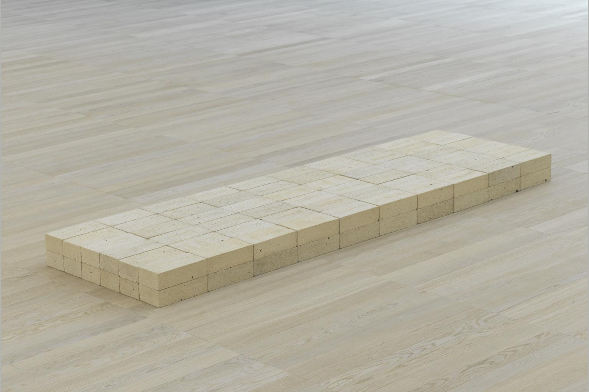
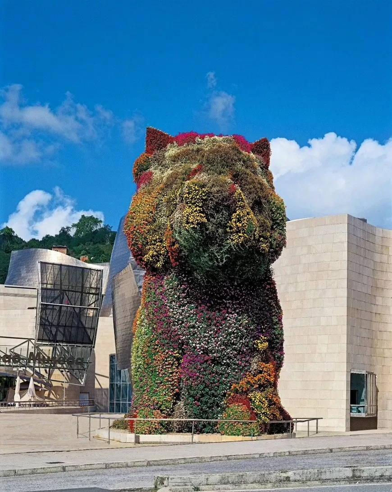

# 导论：你在看什么

## Equivalent VIII  等价物 8 1966 （Carl Andre 卡尔·安德烈）

 http://www.tate.org.uk/art/artworks/andre-equivalent-viii-t01534

 

## Puppy 小狗 1992 （Jeff Koons，杰夫·昆斯）

https://www.guggenheim.org/artwork/48

