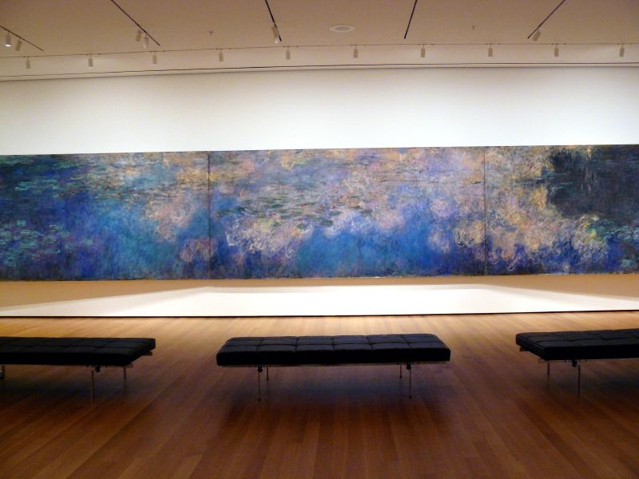
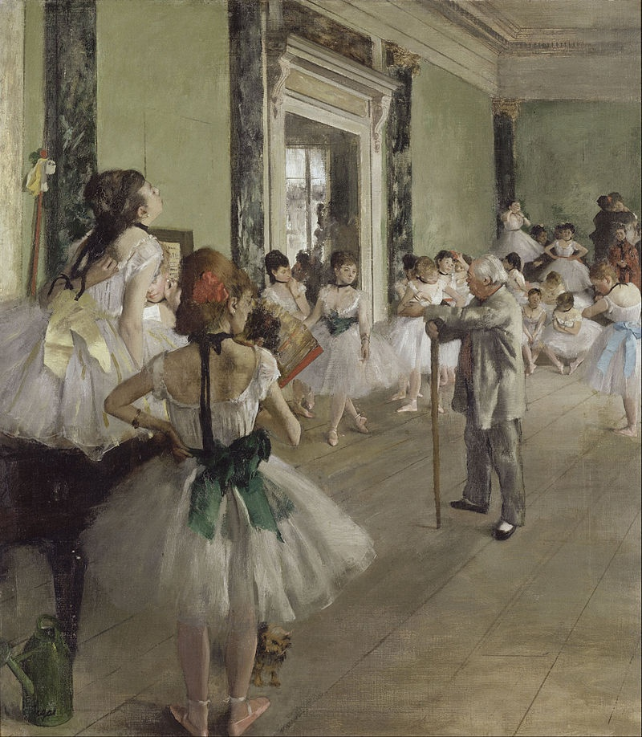
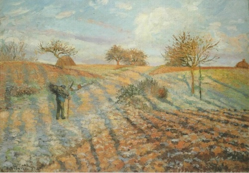
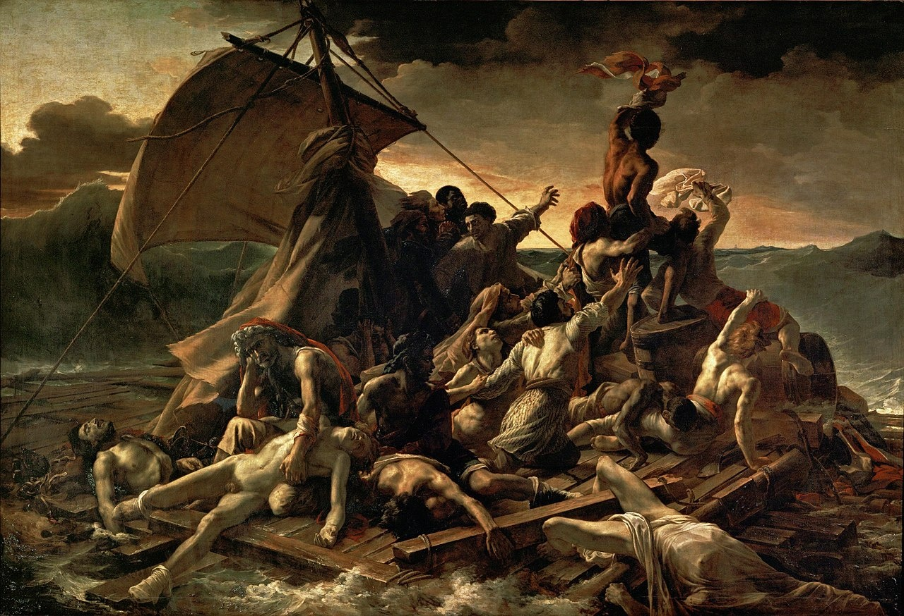
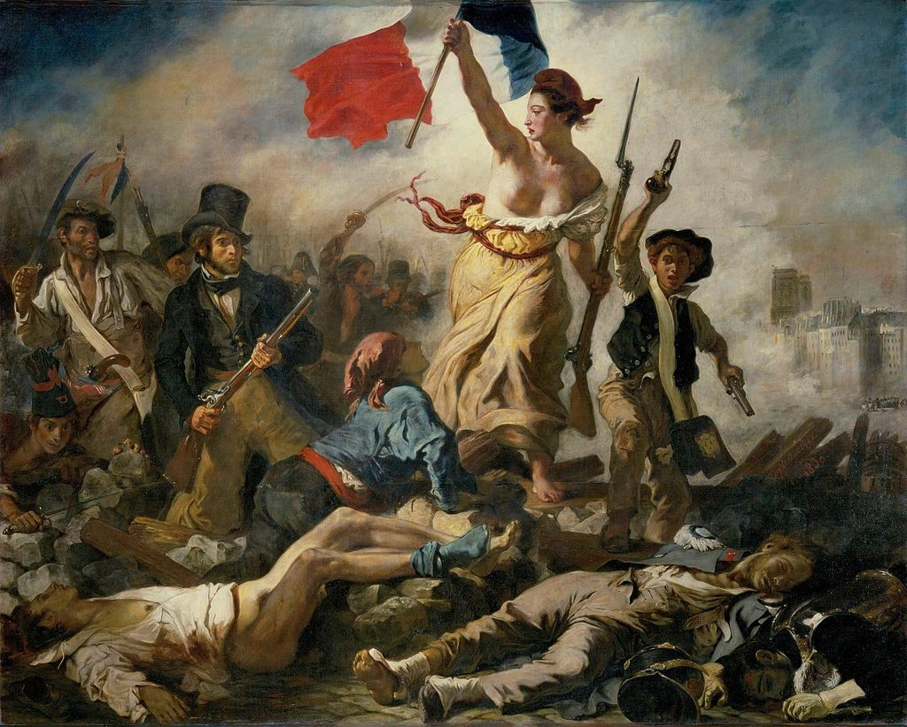
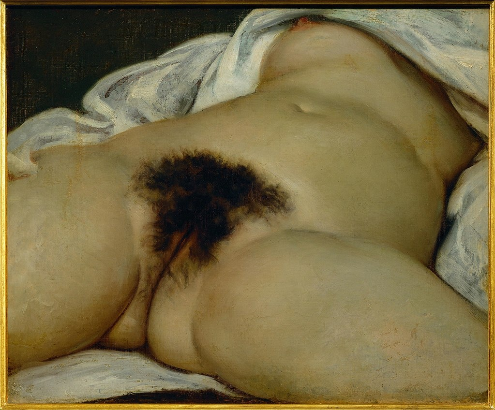
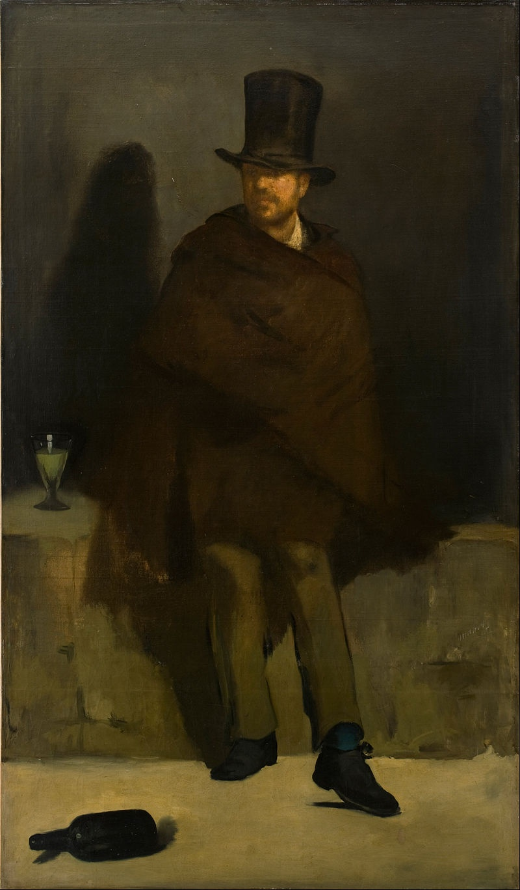
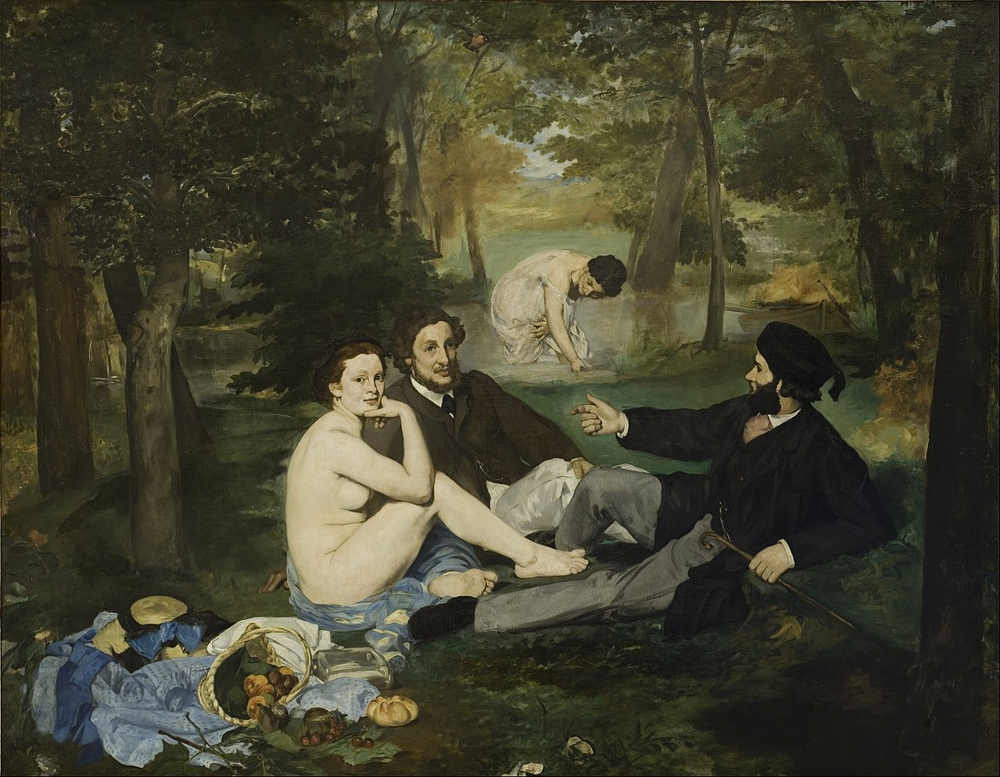
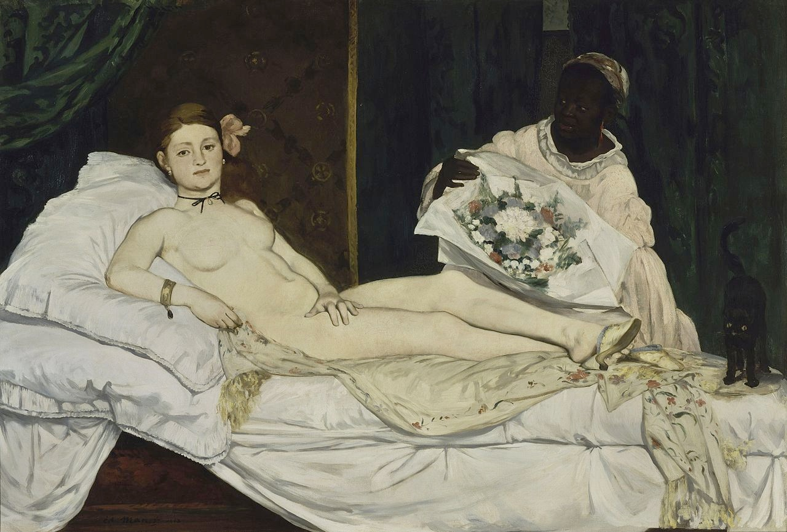

# 2 前印象派：走向真实 1820 - 1970

## 睡莲  Reflections of Clouds on the Water-Lily Pond，1920 （Claude Monet  克劳德·莫奈）

https://en.wikipedia.org/wiki/Water_Lilies_(Monet_series)

## The Dance Class (La Classe de Danse) 舞蹈课 1874（Edgar Degas 埃德加·德加）

https://en.wikipedia.org/wiki/The_Ballet_Class_(Degas,_Mus%C3%A9e_d%27Orsay)

## Hoar Frost, the Old Road to Ennery 白霜，通往埃纳里的老路  1873（Camille Pissarro , 米耶·毕沙罗）

https://artbookannex.com/tag/ennery/

## The Raft of the Medusa 美杜莎之筏 1818-1819（Théodore Géricault, 泰奥多尔·席里柯）

https://en.wikipedia.org/wiki/The_Raft_of_the_Medusa

## Liberty Leading the People 自由引导人民 1830 （Eugène Delacroix, 欧仁·德拉克罗瓦）

https://en.wikipedia.org/wiki/Liberty_Leading_the_People

## L'Origine du monde ("The Origin of the World") 世界的起源 1866 （Gustave Courbet, 古斯塔夫·库尔贝 ）

https://en.wikipedia.org/wiki/L%27Origine_du_monde

## The Absinthe Drinker (French: Le Buveur d'absinthe)  喝苦艾酒的人 1859 （Édouard Manet, 爱德华·马奈）

https://en.wikipedia.org/wiki/The_Absinthe_Drinker_(Manet_painting)

## Le Déjeuner sur l'herbe (English: The Luncheon on the Grass)  草地上的午餐 1863 （Édouard Manet, 爱德华·马奈）

https://en.wikipedia.org/wiki/Le_D%C3%A9jeuner_sur_l%E2%80%99herbe

## Olympia 奥林匹亚 1863 （Édouard Manet, 爱德华·马奈）

https://en.wikipedia.org/wiki/Olympia_(Manet)

