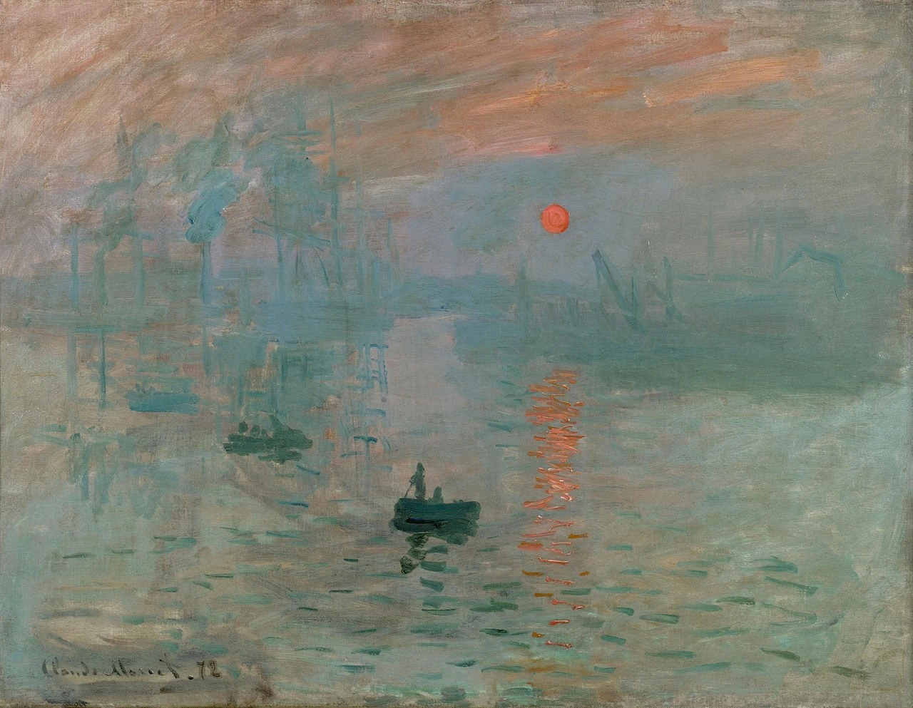
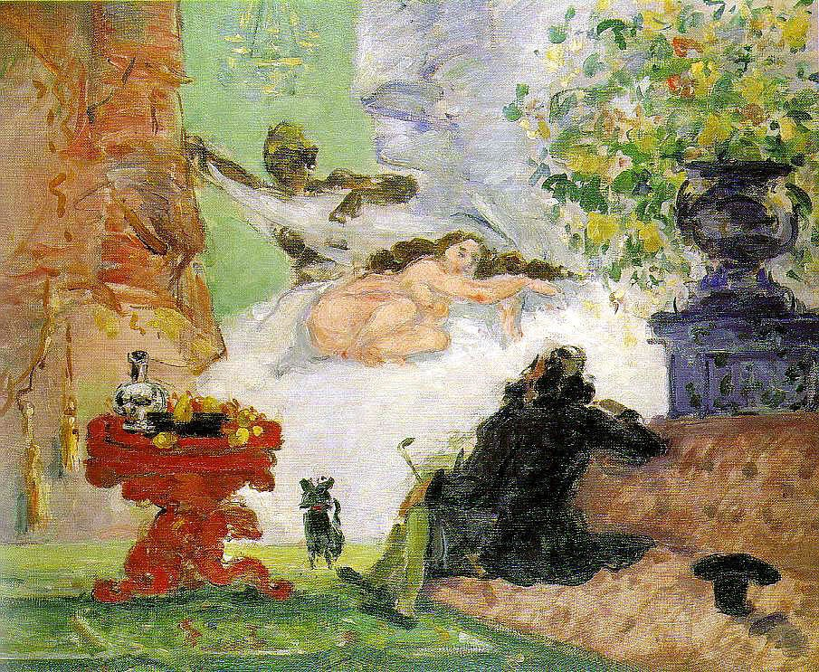
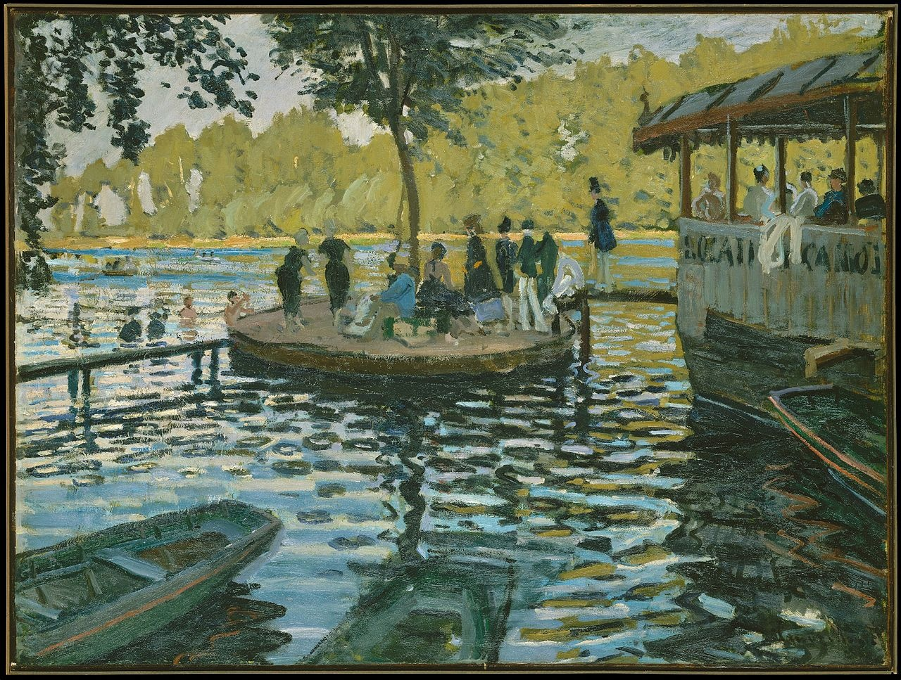
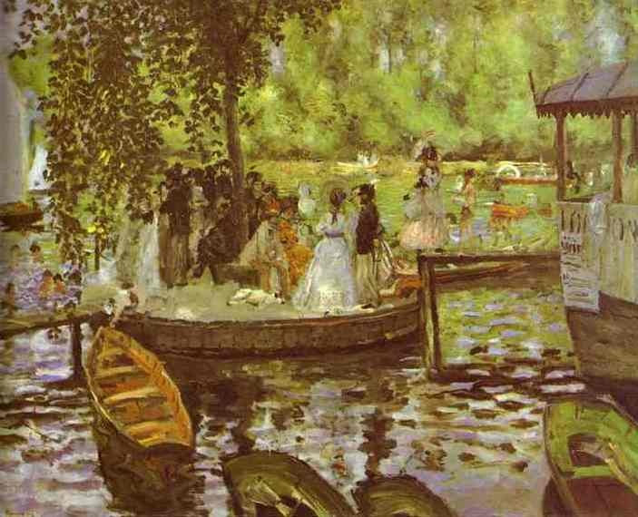
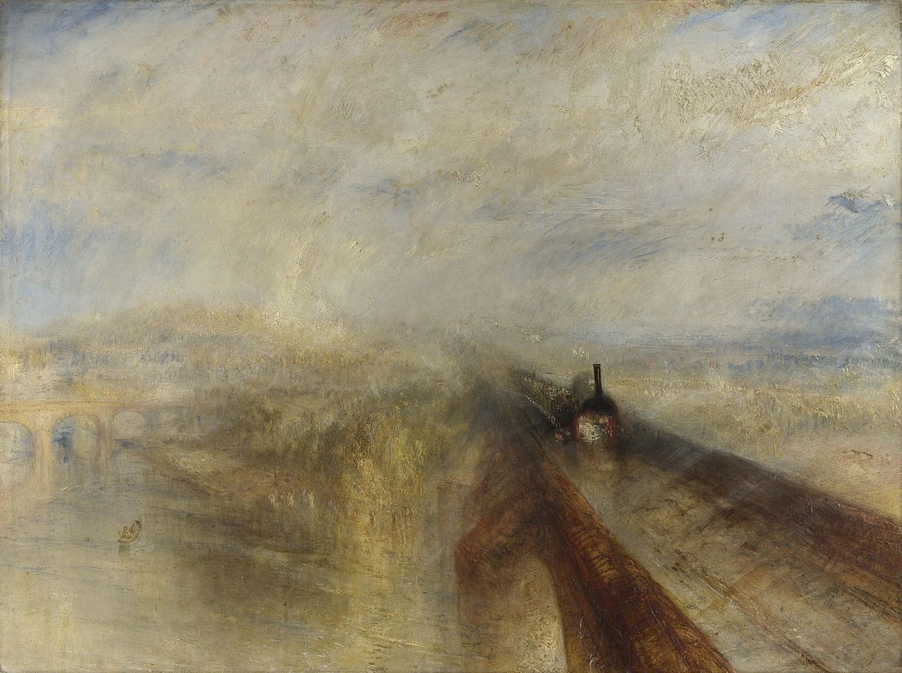
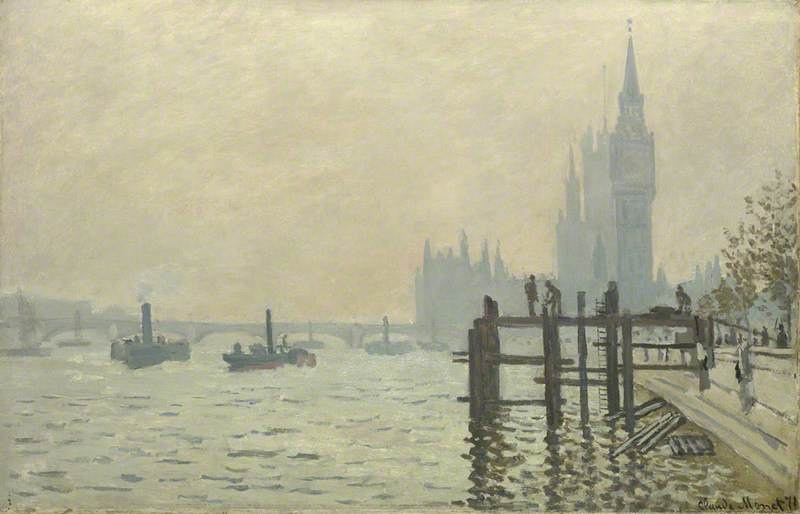
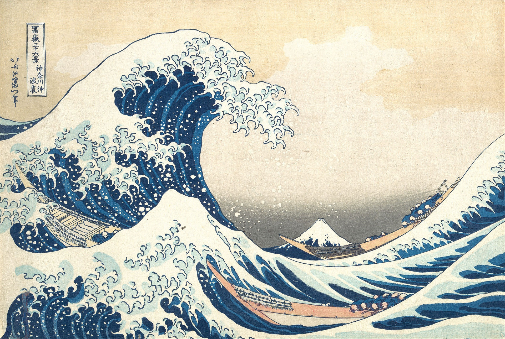
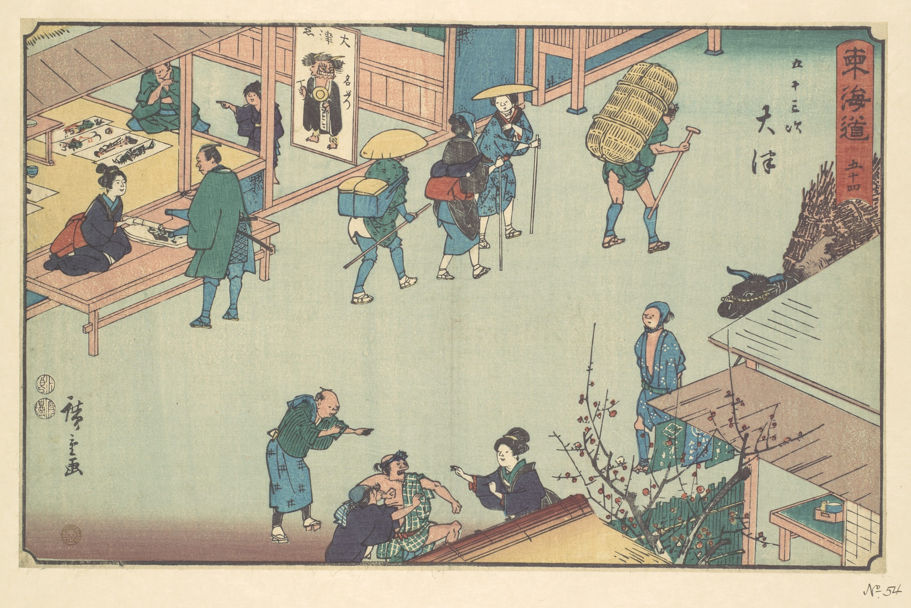
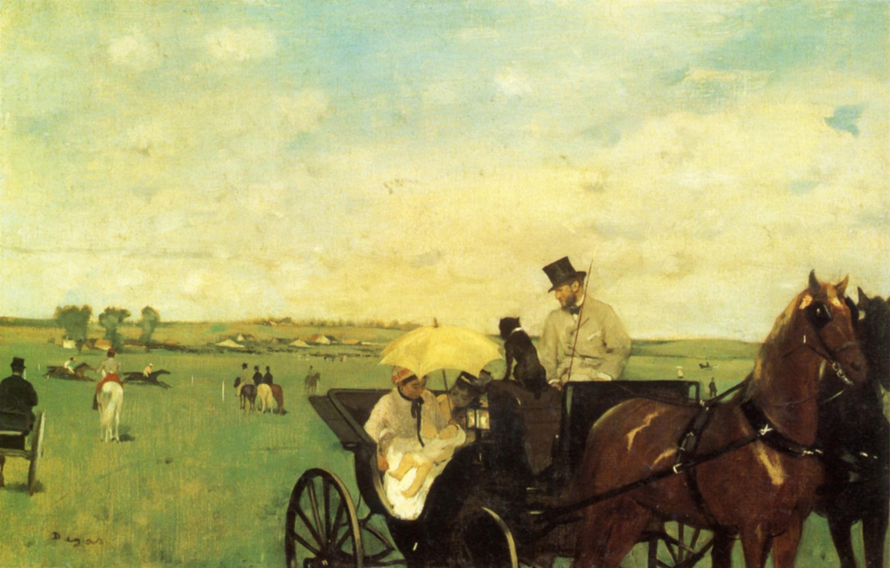

# 3 印象派：现代生活的画家 1870 - 1890

## Impression, Sunrise (French: Impression, soleil levant) 1872（Claude Monet  克劳德·莫奈）

https://en.wikipedia.org/wiki/Impression,_Sunrise

## A Modern Olympia 现代奥林匹亚 1870（Paul Cézanne, 保罗·塞尚）

http://www.paulcezanne.org/a-modern-olympia.jsp#prettyPhoto

## Bain à la Grenouillère 青蛙塘 1869 （Claude Monet  克劳德·莫奈）

https://en.wikipedia.org/wiki/Bain_%C3%A0_la_Grenouill%C3%A8re

## La Grenouillère 青蛙塘 1869 （Pierre-Auguste Renoir, 皮埃尔-奥古斯特·雷诺阿）

https://en.wikipedia.org/wiki/Pierre-Auguste_Renoir

## Rain, Steam and Speed – The Great Western Railway  雨、蒸汽和速度 1844 （ J. M. W. Turner, J.M.W 特纳）

https://en.wikipedia.org/wiki/Rain,_Steam_and_Speed_%E2%80%93_The_Great_Western_Railway

## The Thames below Westminster 威斯敏斯特下的泰晤士河 1871 （Claude Monet  克劳德·莫奈）

https://artuk.org/discover/artworks/the-thames-below-westminster-115865

## 神奈川沖浪裏  The Great Wave off Kanagawa 神奈川巨浪  1829-1833 （葛飾北斎，Katsushika Hokusai, 葛饰北斋）

https://en.wikipedia.org/wiki/The_Great_Wave_off_Kanagawa

## 大津駅 Station of Otsu 大津站 1840（安藤 広重, Ando Hiroshige, 安藤广重（后改名 歌川 広重,  Utagawa Hiroshige,  歌川广重））

https://www.metmuseum.org/toah/works-of-art/JP804/

## A Carriage at The Races 赛马场上的马车 1870 （Edgar Degas 埃德加·德加）

https://www.wikiart.org/en/edgar-degas/a-carriage-at-the-races-1872

