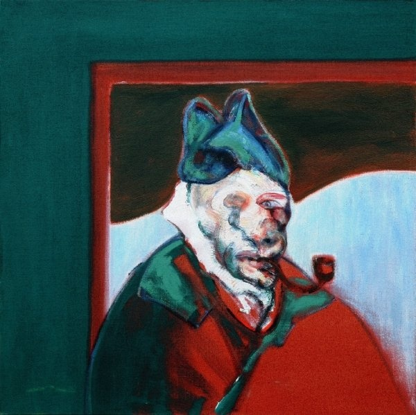

# 梵高与表现主义

## The Potato Eaters 吃土豆的人 1885（Vincent Willem van Gogh, 文森特·梵高）

https://en.wikipedia.org/wiki/The_Potato_Eaters

## The Yellow House 黄房子 1888 （Vincent Willem van Gogh, 文森特·梵高）

https://en.wikipedia.org/wiki/The_Yellow_House

## Still Life With a Plate of Onions 静物：一盘洋葱  1889 （Vincent Willem van Gogh, 文森特·梵高）

https://commons.wikimedia.org/wiki/File:Still_life_with_a_plate_of_onions.jpg

## The Sower 播种者 1888（Vincent Willem van Gogh, 文森特·梵高）

https://en.wikipedia.org/wiki/Vincent_van_Gogh#/media/File:The_Sower.jpg

## The Night Café 夜间咖啡馆 1888（Vincent Willem van Gogh, 文森特·梵高）

https://en.wikipedia.org/wiki/The_Night_Caf%C3%A9

## Sunflowers 向日葵 1888（Vincent Willem van Gogh, 文森特·梵高）

https://en.wikipedia.org/wiki/Sunflowers_(Van_Gogh_series)

## Starry Night Over the Rhône 满天星斗下的罗纳河 1888 （Vincent Willem van Gogh, 文森特·梵高）

https://en.wikipedia.org/wiki/Starry_Night_Over_the_Rh%C3%B4ne

## Bedroom in Arles 寝室 1888（Vincent Willem van Gogh, 文森特·梵高）

https://en.wikipedia.org/wiki/Bedroom_in_Arles

## The Scream 呐喊 1893 （Edvard Munch, 爱德华·蒙克）

https://en.wikipedia.org/wiki/The_Scream

## Study after Velázquez's Portrait of Pope Innocent X 临摹委拉斯开兹的《教皇英诺森十世肖像》1953（Francis Bacon, 弗朗西斯·培根）

https://en.wikipedia.org/wiki/Study_after_Vel%C3%A1zquez%27s_Portrait_of_Pope_Innocent_X

## Homage to Van Gogh 向梵高致敬 1960 （Francis Bacon, 弗朗西斯·培根）

https://www.artimage.org.uk/3087/francis-bacon/homage-to-van-gogh--1960

## Painter on the Road to Tarascon, August 1888 (destroyed by fire in the Second World War) 去往塔拉斯孔路上的画家 1888  （Vincent Willem van Gogh, 文森特·梵高）

https://en.wikipedia.org/wiki/Vincent_van_Gogh#/media/File:Vincent_Van_Gogh_0013.jpg

