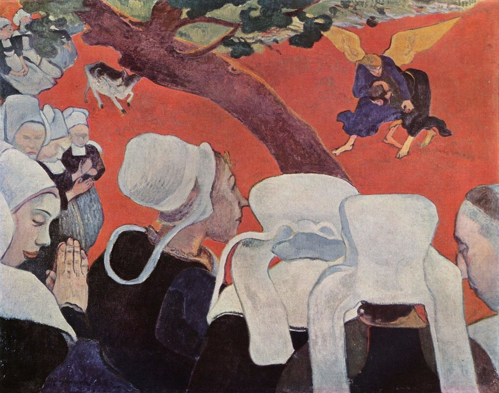
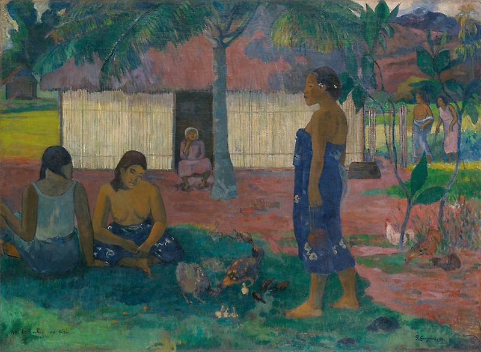

# 保罗·高更和象征主义

## Vision after the Sermon (Jacob Wrestling with the Angel) 布道后的幻象（雅各与天使搏斗） 1888（Paul Gauguin,  保罗·高更） 

https://en.wikipedia.org/wiki/Vision_After_the_Sermon

## No te aha oe riri (Why Are You Angry?), 你为何生气 1896（Paul Gauguin,  保罗·高更） 

http://www.artic.edu/aic/collections/artwork/16496

