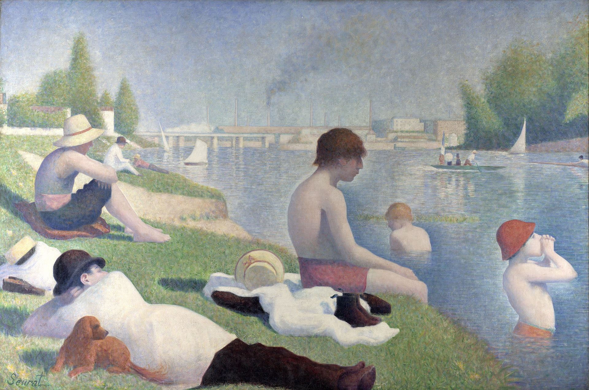
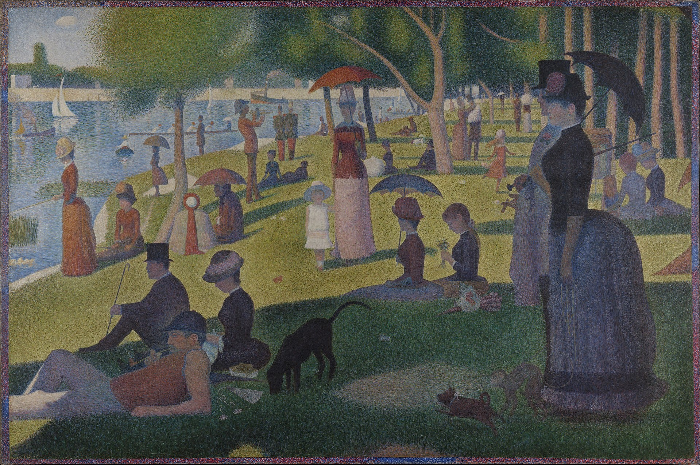

# 修拉的点彩画派

## Bathers at Asnières (French: Une Baignade, Asnières)  阿尼埃尔的浴场 1884（Georges Seurat, 乔治·修拉）

https://en.wikipedia.org/wiki/Bathers_at_Asni%C3%A8res

## A Sunday Afternoon on the Island of La Grande Jatte 大碗岛的星期天下午 1884-1886（Georges Seurat, 乔治·修拉）

https://en.wikipedia.org/wiki/A_Sunday_Afternoon_on_the_Island_of_La_Grande_Jatte

