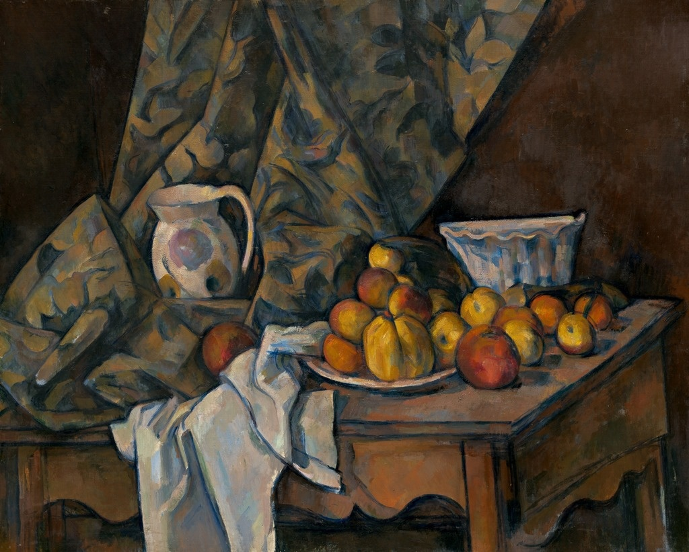
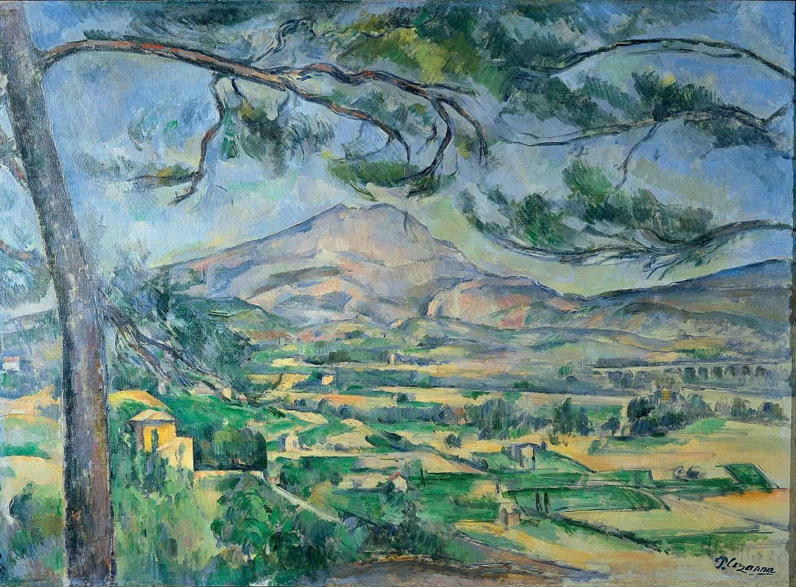

# 5 塞尚：吾人之父 1839 - 1906

## Still Life with Apples and Peaches 有苹果和桃子的静物 1905（Paul Cézanne, 保罗·塞尚）

https://www.nga.gov/Collection/art-object-page.45986.html

## Mont Sainte-Victoire with Large Pine 圣维克多山 1887  （Paul Cézanne, 保罗·塞尚）

https://en.wikipedia.org/wiki/Mont_Sainte-Victoire_with_Large_Pine

