# 6 原始主义 1880 - 1930 野兽派 1905 - 1910：原始的呐喊

## The Kiss 吻 1907-1908  （Gustav Klimt,  古斯塔夫·克里姆特） 

https://en.wikipedia.org/wiki/The_Kiss_(Klimt)

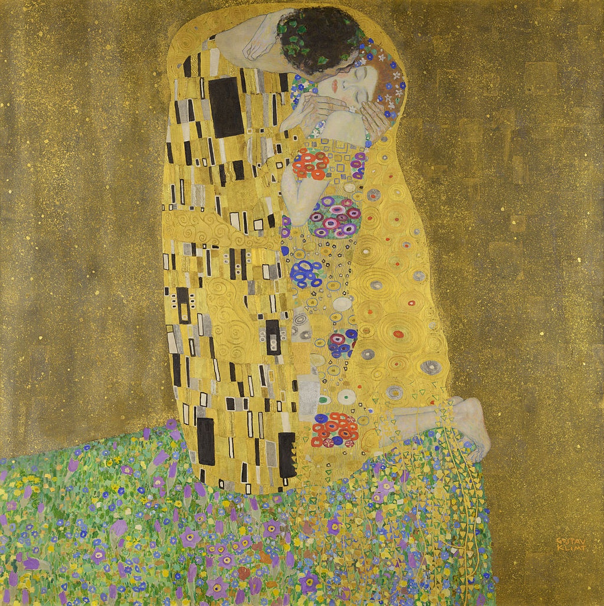

## Boats in the Harbour at Collioure 科利乌尔港的船 1905 （André Derain, 安德烈·德兰）

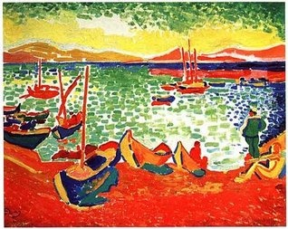

## Restaurant de la Machine at Bougival 布吉瓦尔的餐馆 1905（Maurice de Vlaminck, 莫里斯·德·弗拉芒克）

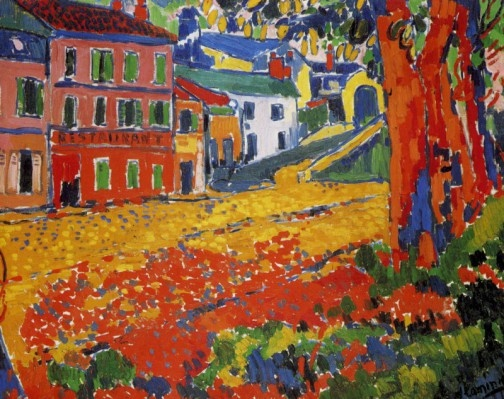

## Woman with a Hat 戴帽子的妇人 1905 （Henri Matisse, 亨利·马蒂斯）

https://en.wikipedia.org/wiki/Woman_with_a_Hat

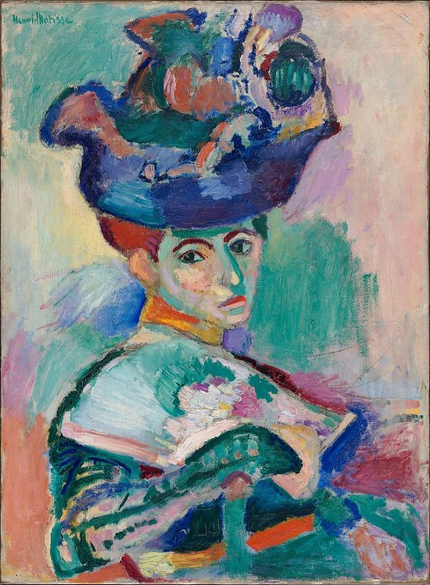

## Le bonheur de vivre (The Joy of Life) 生之欢乐 1905-1906 （Henri Matisse, 亨利·马蒂斯）

https://en.wikipedia.org/wiki/Le_bonheur_de_vivre

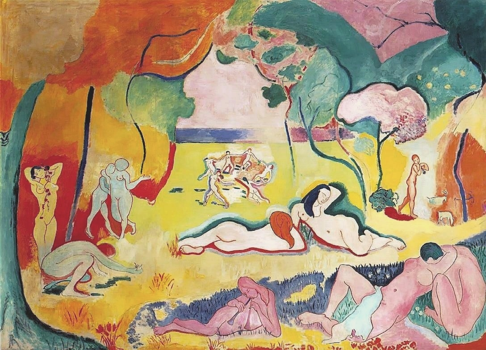

## Reciproco Amore 互爱 1589-1595（Agostino Carracci, 阿戈斯蒂诺·卡拉奇）

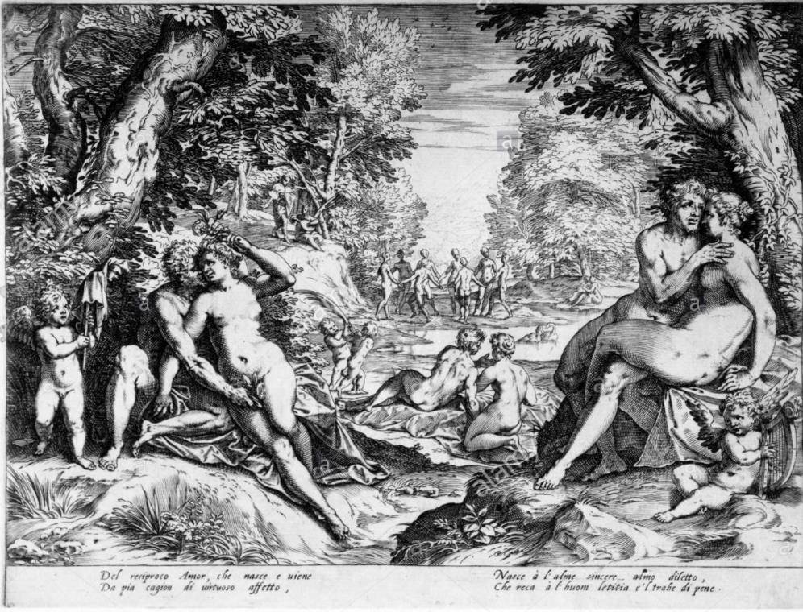

## Portrait of Gertrude Stein 格特鲁德·斯泰因肖像 1905-1906 （Pablo Picasso, 巴勃罗·毕加索）

https://en.wikipedia.org/wiki/Portrait_of_Gertrude_Stein

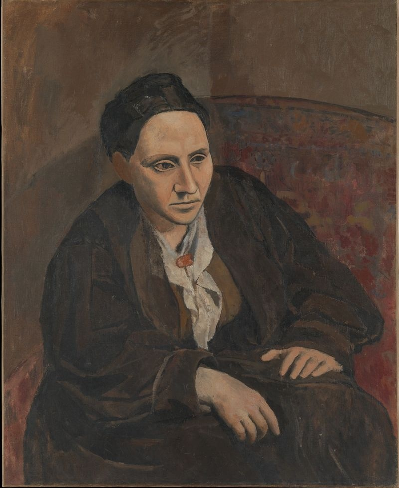

## Les Demoiselles d'Avignon (The Young Ladies of Avignon, and originally titled The Brothel of Avignon)  亚维农少女 1907 （Pablo Picasso, 巴勃罗·毕加索）

https://en.wikipedia.org/wiki/Les_Demoiselles_d%27Avignon

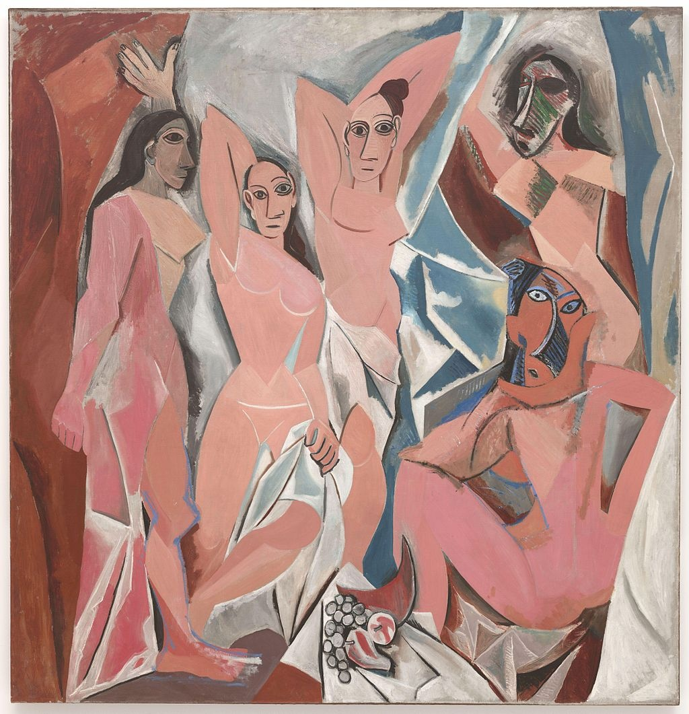

## A Carnival Evening 狂欢节之夜 1886（Henri Rousseau, 亨利·卢梭）

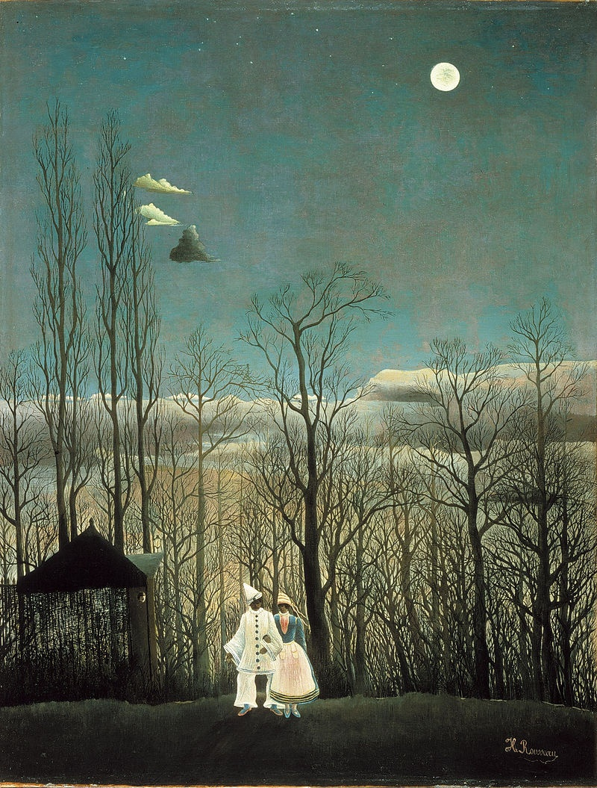

## The Hungry Lion Throws Itself on the Antelope (Le lion ayant faim se jette sur l'antilope)  饿狮猛扑羚羊 1905（Henri Rousseau, 亨利·卢梭）

https://en.wikipedia.org/wiki/The_Hungry_Lion_Throws_Itself_on_the_Antelope

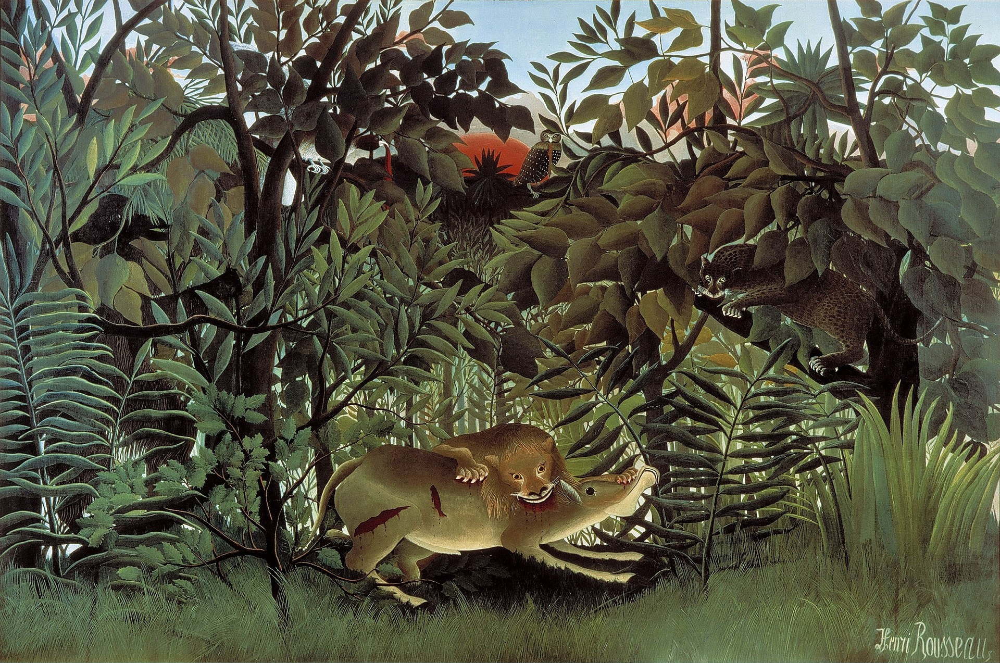

## Portrait of a Woman 一个女人的肖像 1895 （Henri Rousseau, 亨利·卢梭）

https://commons.wikimedia.org/wiki/File:Henri_Rousseau__Portrait_of_a_Woman_(1895).jpg

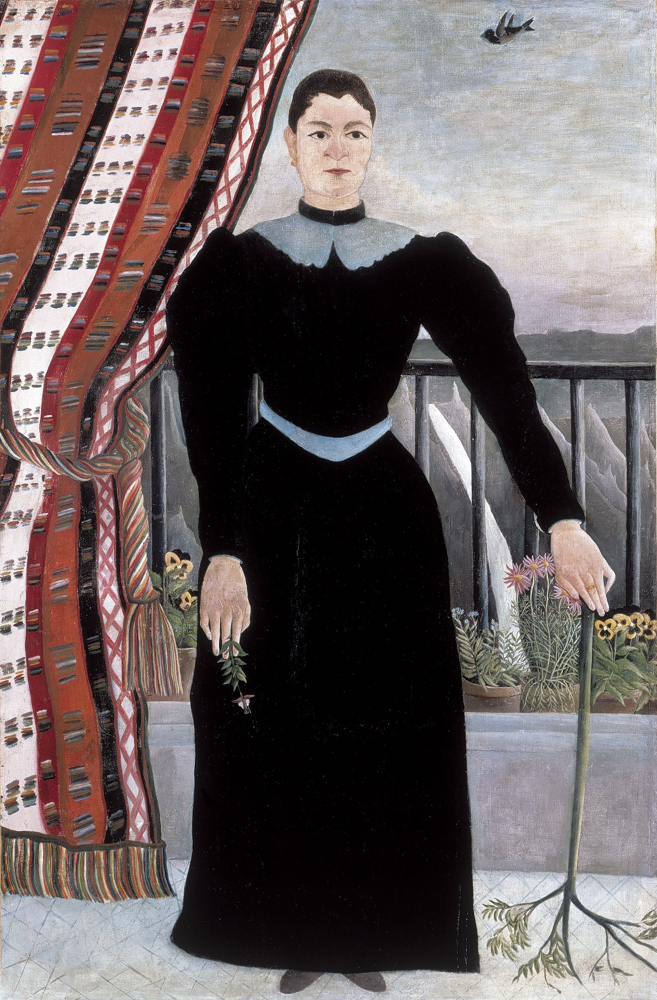
