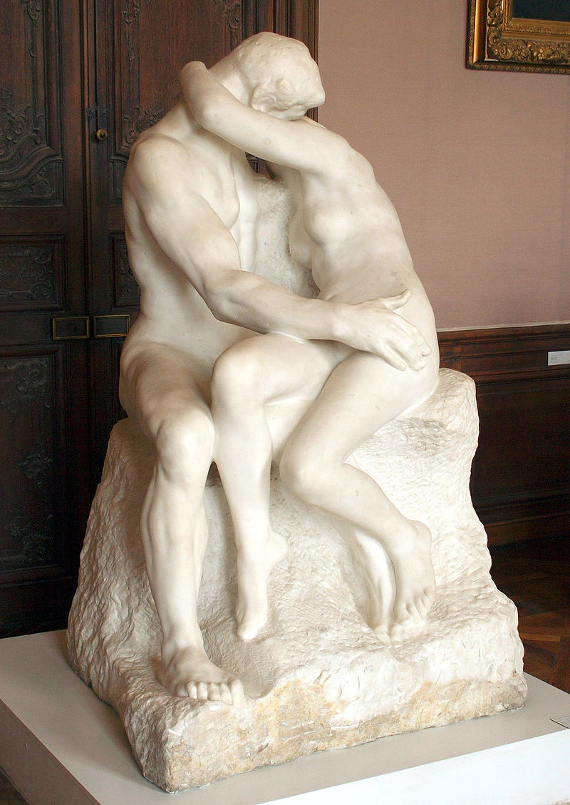
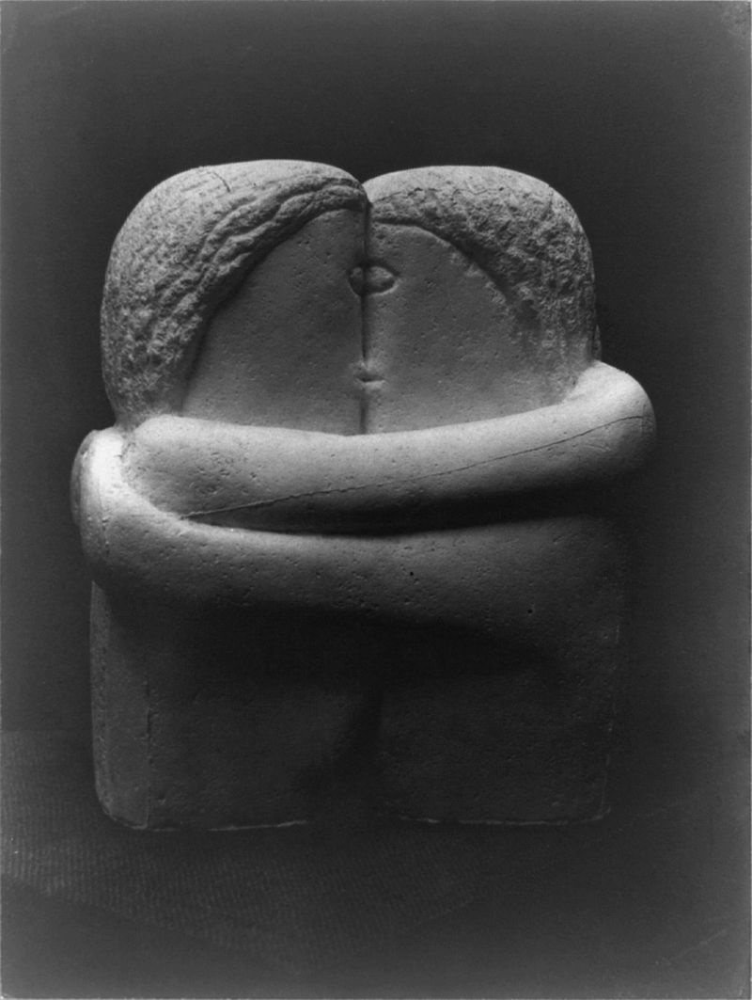
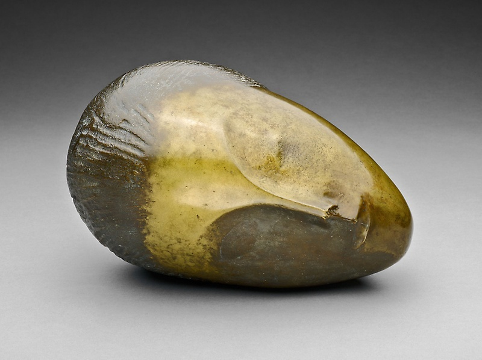
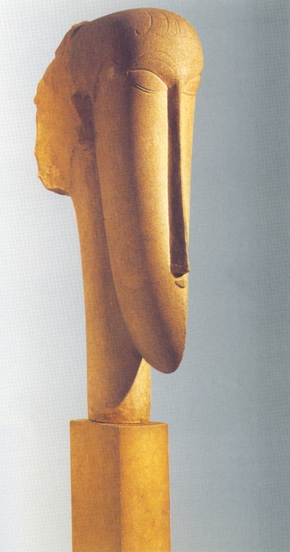
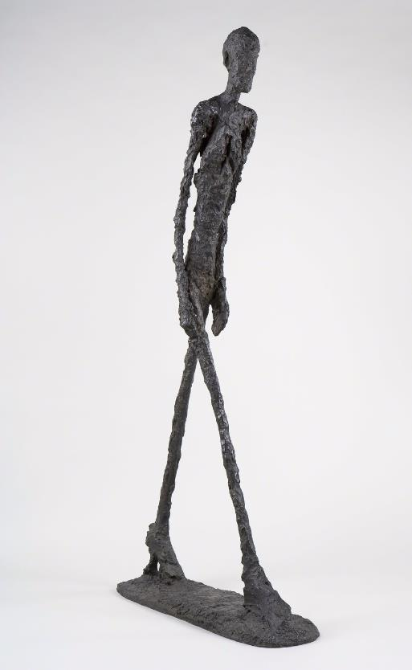
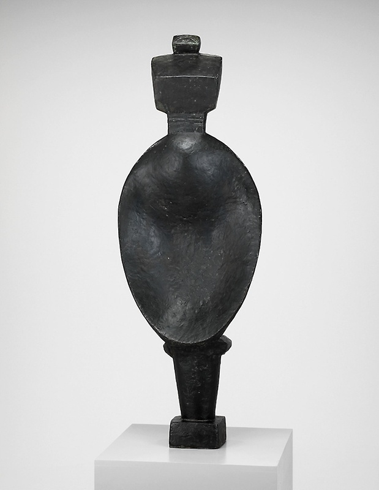
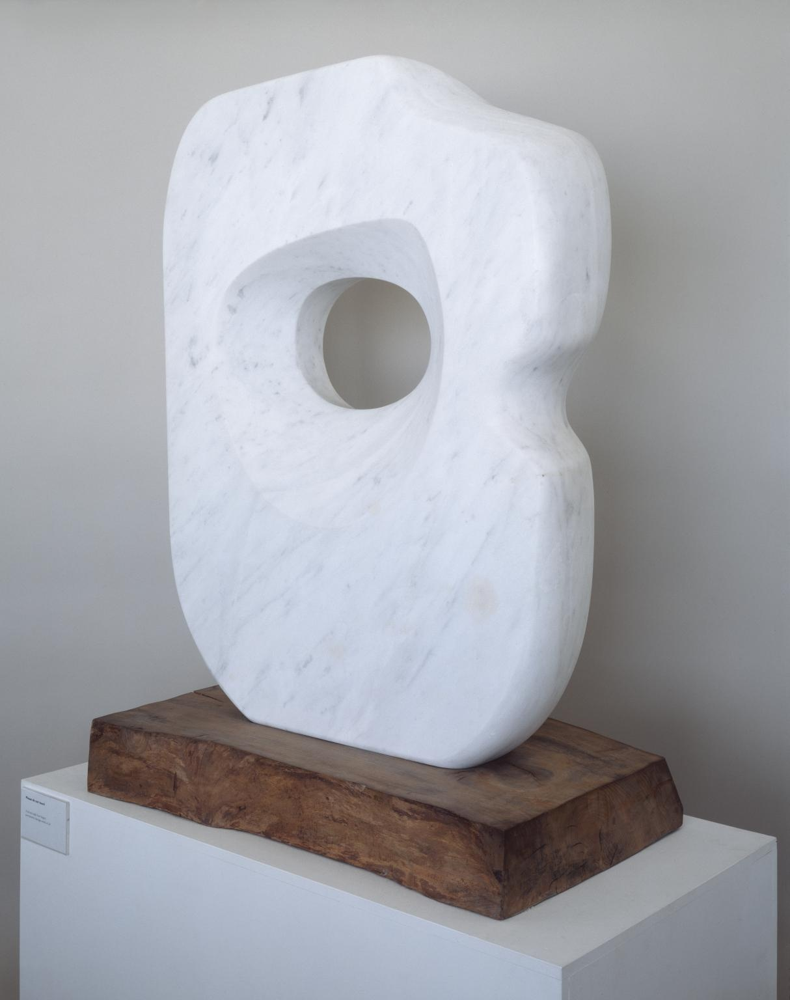
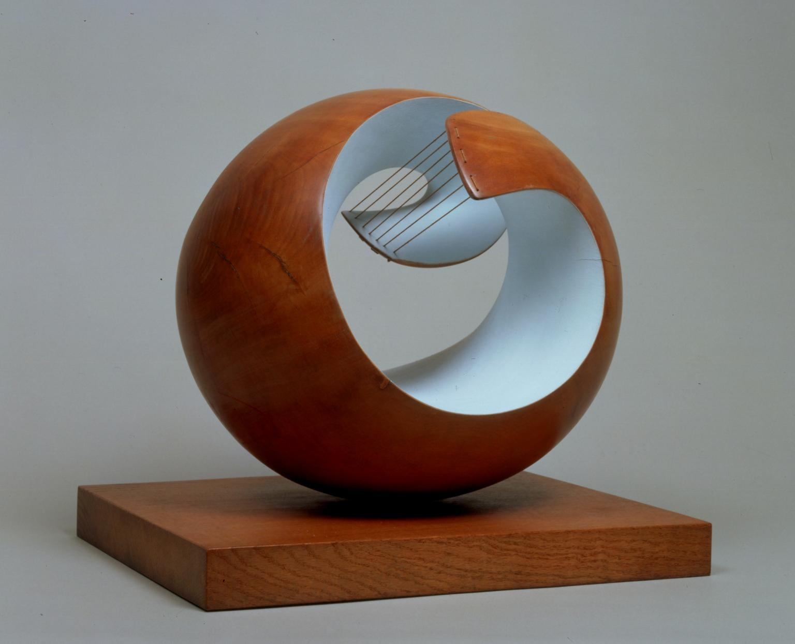
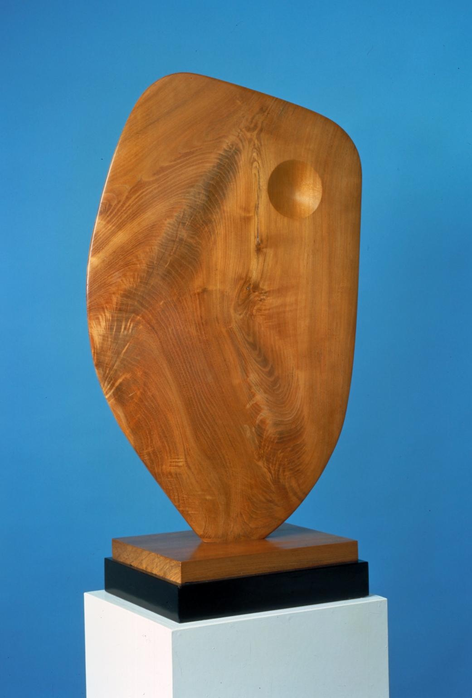

# 原始主义雕塑

## The Kiss (French: Le Baiser)  吻 1882（Auguste Rodin, 奥古斯特·罗丹）

https://en.wikipedia.org/wiki/The_Kiss_(Rodin_sculpture)

## The Kiss  吻 1907-1908（Constantin Brâncuși, 康斯坦丁·布朗库西）

https://en.wikipedia.org/wiki/The_Kiss_(Br%C3%A2ncu%C8%99i_sculpture)

## Sleeping Muse, 沉睡的缪斯 1910 （Constantin Brâncuși, 康斯坦丁·布朗库西）

http://www.artic.edu/aic/collections/artwork/9024

## Head 头 1911-1912（Amedeo Modigliani, 阿梅代奥·莫迪利亚尼）

https://www.wikiart.org/en/amedeo-modigliani/head

## Walking Man I 行走的人1 1960（Alberto Giacometti， 阿尔伯托·贾科梅蒂）

https://www.artsy.net/artwork/alberto-giacometti-walking-man-i

## Spoon Woman勺形女人 1927 （Alberto Giacometti， 阿尔伯托·贾科梅蒂）

http://www.artic.edu/aic/collections/artwork/37761

## Pierced Form 穿孔之形 1963-1964（Barbara Hepworth, 芭芭拉·赫普沃斯）

http://www.tate.org.uk/art/artworks/hepworth-pierced-form-t00704

## Pelagos 海洋生物 1946 （Barbara Hepworth, 芭芭拉·赫普沃斯）

http://www.tate.org.uk/art/artworks/hepworth-pelagos-t00699

## Single Form 单一的形式 1961 （Barbara Hepworth, 芭芭拉·赫普沃斯）

http://www.tate.org.uk/art/artworks/hepworth-single-form-september-t03143

