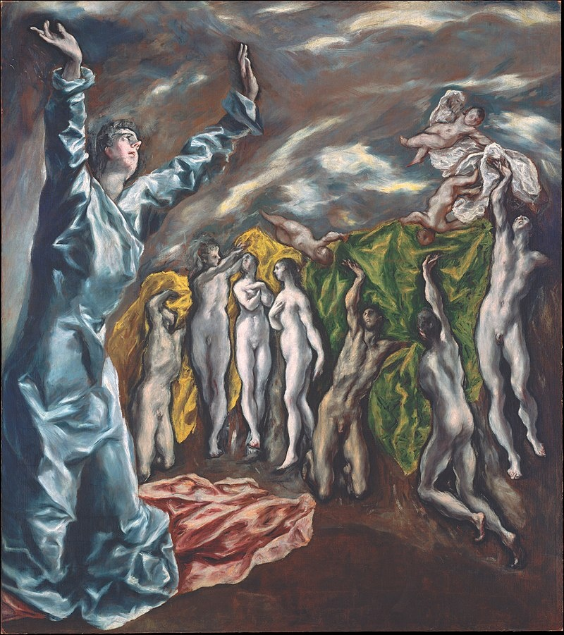
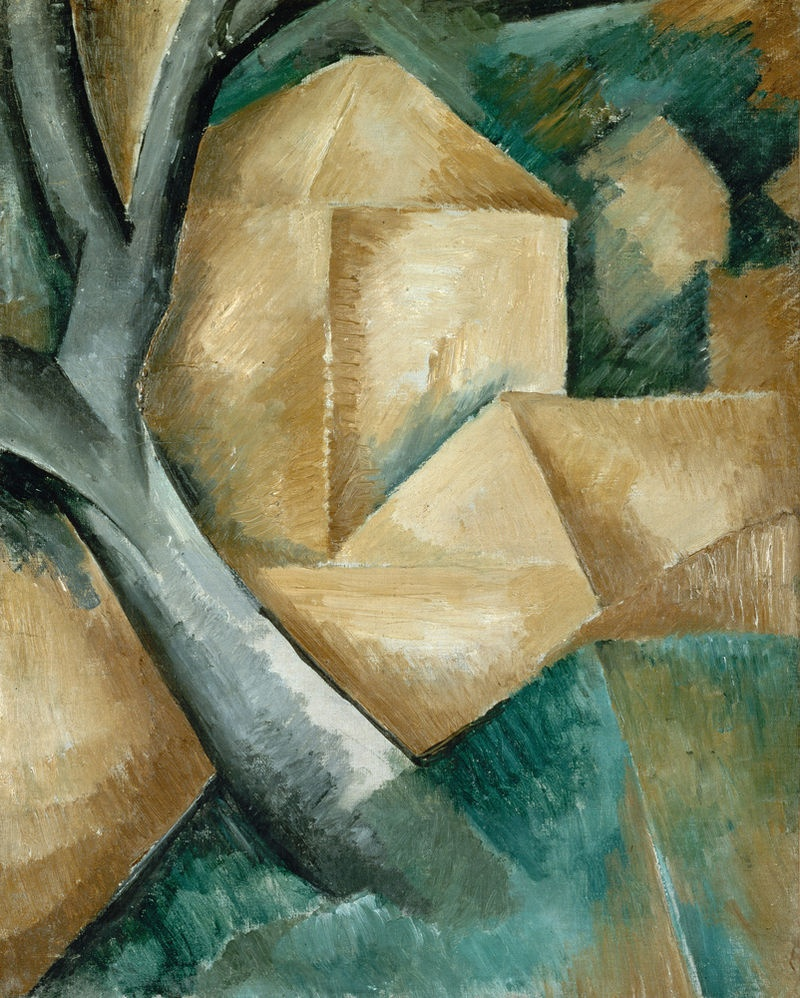
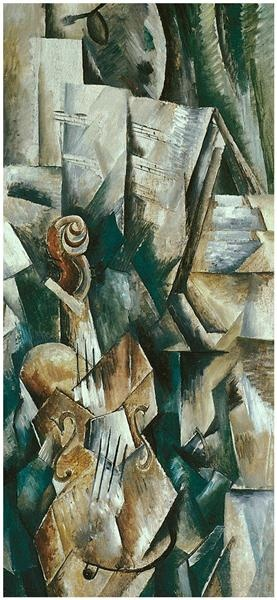
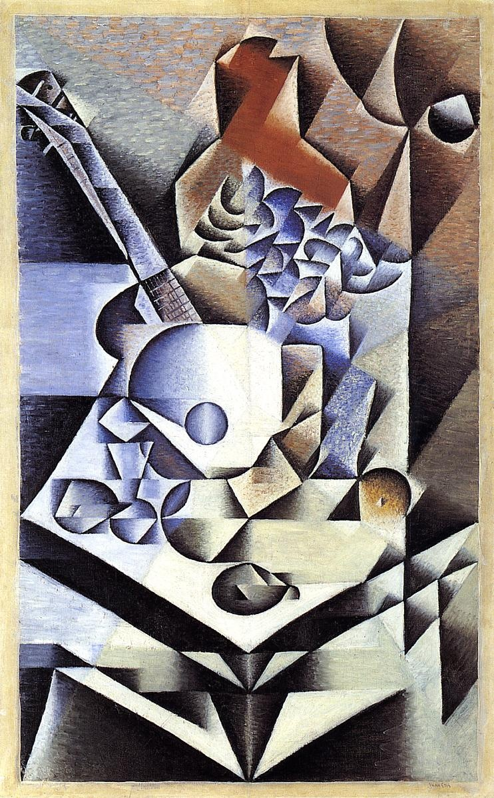
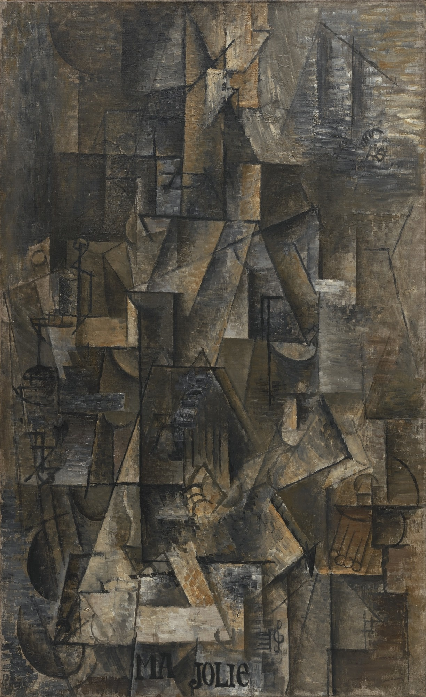
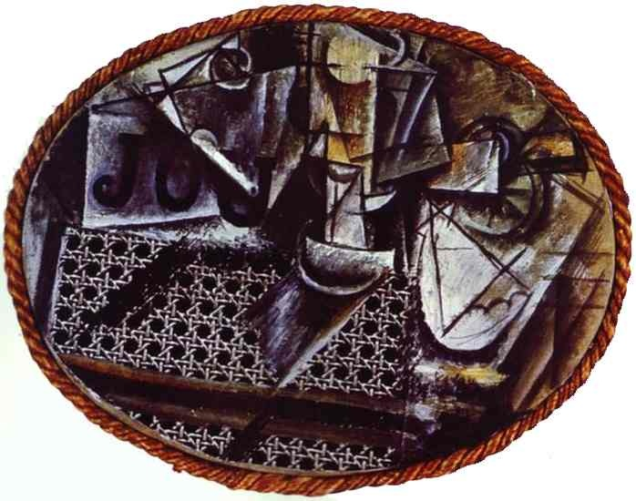
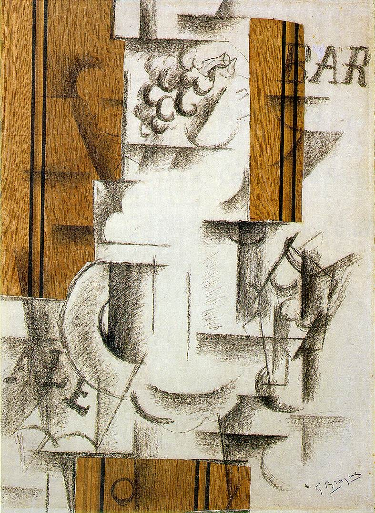
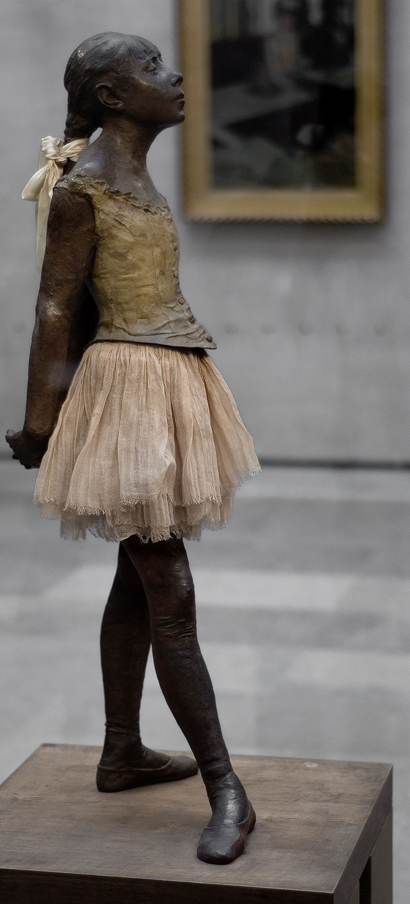
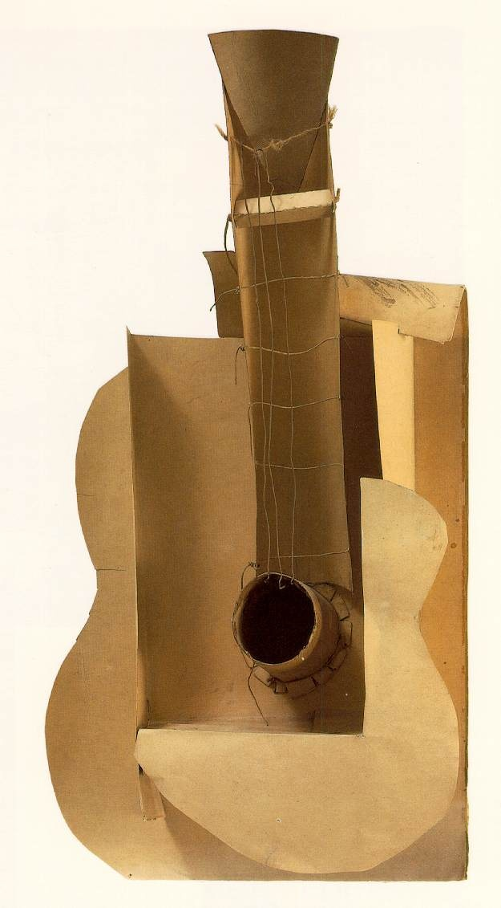

# 7 立体主义：另一种视角 1907 - 1914

## Opening of the Fifth Seal 揭开第五印  1608（El Greco, 埃尔·格列柯）

https://en.wikipedia.org/wiki/Opening_of_the_Fifth_Seal

## Houses at l'Estaque 埃斯塔克的房子 1908（Georges Braque, 乔治·布拉克）

https://en.wikipedia.org/wiki/Houses_at_l%27Estaque

## Violin and Palette 小提琴与调色板 1909（Georges Braque, 乔治·布拉克）

https://www.wikiart.org/en/georges-braque/violin-and-palette-1909

## Still Life with Flowers 静物花卉 1912（Juan Gris, 胡安·格里斯）

https://www.wikiart.org/en/juan-gris/still-life-with-flowers-1912

## Ma Jolie 我的美人 1912（Pablo Picasso, 巴勃罗·毕加索）

https://www.moma.org/collection/works/79051

## Still-Life with Chair Caning有藤椅的静物 1912（Pablo Picasso, 巴勃罗·毕加索）

http://www.pablo-ruiz-picasso.net/work-88.php

## Fruit Dish and Glass 水果盘与玻璃杯  1912 （Georges Braque, 乔治·布拉克）

https://en.wikipedia.org/wiki/Fruit_Dish_and_Glass

## The Little Fourteen-Year-Old Dancer (French: La Petite Danseuse de Quatorze Ans)  小舞女 1880-1881 （Edgar Degas 埃德加·德加）

https://en.wikipedia.org/wiki/Little_Dancer_of_Fourteen_Years

## Guitar 吉他 1912（Pablo Picasso, 巴勃罗·毕加索）

https://www.wikiart.org/en/pablo-picasso/guitar-1912

