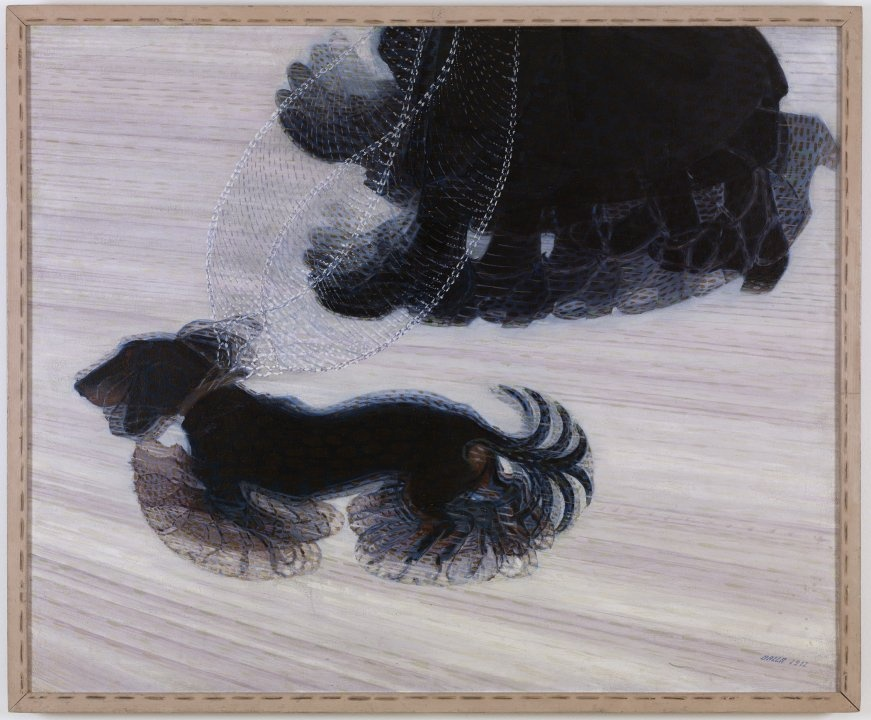
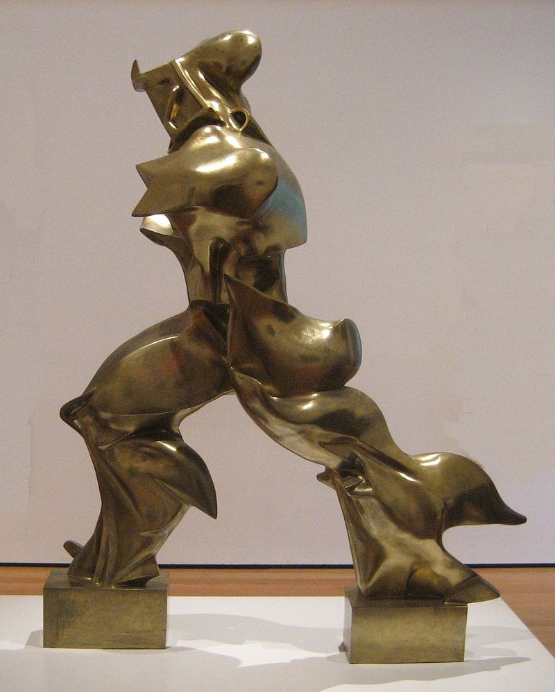
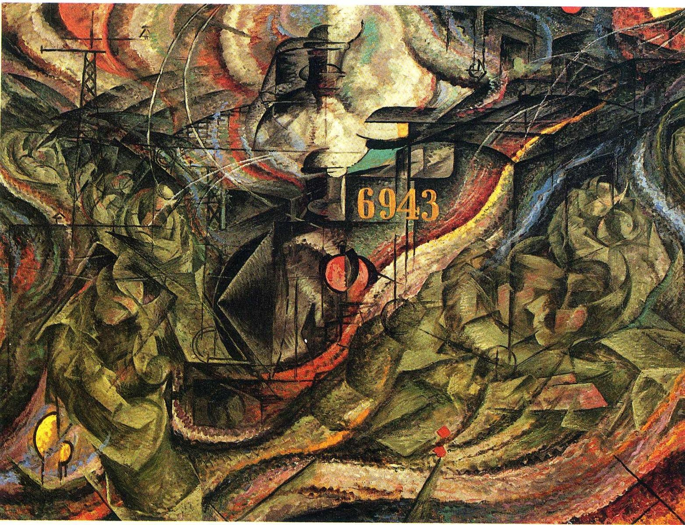
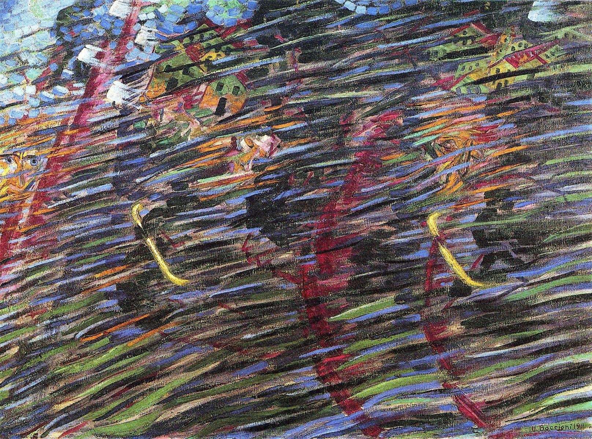
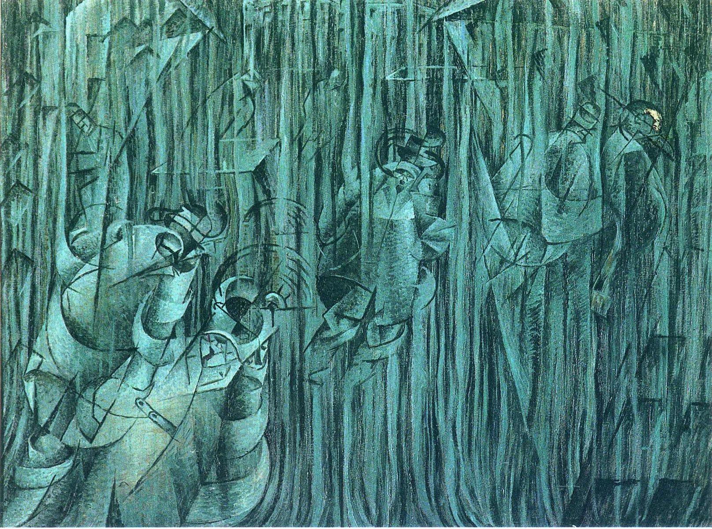
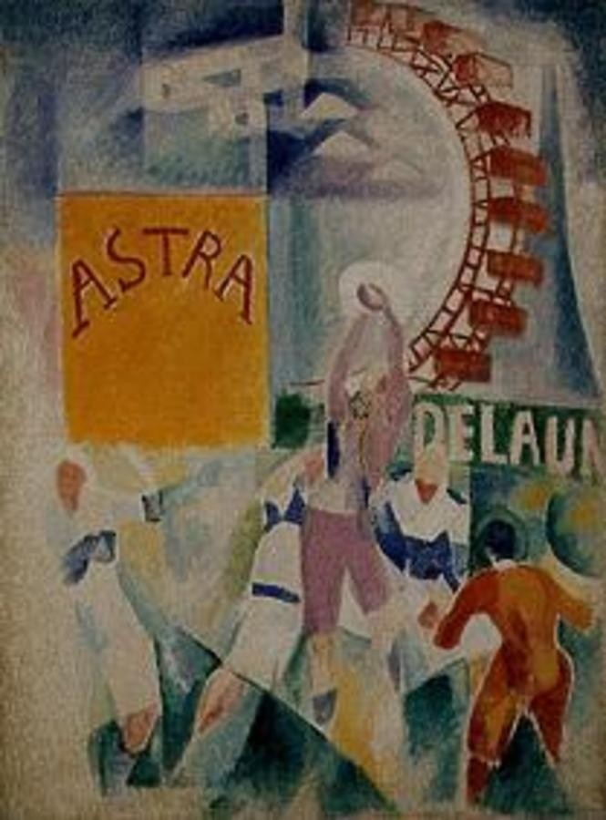
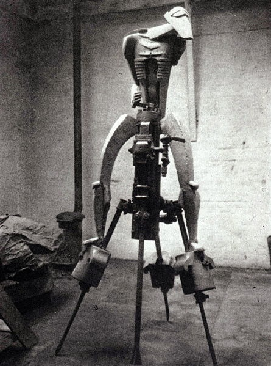

# 8 未来主义：快进 1909 - 1919

## Dynamism of a Dog on a Leash (Italian: Dinamismo di un cane al guinzaglio)拴着皮带的狗的动态 1912（Giacomo Balla, 贾科莫·巴拉）

https://en.wikipedia.org/wiki/Dynamism_of_a_Dog_on_a_Leash

## Unique Forms of Continuity in Space 空间中连续的唯一形体 1913（UmbertoBoccioni, 翁贝托·薄丘尼）

https://en.wikipedia.org/wiki/Unique_Forms_of_Continuity_in_Space

## States of Mind I: The Farewells  心境I 告别 1911（UmbertoBoccioni, 翁贝托·薄丘尼）

https://www.wikiart.org/en/umberto-boccioni/states-of-mind-i-the-farewells-1911

## States of Mind II: Those Who Go 心境II 离开的人 1911（UmbertoBoccioni, 翁贝托·薄丘尼）

https://www.wikiart.org/en/umberto-boccioni/states-of-mind-ii-those-who-go-1911

## States of Mind III: Those Who Stay 心境III 留下的人 1911（UmbertoBoccioni, 翁贝托·薄丘尼）

https://www.wikiart.org/en/umberto-boccioni/states-of-mind-iii-those-who-stay-1911-1

## L'Équipe de Cardiff 加迪夫队 1913（Robert Delaunay, 罗伯特·德劳内）

https://fr.wikipedia.org/wiki/L%27%C3%89quipe_de_Cardiff

## Rock Drill 凿岩机 1913（Jacob Epstein, 雅各·爱泼斯坦）

https://en.wikipedia.org/wiki/Rock_Drill_(Jacob_Epstein)

