# 9 康定斯基/俄耳甫斯主义/青骑士：音乐之声 1910 - 1914

## The First Step 第一步 1910（František Kupka, 弗朗齐歇克·库普卡）

https://www.moma.org/collection/works/79969

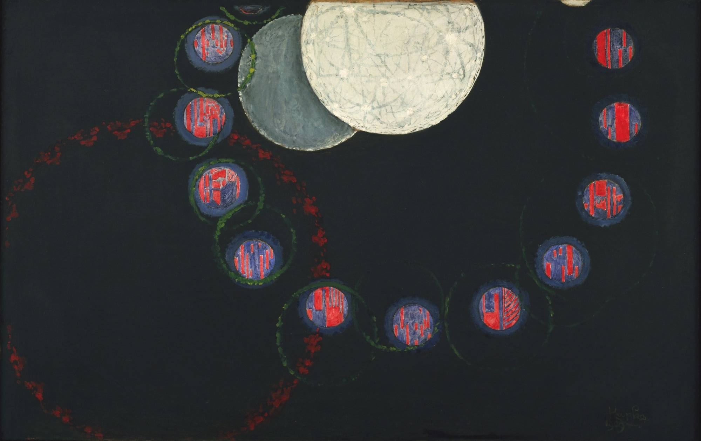

## Disque simultané（Simultaneous Disc）共时的圆盘 1912（Robert Delaunay, 罗伯特·德劳内）

https://fr.wikipedia.org/wiki/Disque_simultan%C3%A9

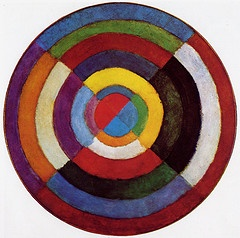

## München - Planegg I 慕尼黑-普拉内格 1 1901（Wassily Kandinsky, 瓦西里·康定斯基）

https://www.akg-images.de/archive/Munchen-%25E2%2580%2593-Planegg-I-2UMDHUORFRFR.html

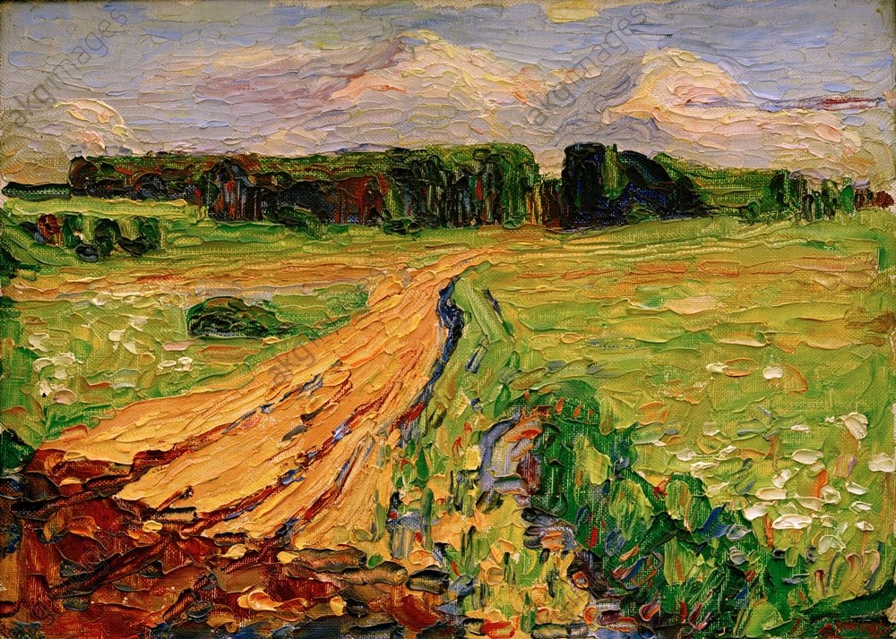

## Murnau, Dorfstrasse (A Village Street) 穆尔瑙，乡村道路 1908 （Wassily Kandinsky, 瓦西里·康定斯基）

https://commons.wikimedia.org/wiki/File:Vassily_Kandinsky,_1908,_Murnau,_Dorfstrasse.jpg

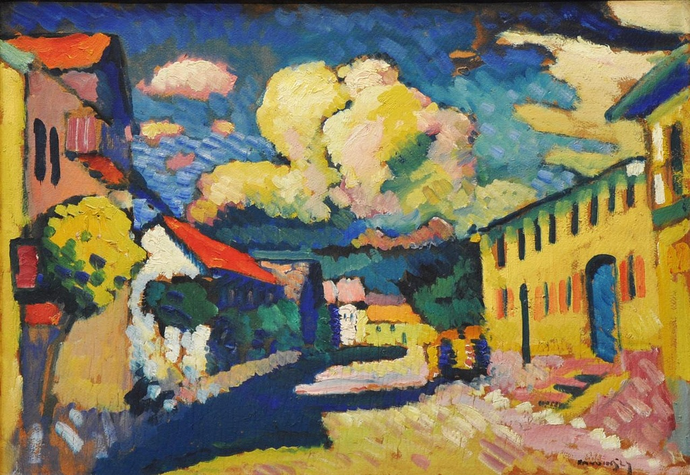

## Kochel - Straight Road 科黑尔，笔直的路 1909（Wassily Kandinsky, 瓦西里·康定斯基）

http://www.the-athenaeum.org/art/detail.php?ID=116422

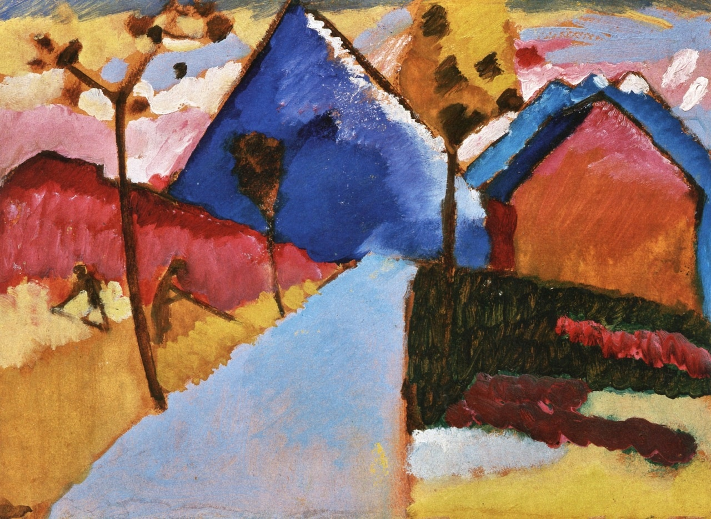

## Improvisation 4 即兴 4 1909（Wassily Kandinsky, 瓦西里·康定斯基）

https://www.wikiart.org/en/wassily-kandinsky/improvisation-4-1909

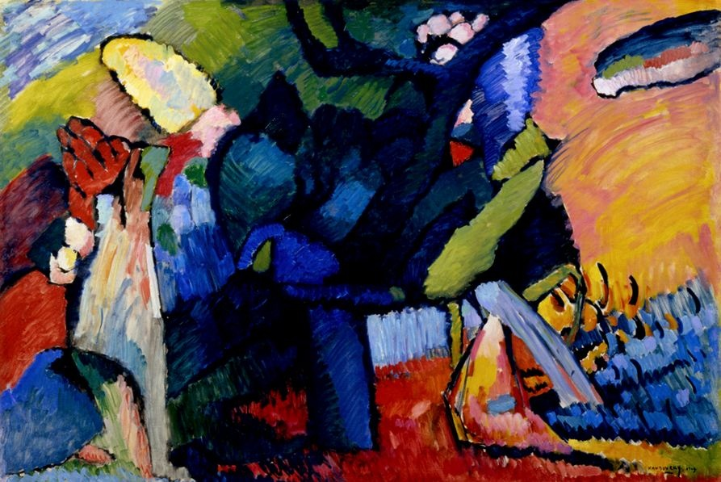

## Impression III (Concert) 印象3（音乐会） 1911 （Wassily Kandinsky, 瓦西里·康定斯基）

https://www.wikiart.org/en/wassily-kandinsky/impression-iii-concert-1911

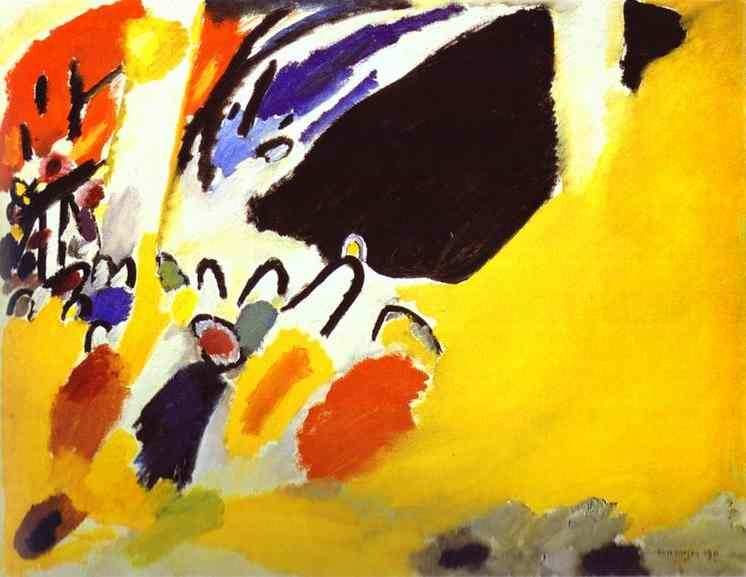

## Picture with a Circle  带圆的画 1911 （Wassily Kandinsky, 瓦西里·康定斯基）

http://www.wassilykandinsky.net/work-432.php

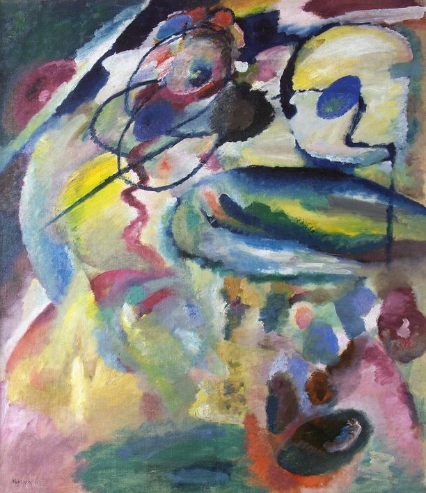

## Composition IV 作曲 4 1911（Wassily Kandinsky, 瓦西里·康定斯基）

https://www.wikiart.org/en/wassily-kandinsky/composition-iv-1911

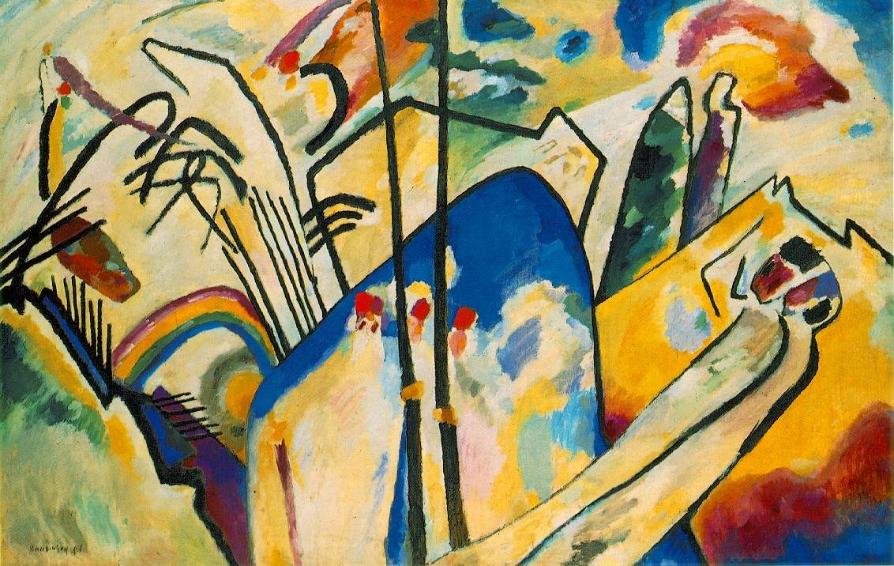

## Composition VII 作曲 7 1913（Wassily Kandinsky, 瓦西里·康定斯基）

http://www.wassilykandinsky.net/work-36.php

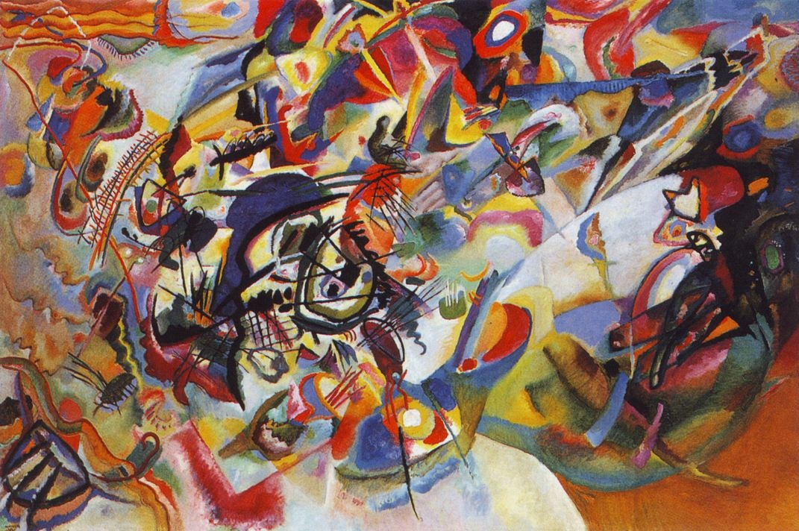

## Hammamet with mosque 哈马马特的清真寺 1914（Paul Klee, 保罗·克利）

https://www.wikiart.org/en/paul-klee/hammamet-with-mosque-1914

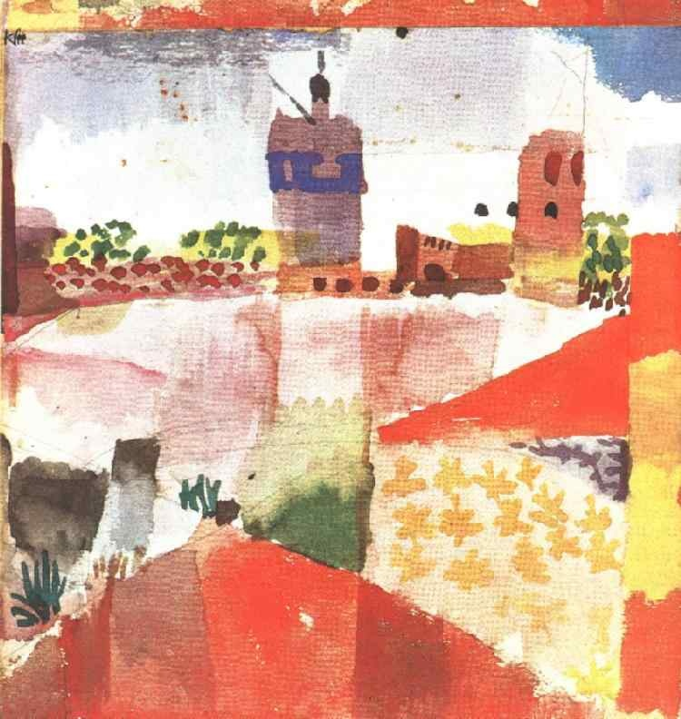
