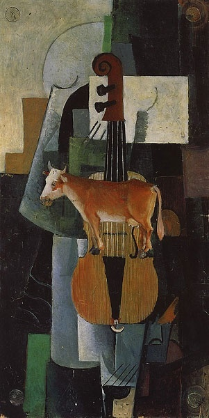
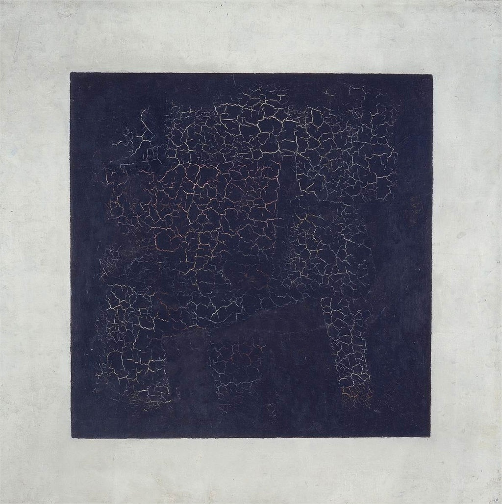
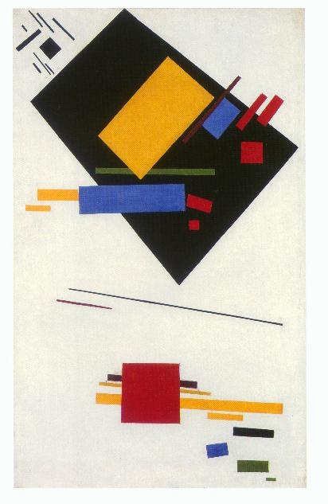
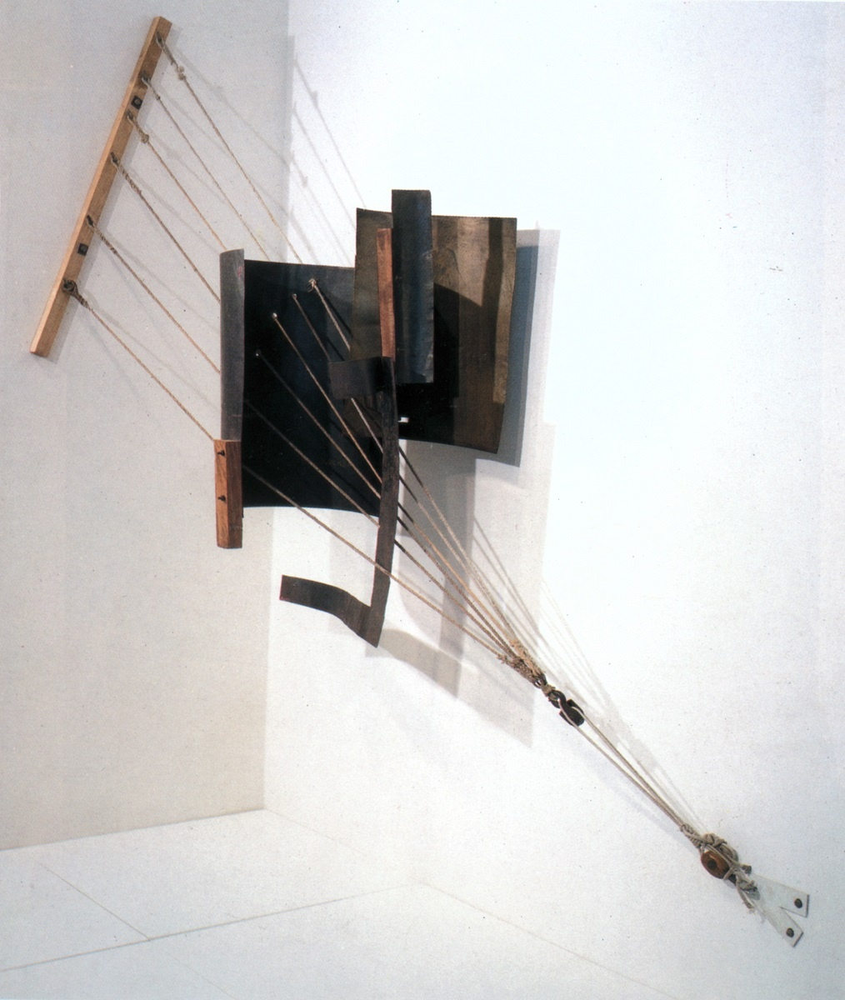
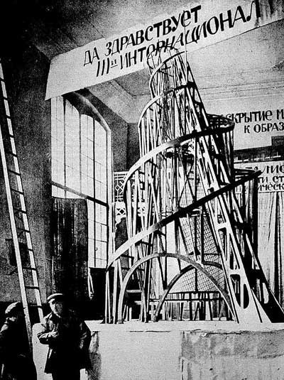
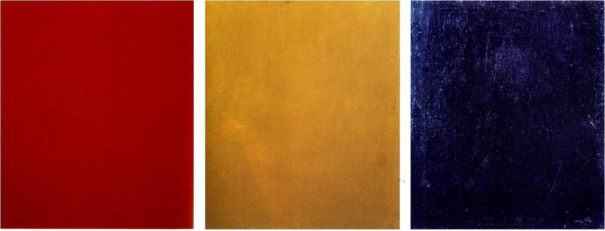
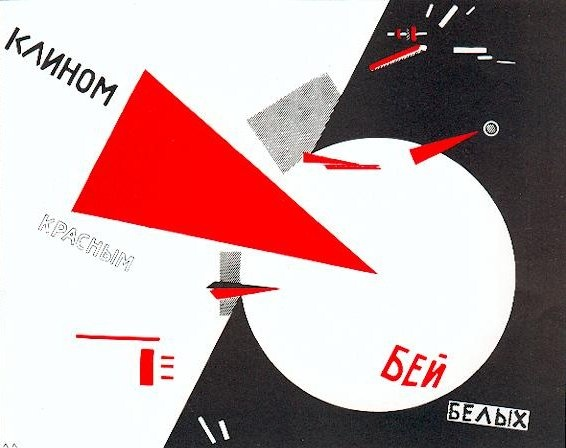

# 10 至上主义/构成主义：俄国人 1915 - 1925

## Cow And Violin 奶牛和小提琴 1913（Kazimir Malevich, 卡济米尔·马列维奇）

http://russianartgallery.org/famous/malevich_cow.htm

## Black Square 黑色正方形 1915 （Kazimir Malevich, 卡济米尔·马列维奇）

https://en.wikipedia.org/wiki/Black_Square_(painting)

## Suprematist Painting 至上主义 1915 （Kazimir Malevich, 卡济米尔·马列维奇）

http://www.ibiblio.org/eldritch/el/mpix.html

## Corner Counter-Relief 1914 角落的反浮雕（Vladimir Tatlin, 弗拉基米尔·塔特林）

http://rusmuseumvrm.ru/data/collections/sculpture/20/tatlin_ve_uglovoy_kontrrelef_1914/index.php?lang=en

## Monument to the Third International 第三国际的纪念塔 1919-1920（Vladimir Tatlin, 弗拉基米尔·塔特林）

https://en.wikipedia.org/wiki/Tatlin%27s_Tower

## Pure Red Color, Pure Yellow Color, Pure Blue Color 纯红、纯黄和纯蓝 1921（Alexander Rodchenko, 亚历山大·罗琴科）

## Beat the Whites with the Red Wedge 以红锲攻打白军 1919（El Lissitzky, 埃尔·利西茨基）

https://en.wikipedia.org/wiki/Beat_the_Whites_with_the_Red_Wedge

