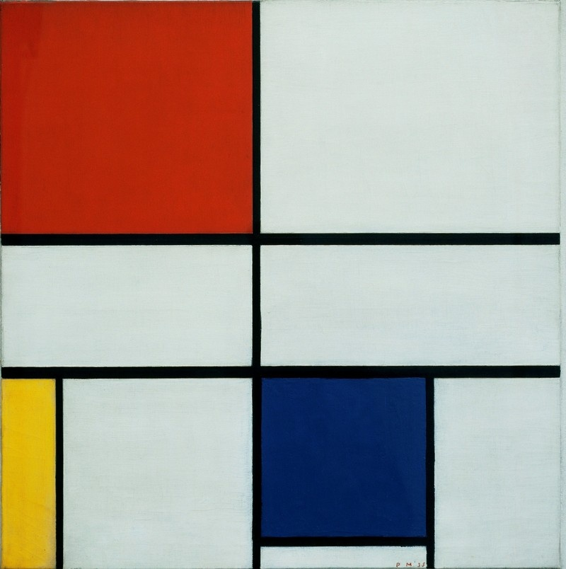
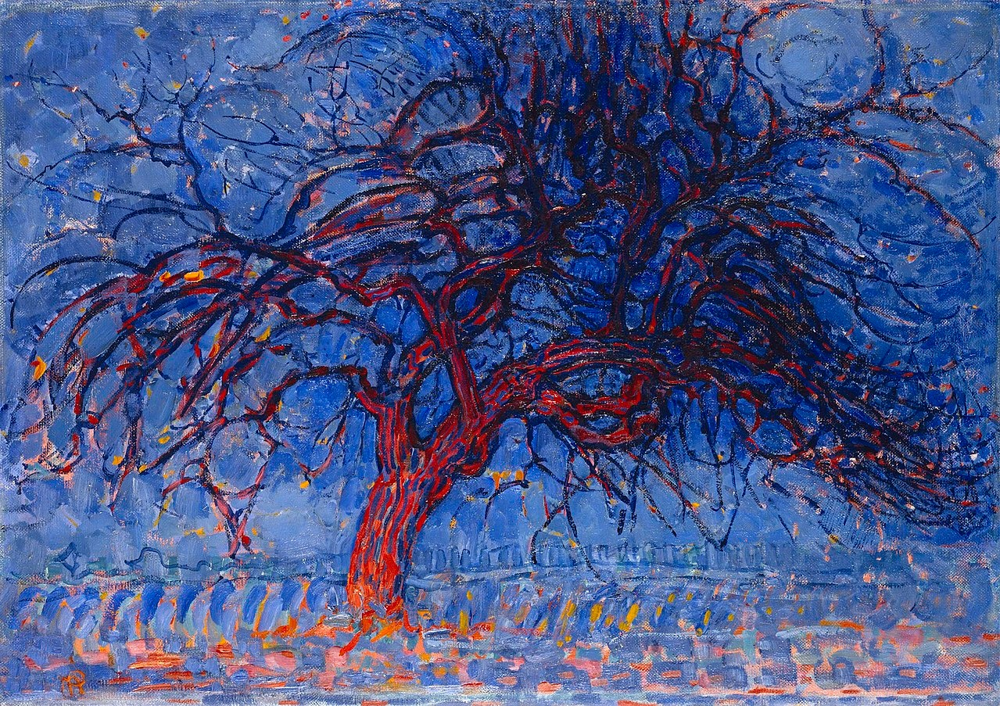
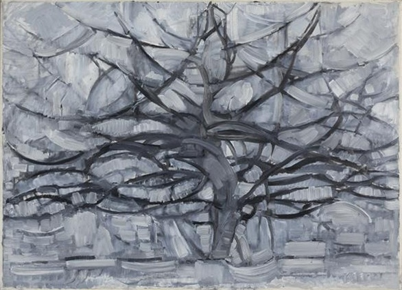
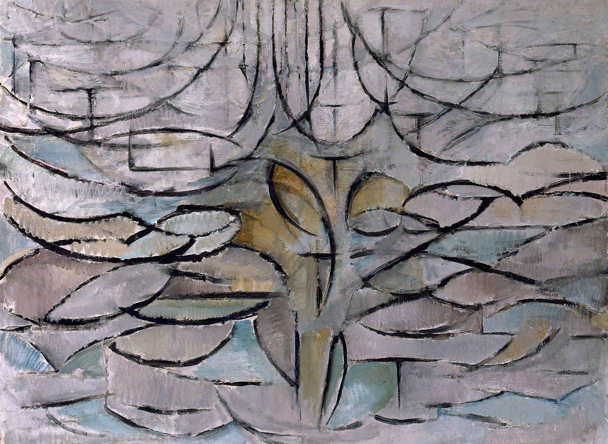
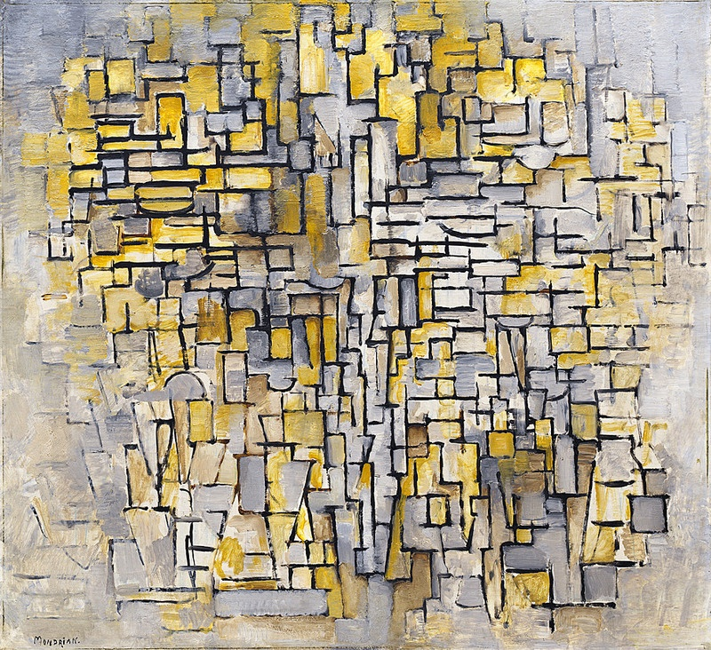
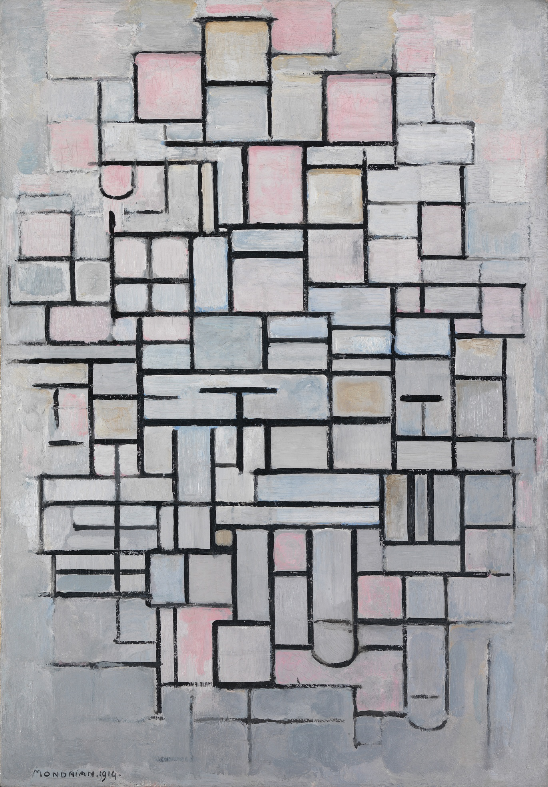
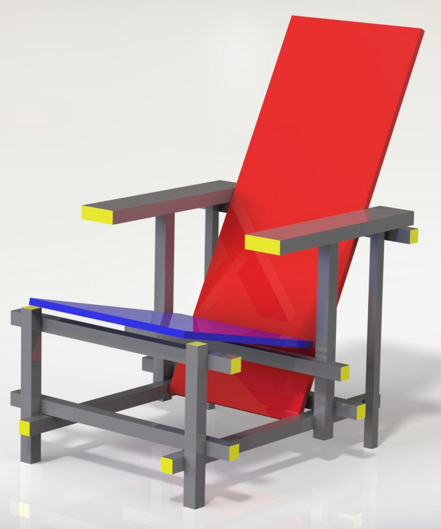
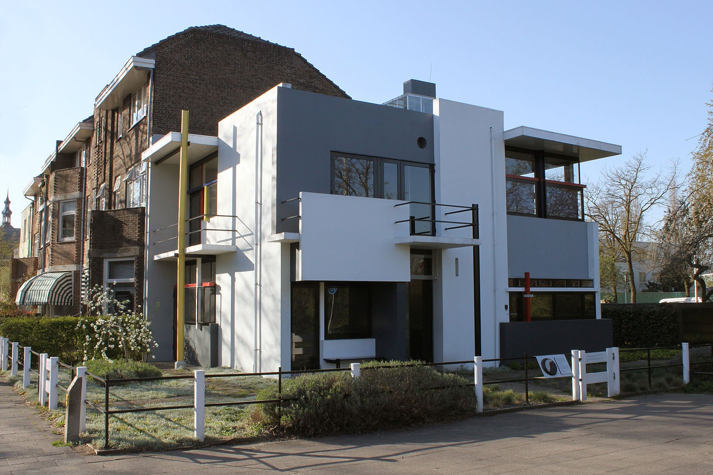
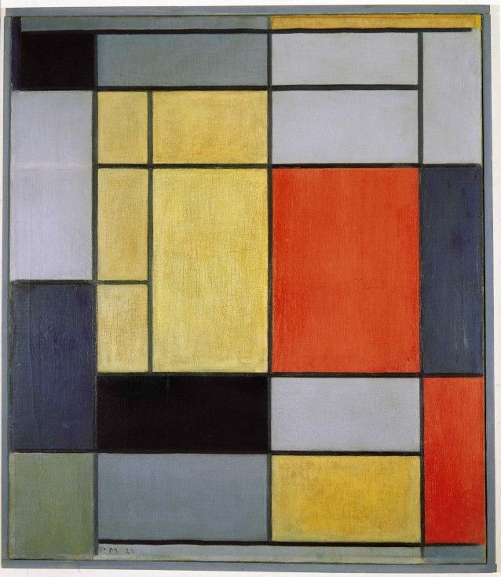

# 11 新造型主义：网格 1917 - 1931

## Composition C (No.III) with Red, Yellow and Blue构成C（第 3号），红黄蓝 1935（Piet Mondrian, 皮埃特·蒙特里安）

https://theartstack.com/artist/piet-mondrian/composition-c-no-iii-with-red-yellow-and-blue#

## Evening; Red Tree 夜晚，红树 1908 （Piet Mondrian, 皮埃特·蒙特里安）

https://en.wikipedia.org/wiki/Evening;_Red_Tree

## Gray Tree 灰色的树 1912 （Piet Mondrian, 皮埃特·蒙特里安）

https://en.wikipedia.org/wiki/Gray_Tree

## Blossoming Apple Tree  开花的苹果树 1912 （Piet Mondrian, 皮埃特·蒙特里安）

https://en.wikipedia.org/wiki/Evening;_Red_Tree#/media/File:Blossoming_apple_tree,_by_Piet_Mondriaan.jpg

## Tableau No. 2/Composition No. VII 画面 2/构成 7 1913 （Piet Mondrian, 皮埃特·蒙特里安）

https://theartstack.com/artist/piet-mondrian/tableau-no-2-compositio

## Composition No VI 构成 6 1914 （Piet Mondrian, 皮埃特·蒙特里安）

## Red and Blue Chair 红蓝椅 1923 （Gerrit Rietveld, 赫里特·里特费尔德）

http://www.theartstory.org/movement-de-stijl-artworks.htm

## Rietveld Schröder House 施罗德住宅 1924 （Gerrit Rietveld, 赫里特·里特费尔德）

https://en.wikipedia.org/wiki/Rietveld_Schr%C3%B6der_House

## Composition No.1 构成第一号 1920 （Piet Mondrian, 皮埃特·蒙特里安）

