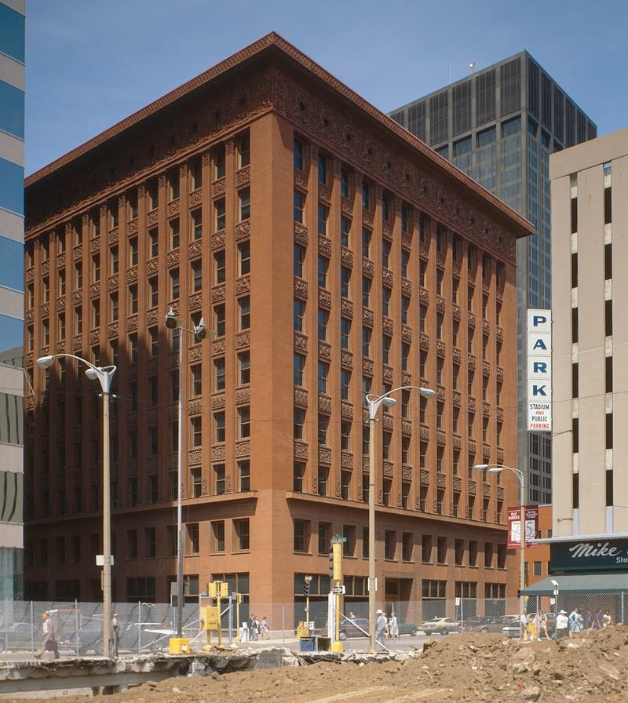
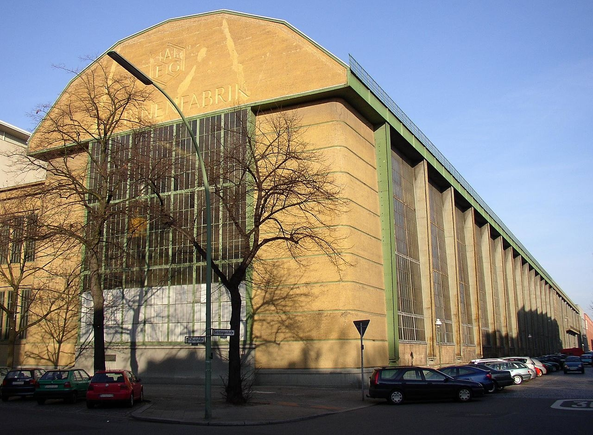
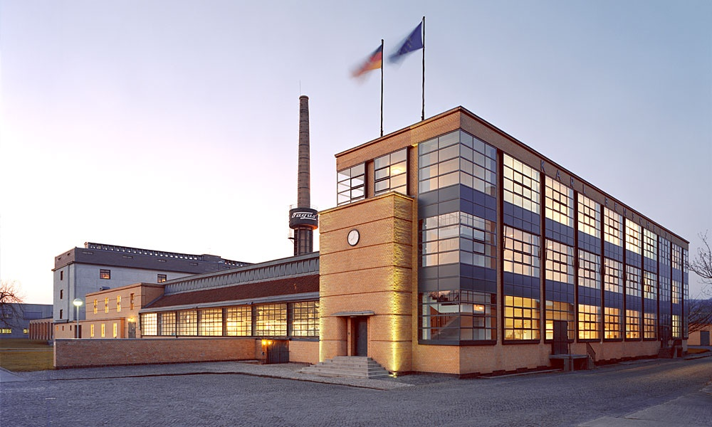

# 12 包豪斯：校园重聚 1919 - 1933

## Wainwright Building 温赖特大厦 1891（ Dankmar Adler and Louis Sullivan, 阿德勒和路易斯·沙利文）

https://en.wikipedia.org/wiki/Wainwright_Building

## AEG turbine factory 通用电气涡轮机工厂 1909 （Peter Behrens, 彼特·贝伦斯）

https://en.wikipedia.org/wiki/AEG_turbine_factory

## Fagus Factory（German:Fagus-Werk）法古斯工厂 1911-1913 （ Walter Gropius and Adolf Meyer, 沃尔特·格罗佩斯，阿道夫·梅耶）

https://en.wikipedia.org/wiki/Fagus_Factory

