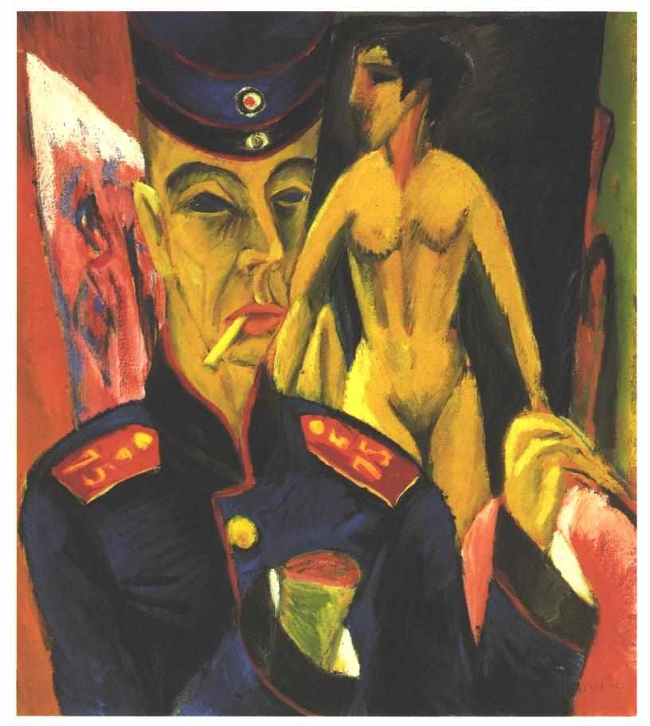
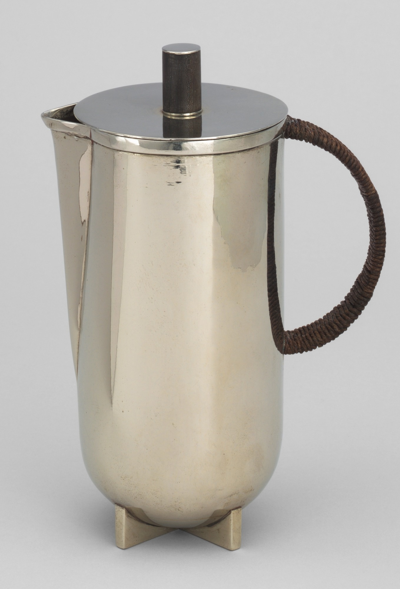
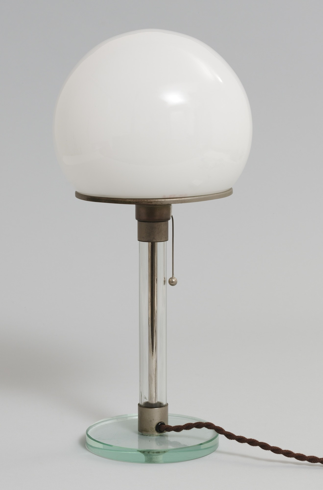
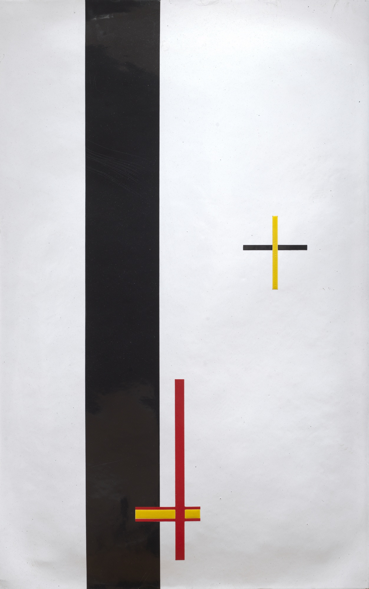
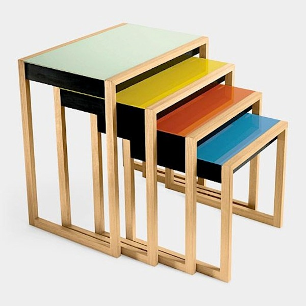
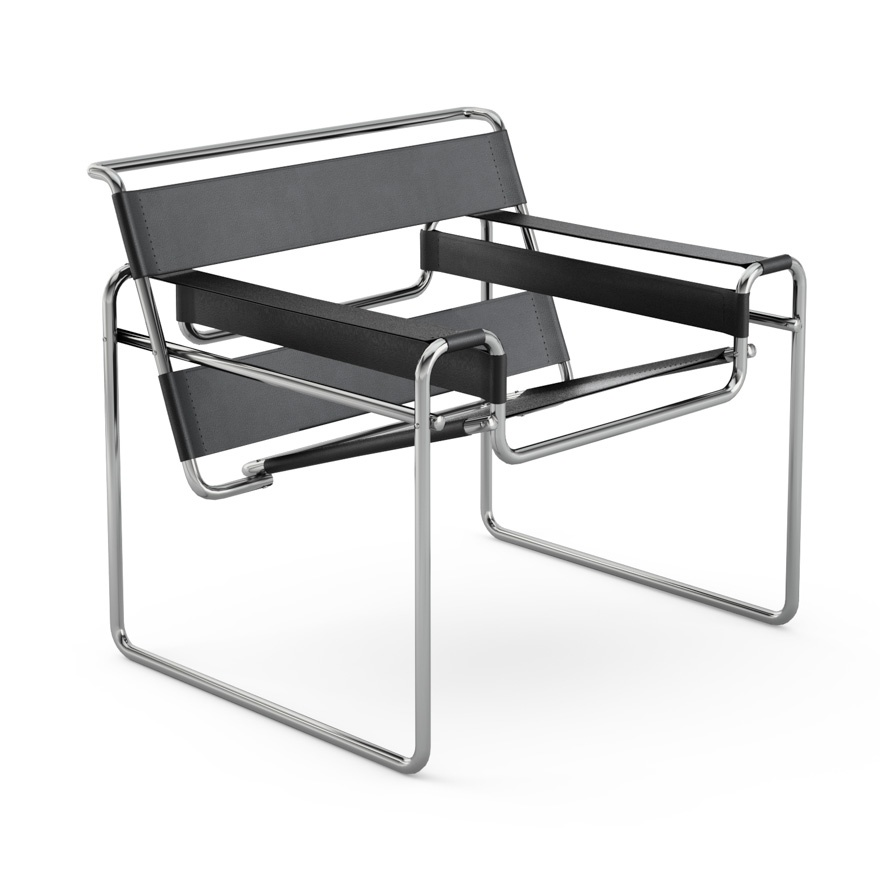
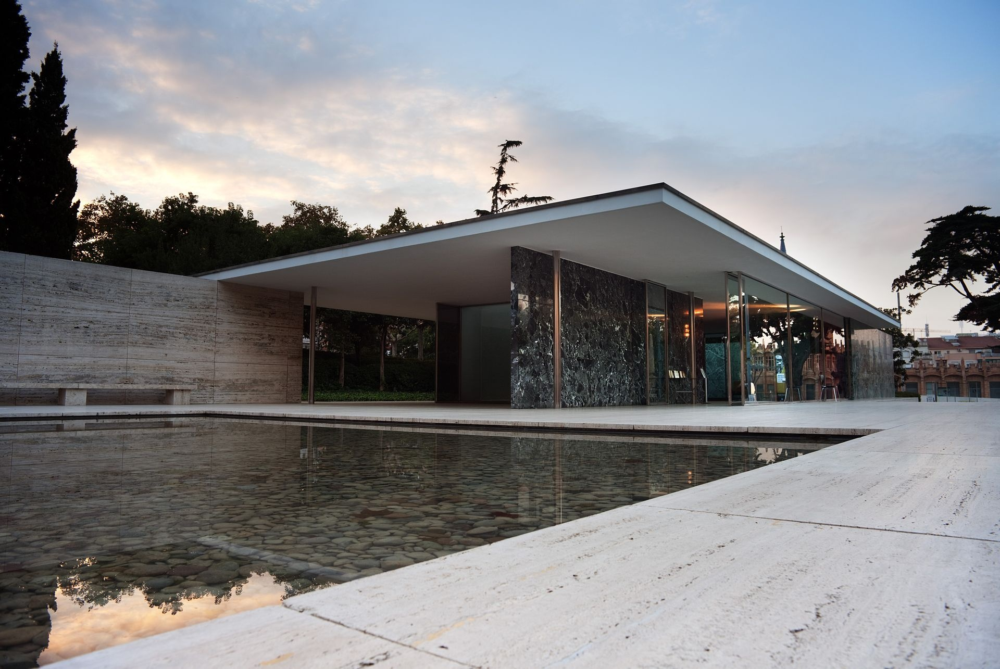
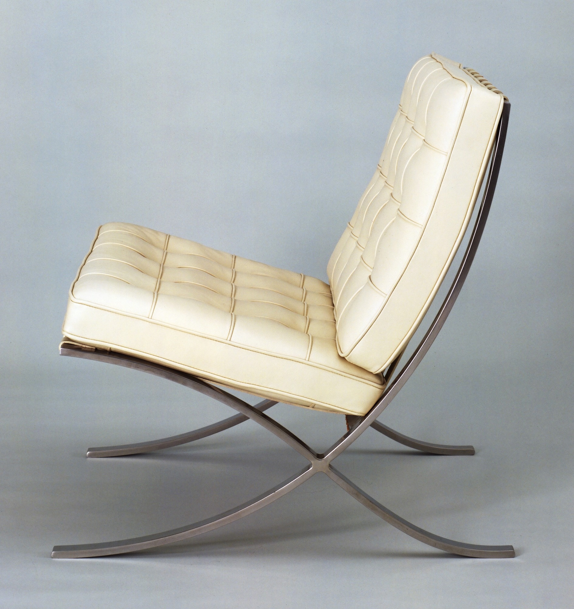

# 包豪斯

## Self-Portrait as a Soldier 作为一个军人的自画像 1915（Ernst Ludwig Kirchner, 恩斯特·路德维希·凯尔希纳）

https://www.wikiart.org/en/ernst-ludwig-kirchner/self-portrait-as-a-soldier-1915

## Hot-Water Jug 1924（Marianne Brandt, 玛丽安·布兰德）

https://www.moma.org/collection/works/2440

## Table Lamp 华根菲尔德台灯 1924（Wilhelm Wagenfeld & Carl Jakob Jucker, 威尔赫姆·华根菲尔德，卡尔·朱克）

https://www.moma.org/collection/works/4056?locale=en

## EM 1 (Telephone Picture) 电话图 EM1 1923 （László Moholy-Nagy, 莫霍利·纳吉）

https://www.moma.org/collection/works/147626

## NESTING TABLES 嵌套桌组 1927 （Josef Albers, 约瑟夫·亚伯斯）

https://blog.timelesswroughtiron.com/2014/09/modern-history-bauhaus-nesting-tables/

## Wassily Chair 瓦西里椅 1925（Marcel Lajos Breuer, 马塞尔·布劳耶）

https://en.wikipedia.org/wiki/Wassily_Chair

## Barcelona Pavilion 巴塞罗那世博会德国馆  1929 （Ludwig Mies van der Rohe, 路德维希·密斯·凡德罗）

https://en.wikipedia.org/wiki/Barcelona_Pavilion

## Barcelona Chair 巴塞罗那椅 1929 （Ludwig Mies van der Rohe, 路德维希·密斯·凡德罗）

https://www.moma.org/collection/works/4369?locale=en

