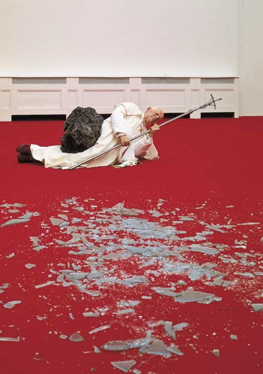
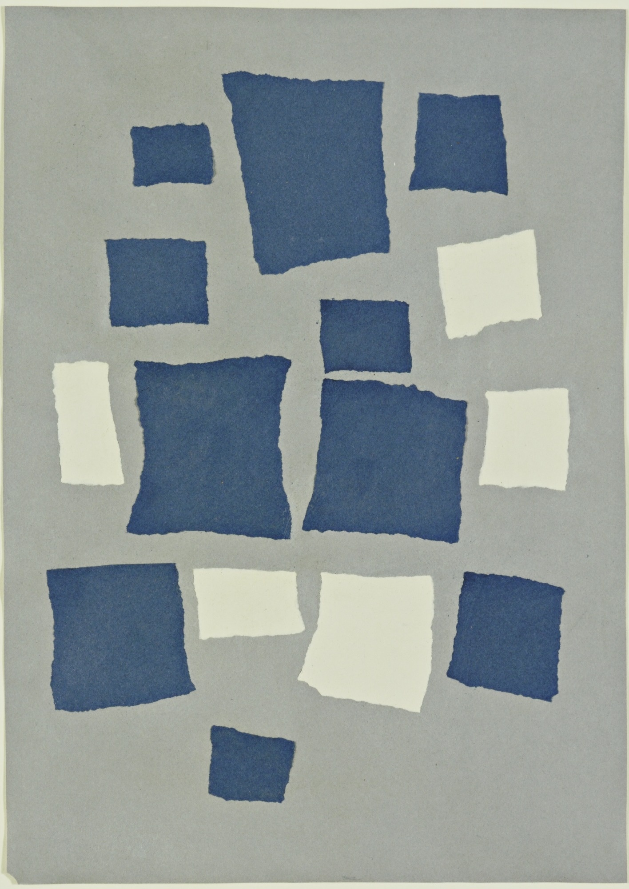
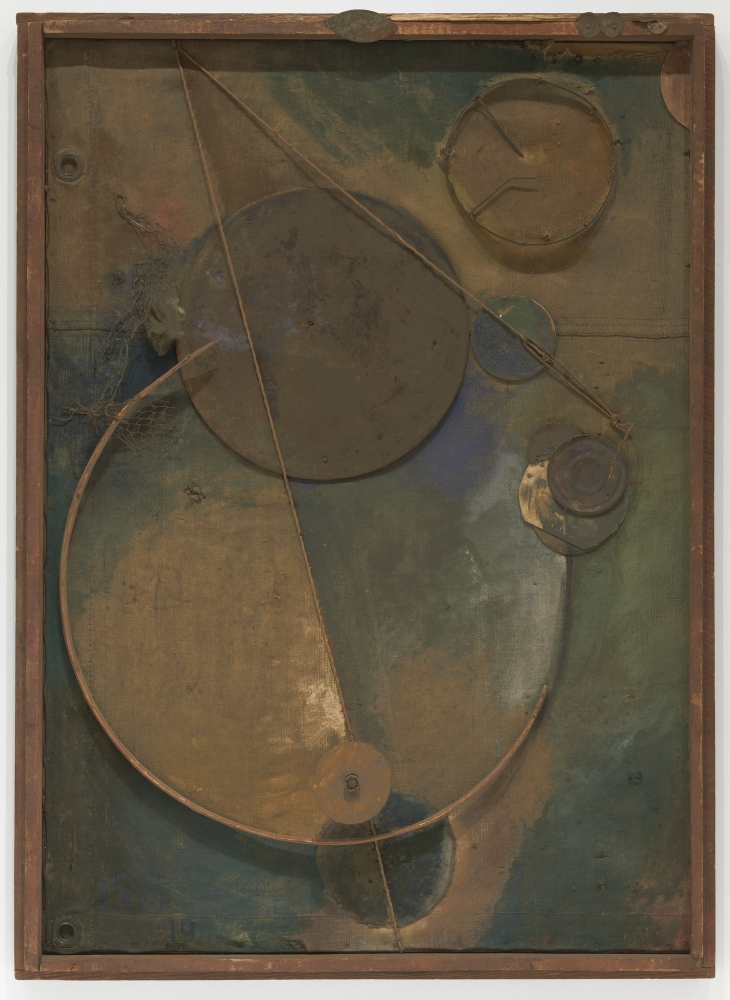
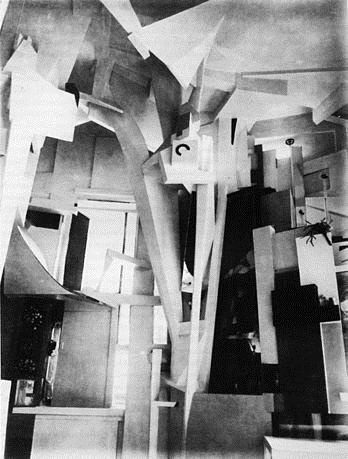
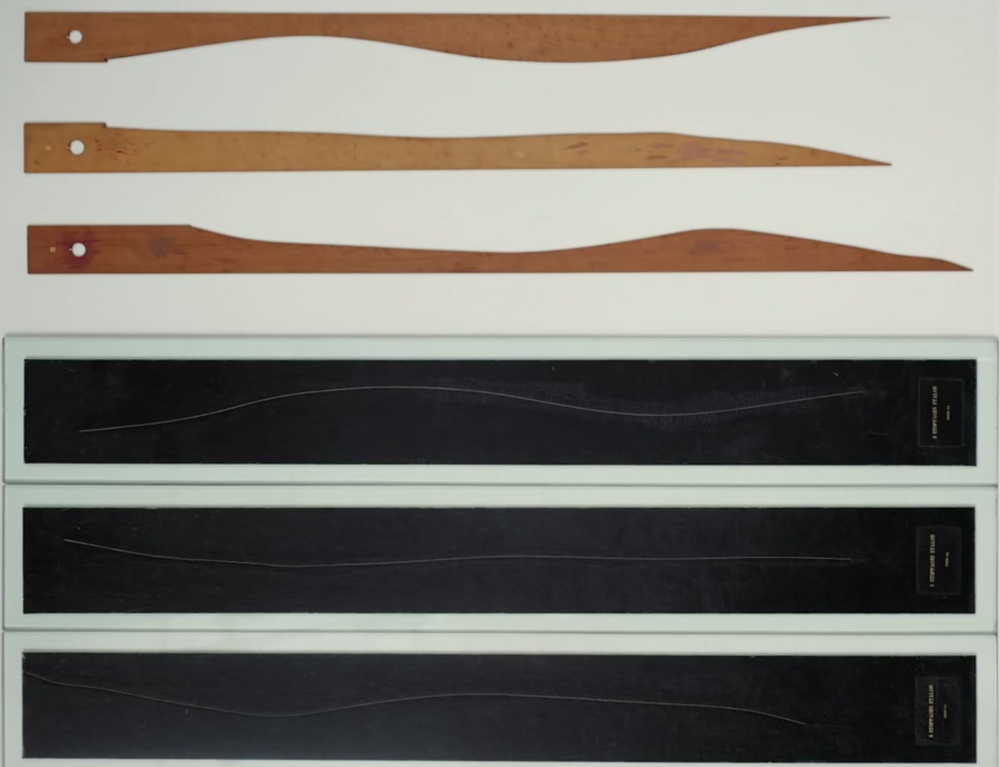
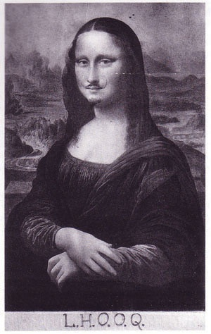
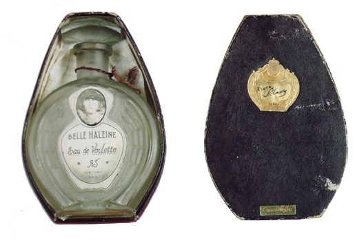

# 13 达达主义：混乱的秩序 1916 - 1923

## La Nona Ora (The Ninth Hour) 第九时辰 1999（Maurizio Cattelan, 莫瑞吉奥·卡特兰）

https://farticulate.wordpress.com/2010/10/21/la-nona-ora-the-ninth-hour-1999/

## Collage with Squares Arranged according to the Laws of Chance 根据随机法则排布的正方形的拼贴画 1916-1917 （Jean （Hans）Arp, 让·阿尔普（汉斯·阿尔普））

https://www.moma.org/collection/works/37013?locale=en

## Revolving 旋转 1919 （Kurt Schwitters, 库尔特·施维特斯）

https://www.moma.org/collection/works/79211?locale=en

## Merzbau 梅尔兹堡 1933 （Kurt Schwitters, 库尔特·施维特斯）

https://www.moma.org/explore/inside_out/2012/07/09/in-search-of-lost-art-kurt-schwitterss-merzbau/

## Standard Stoppages 三个标准的终止 1913-1914（Marcel Duchamp, 马塞尔·杜尚）

https://www.moma.org/collection/works/78990?locale=en

## L.H.O.O.Q. 1919 （Marcel Duchamp, 马塞尔·杜尚）

https://en.wikipedia.org/wiki/L.H.O.O.Q.

## Beautiful Breath: Veil Water 美丽气息 1921 （Marcel Duchamp, 马塞尔·杜尚）

http://www.toutfait.com/unmaking_the_museum/Belle%20Haleine.html

