# 14 超现实主义：以梦为生 1924 - 1945

## The Persistence of Memory 永恒的记忆 1931（Salvador Dalí, 萨尔瓦多·达利）

https://www.moma.org/collection/works/79018?locale=en

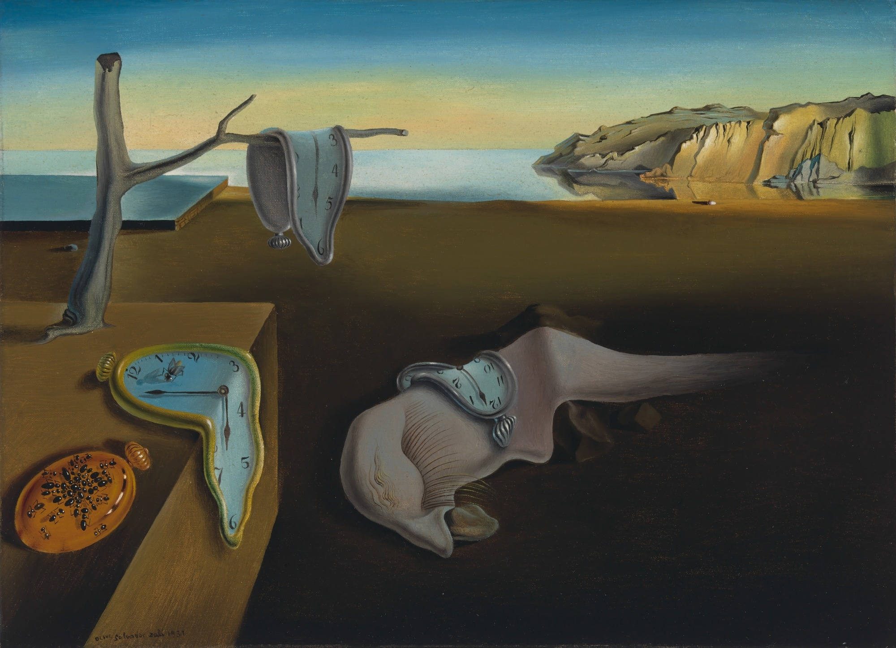

## Lobster Telephone 龙虾电话 1936 （Salvador Dalí, 萨尔瓦多·达利）

https://en.wikipedia.org/wiki/Lobster_Telephone

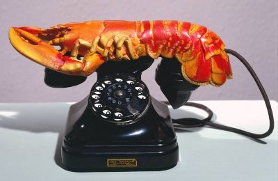

## Maman 妈妈 1999（Louise Bourgeois, 路易丝·布尔乔亚）

https://en.wikipedia.org/wiki/Maman_(sculpture)

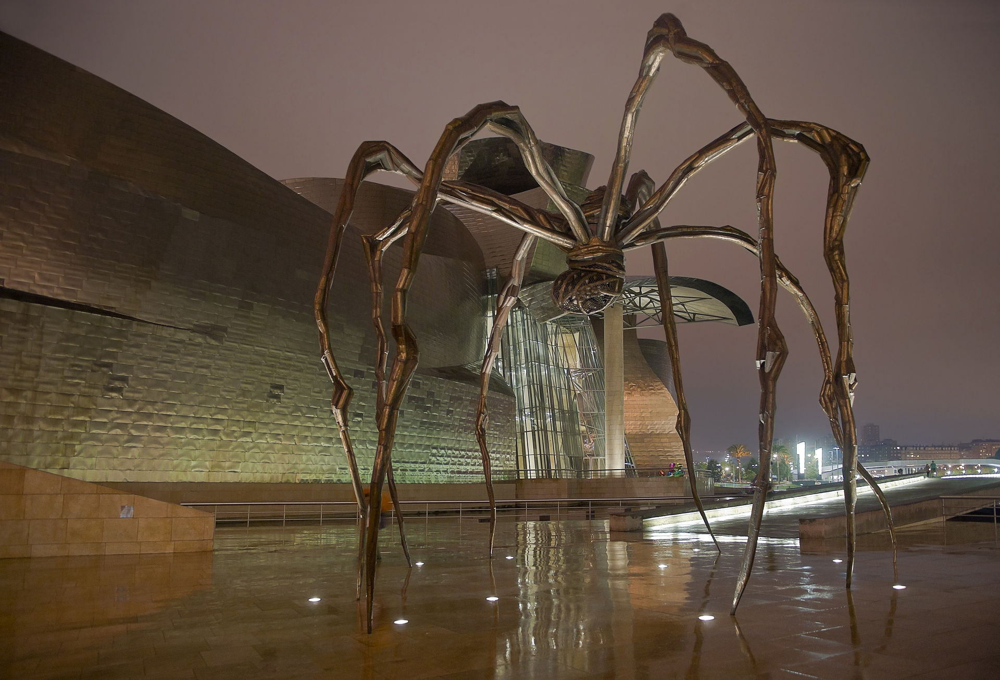

## The Three Dancers 三个舞蹈者 1925（Pablo Picasso, 巴勃罗·毕加索）

http://www.tate.org.uk/art/artworks/picasso-the-three-dancers-t00729

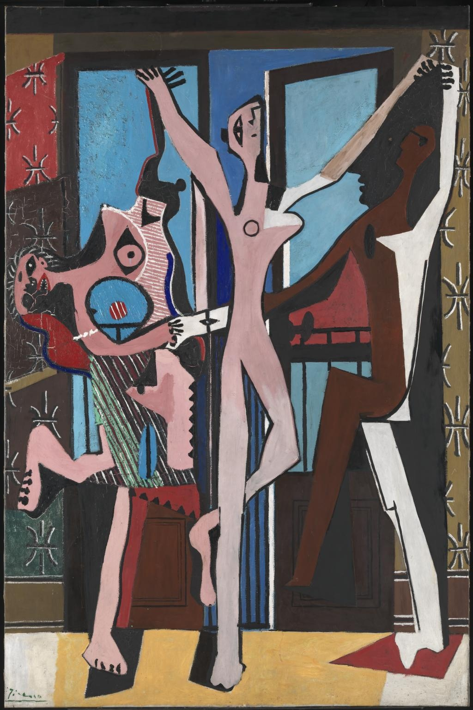

## The Harlequin's Carnival 小丑的狂欢夜 1924-1925（Joan Miró, 胡安·米罗）

https://en.wikipedia.org/wiki/The_Harlequin%27s_Carnival

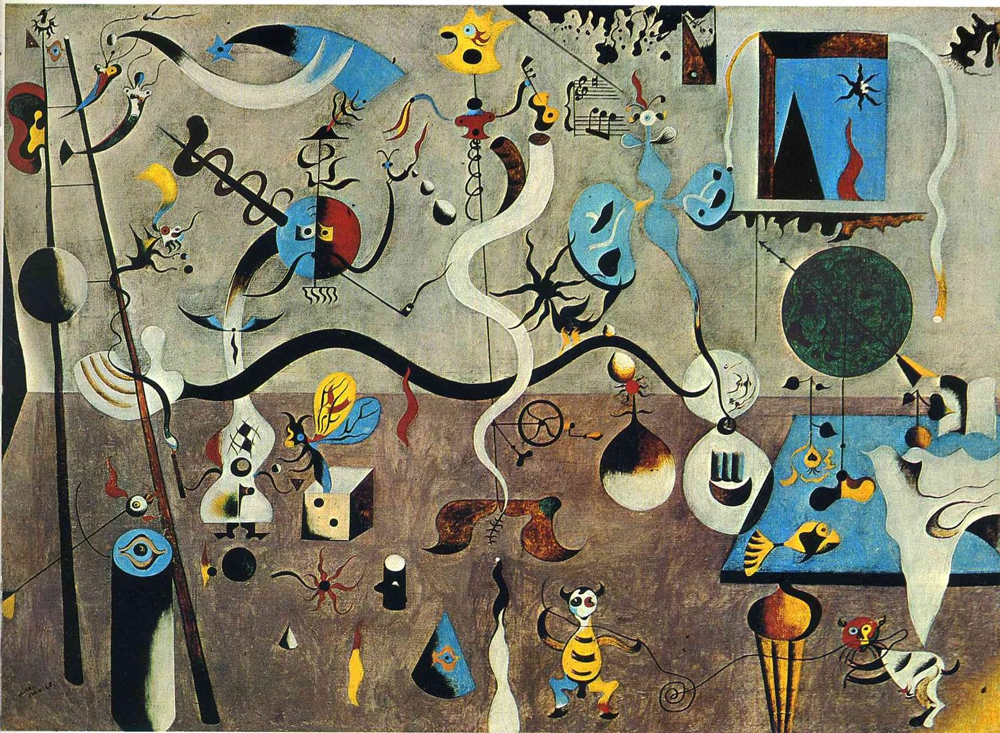

## The Elephant Celebes (or short Celebes) 西里伯斯 1921（Max Ernst, 马克斯·恩斯特）

https://en.wikipedia.org/wiki/The_Elephant_Celebes

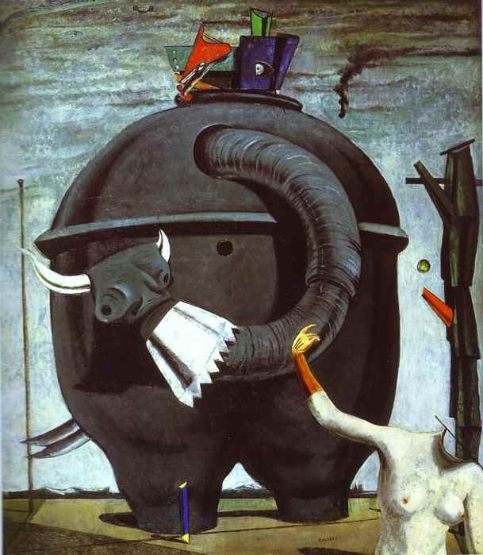

## Forest and Dove 森林与鸽子 1927 （Max Ernst, 马克斯·恩斯特）

http://www.tate.org.uk/art/artworks/ernst-forest-and-dove-t00548

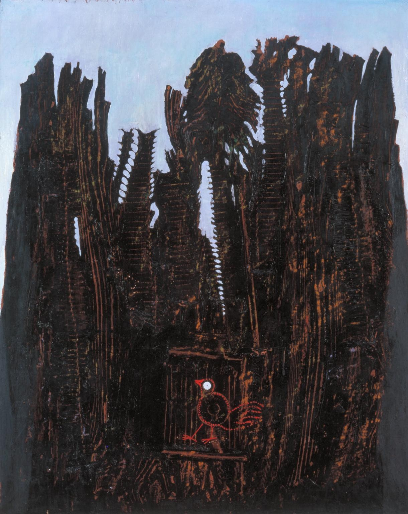

## The Menaced Assassin 受威胁的暗杀者 1927 （René Magritte, 勒内·马格里特）

https://www.moma.org/collection/works/79267?locale=zh

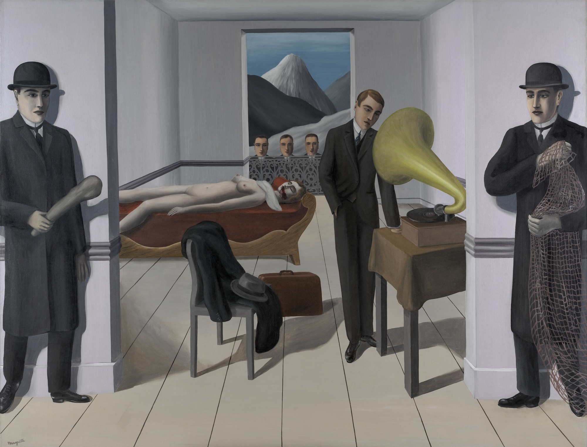

## The Song of Love 爱之歌 1914（Giorgio de Chirico, 乔治·德·基里科）

https://en.wikipedia.org/wiki/The_Song_of_Love

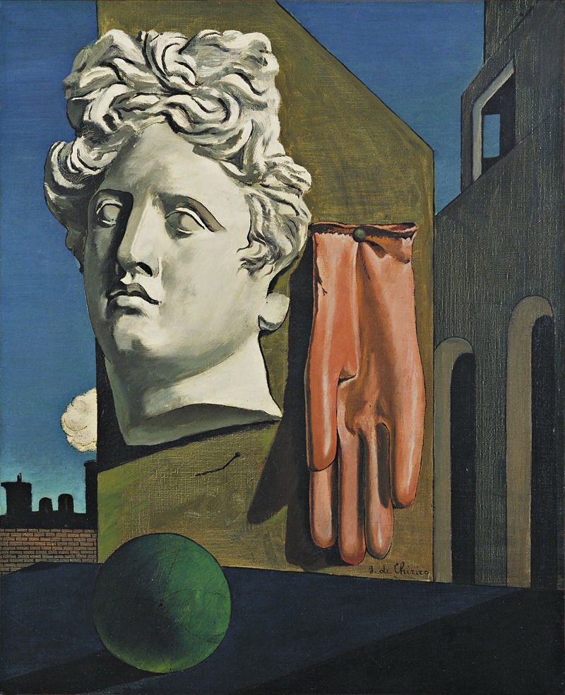

## Nighthawks 夜鹰 1924（Edward Hopper, 爱德华·霍普）

https://en.wikipedia.org/wiki/Nighthawks

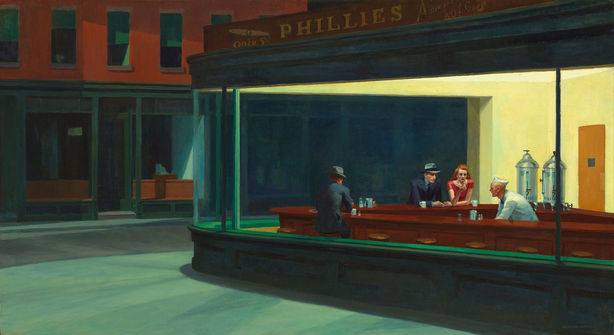

## Primacy of Matter over Thought 物质相对于思想的第一性 1929（Man Ray（born Emmanuel Radnitzky）, 曼·雷）

https://www.wikiart.org/en/man-ray/primacy-of-matter-over-thought-1929

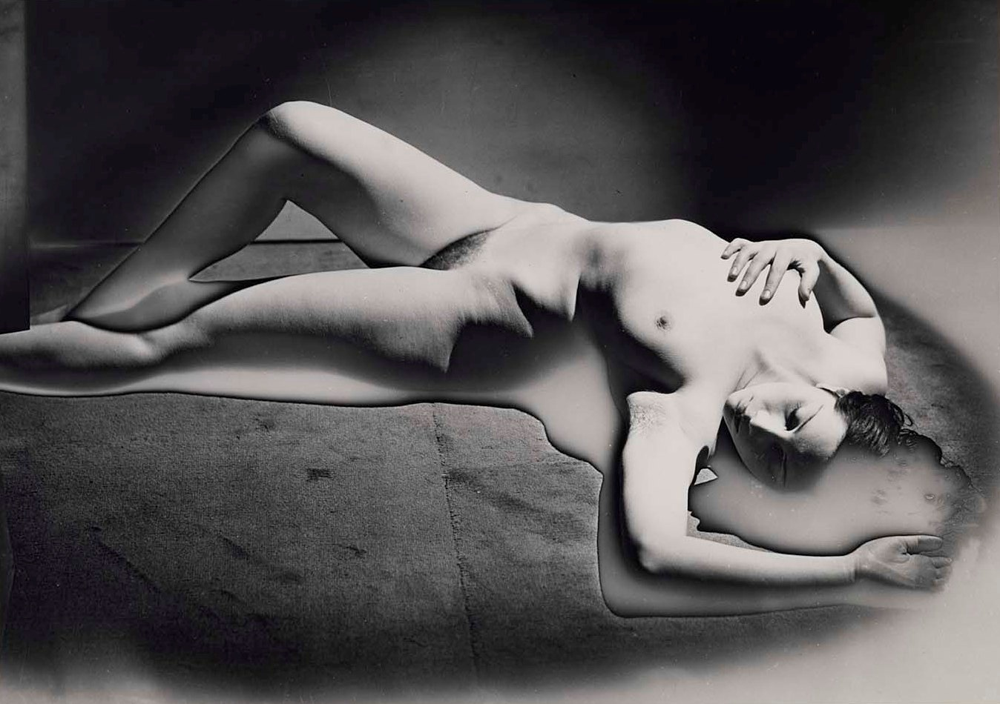

## Object ("The Luncheon in Fur") 1936（Méret Oppenheim, 莫瑞特·奥本海姆）

https://www.moma.org/collection/works/80997?locale=en

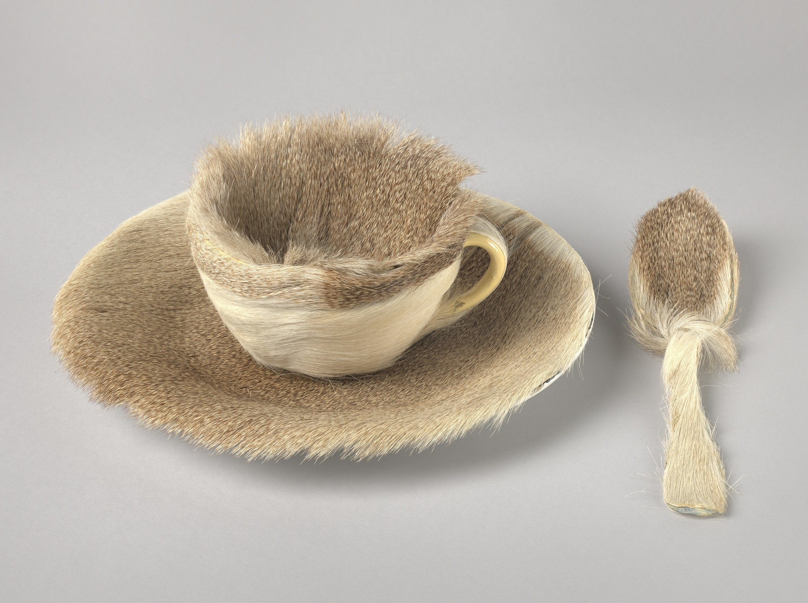

## Erotique voilée 色情的面纱 1933（Man Ray（born Emmanuel Radnitzky）, 曼·雷）

http://www.museoreinasofia.es/en/collection/artwork/erotique-voilee-veiled-erotic

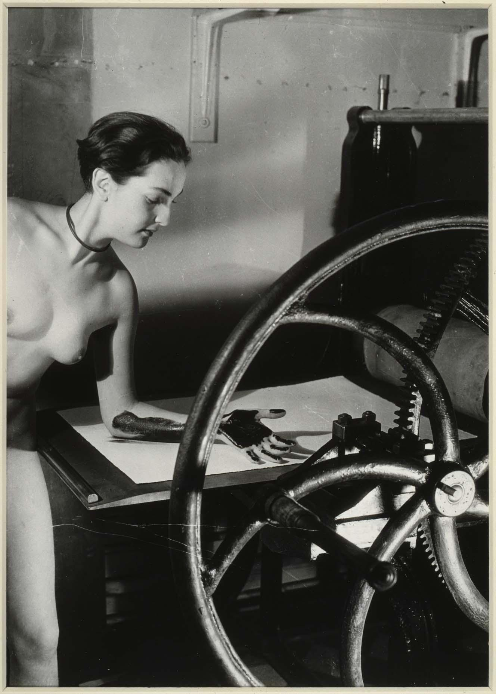

## The Dream (The Bed) 梦 1940（Frida Kahlo, 弗里达·卡罗）

https://www.wikiart.org/en/frida-kahlo/the-dream-the-bed-1940

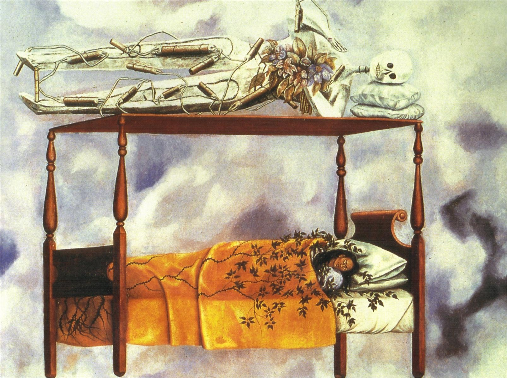

## Self Portrait - The Frame 自画像：框架 1938 （Frida Kahlo, 弗里达·卡罗）

https://www.wikiart.org/en/frida-kahlo/self-portrait-the-frame-1938

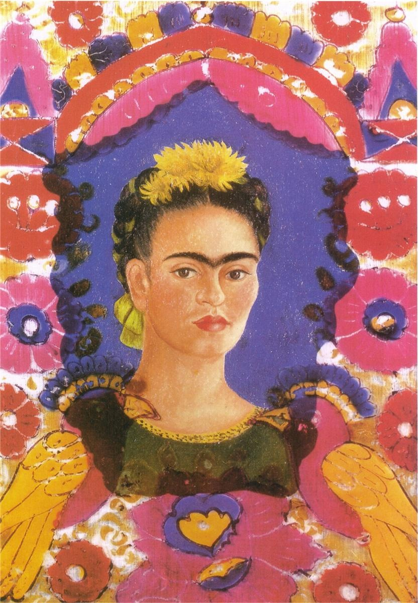

## Self-Portrait: The Inn of the Dawn Horse 自画像：黎明马客栈 1937-1938 （Leonora Carrington, 利奥诺拉·卡灵顿）

https://curiator.com/art/leonora-carrington/self-portrait-inn-of-the-dawn-horse

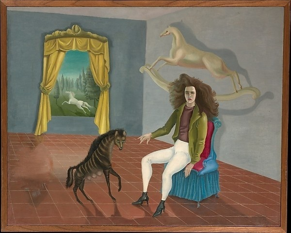
