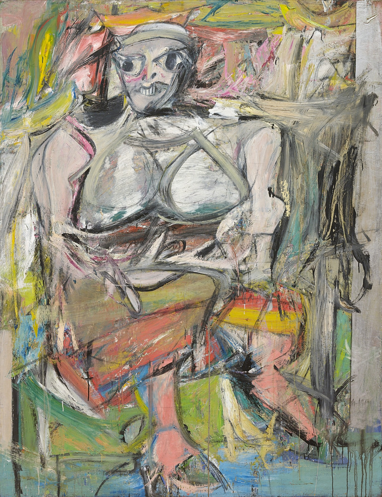

# 15 抽象表现主义：宏大的姿态 1943 - 1970

## Men in the city 城市里的人 1919（Fernand Léger, 费尔南德·莱热）

https://www.wikiart.org/en/fernand-leger/men-in-the-city-1919

## Bird in Space 空间中的鸟 1928（Constantin Brâncuși, 康斯坦丁·布朗库西）

https://www.moma.org/collection/works/81033?locale=en

## Stenographic Figure 速记人物 1942 （Jackson Pollock, 杰克逊·波洛克）

https://www.moma.org/collection/works/79686?locale=en

## Mural 壁画 1943（Jackson Pollock, 杰克逊·波洛克）

https://www.wikiart.org/en/jackson-pollock/mural-1943-1

## The She-Wolf 母狼 1943 （Jackson Pollock, 杰克逊·波洛克）

https://www.moma.org/collection/works/78719?locale=en

## Full Fathom Five 满五英寻 1947 （Jackson Pollock, 杰克逊·波洛克）

https://www.moma.org/collection/works/79070?locale=en

## Painting 画 1948 （Willem de Kooning, 威廉·德·库宁）

https://www.moma.org/collection/works/79242?locale=en

## Excavation 挖掘 1950 （Willem de Kooning, 威廉·德·库宁）

https://www.wikiart.org/en/willem-de-kooning/excavation

## Woman I 女人1 1950-1952 （Willem de Kooning, 威廉·德·库宁）

https://www.moma.org/collection/works/79810?locale=en

## Onement, I 太一 1 1948 （Barnett Newman, 巴尼特·纽曼）

https://www.moma.org/collection/works/79601?locale=en

## Vir Heroicus Sublimis 人，英勇而崇高 1950-1951 （Barnett Newman, 巴尼特·纽曼）

https://www.moma.org/collection/works/79250?locale=en

## Untitled (Violet, Black, Orange, Yellow on White and Red) 无题（白红上的紫罗兰色、黑色、橙色和黄色） 1949 （Mark Rothko, 马克·罗斯科）

https://www.guggenheim.org/artwork/3533

## Ochre and Red on Red 赭石，红上之红 1949 （Mark Rothko, 马克·罗斯科）

https://www.wikiart.org/en/mark-rothko/ochre-and-red-on-red-1

## Australia 澳大利亚 1951 （David Smith, 大卫·史密斯）

https://www.moma.org/collection/works/82047?locale=en

## Early One Morning 一天清晨 1962 （Anthony Caro, 安东尼·卡洛）

http://www.tate.org.uk/art/artworks/caro-early-one-morning-t00805

