# 16 波普艺术：零售疗法 1956 - 1970

## I was a Rich Man’s Plaything 我是一个有钱人的玩物 1947 （Eduardo Paolozzi, 爱德华多·保罗齐）

http://www.tate.org.uk/art/artworks/paolozzi-i-was-a-rich-mans-plaything-t01462

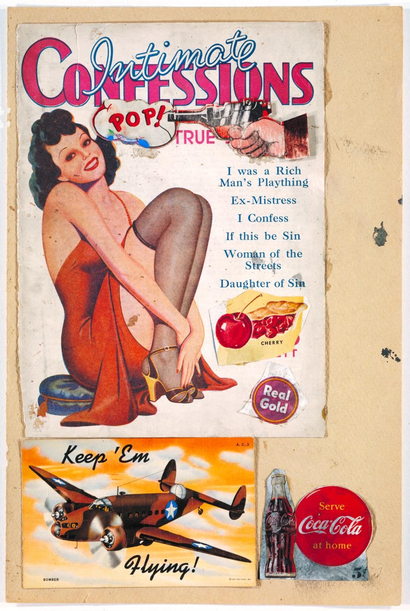

## Just what is it that makes today's homes so different, so appealing? 是什么让今天的家庭如此不同、如此富有魅力？ 1956 （Richard Hamilton, 理查德·汉密尔顿）

https://en.wikipedia.org/wiki/Just_what_is_it_that_makes_today%27s_homes_so_different,_so_appealing%3F

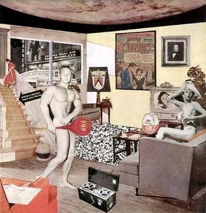

## Flag 旗 1954-1955（Jasper Johns, 贾斯培·琼斯）

https://www.moma.org/collection/works/78805?locale=en

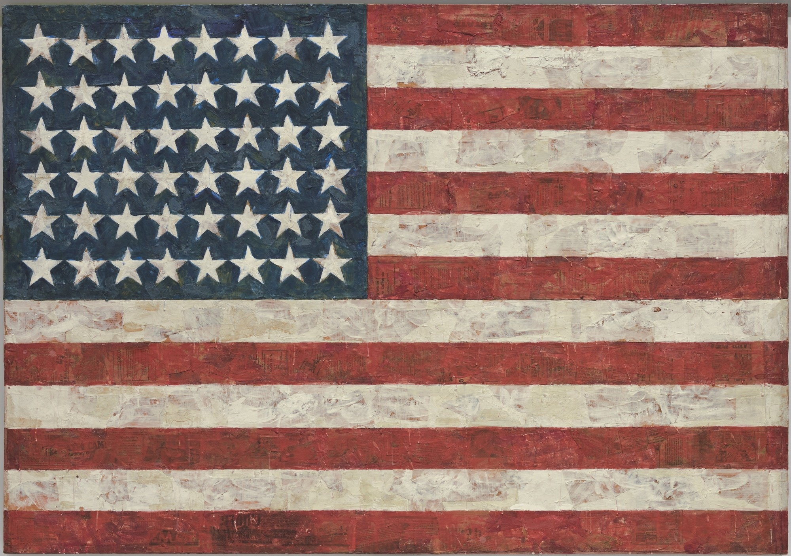

## Monogram 字母组合 1955-1959（Robert Rauschenberg, 罗伯特·劳森伯格）

https://www.moma.org/audio/playlist/40/648

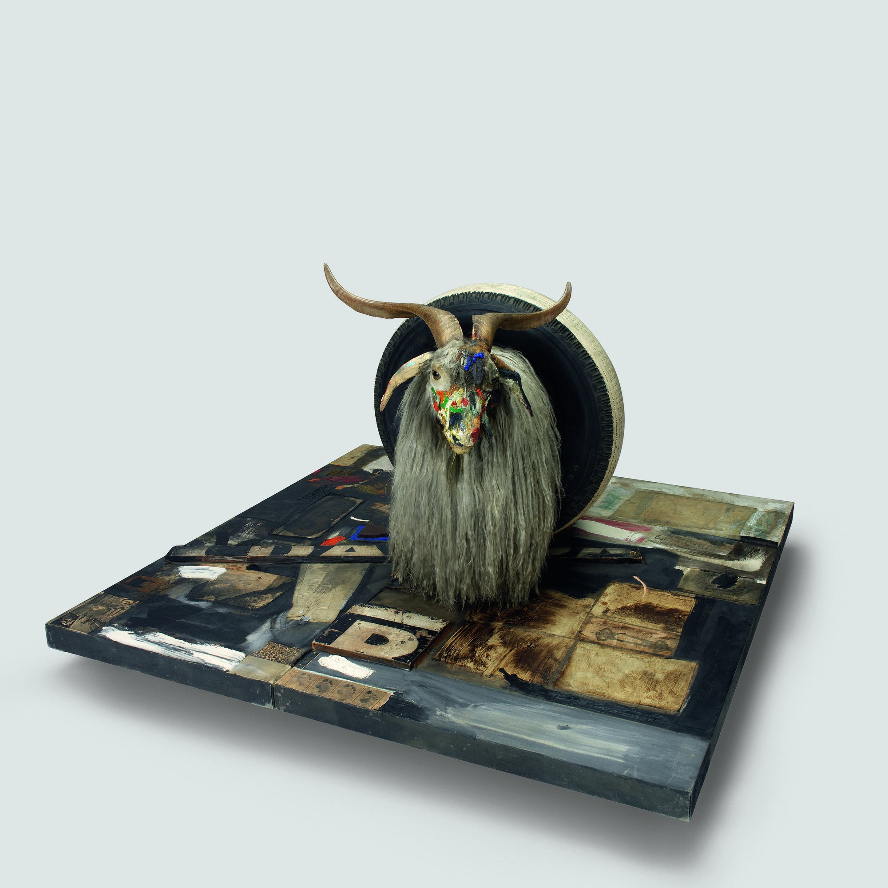

## White Painting 白色绘画 1951 （Robert Rauschenberg, 罗伯特·劳森伯格）

https://www.moma.org/audio/playlist/40/639

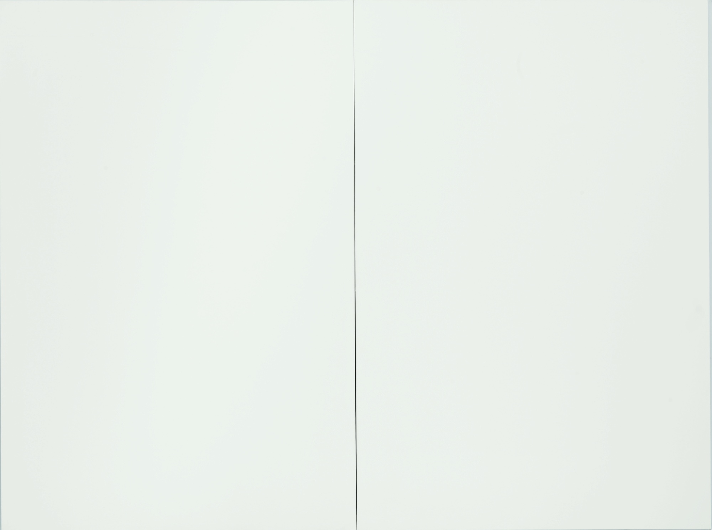

## Erased de Kooning Drawing 擦除的德·库宁绘画 1953 （Robert Rauschenberg, 罗伯特·劳森伯格）

https://www.rauschenbergfoundation.org/art/artwork/erased-de-kooning-drawing

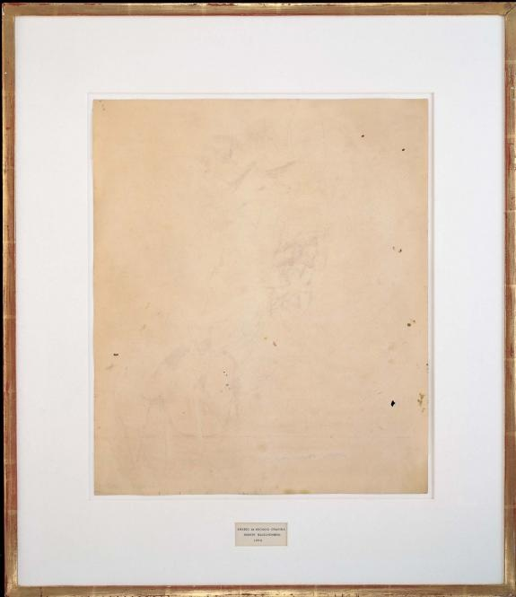

## Coca-Cola[1] 可口可乐[1] 1961（Andy Warhol, 安迪·沃霍尔）

https://www.zhihu.com/question/22057640

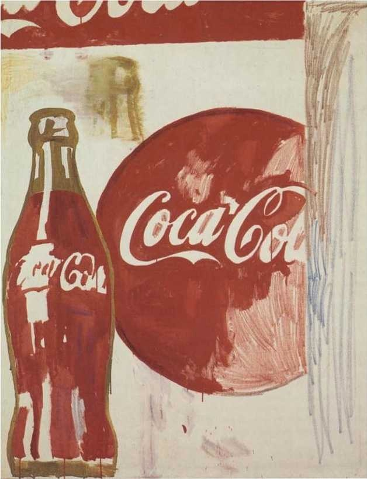

## Water Heater 热水器 1961 （Andy Warhol, 安迪·沃霍尔）

https://www.moma.org/collection/works/80290?locale=en

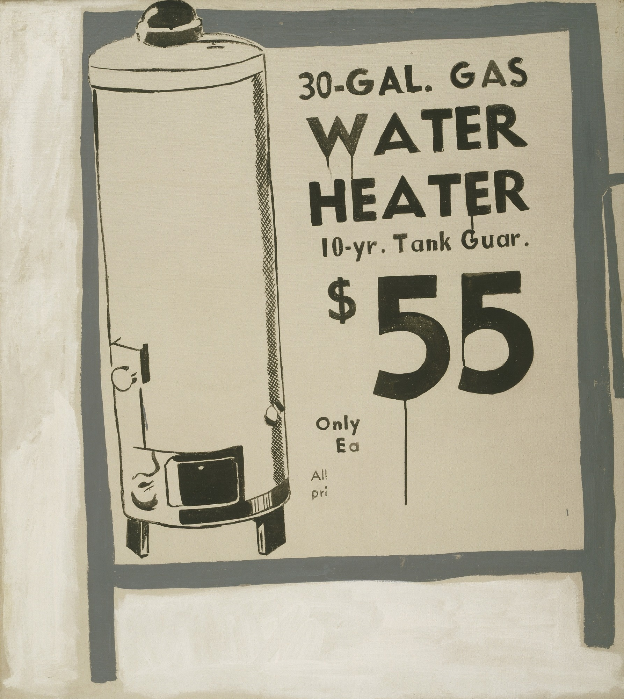

## Campbell's Soup Cans 金宝汤罐头 1962 （Andy Warhol, 安迪·沃霍尔）

https://www.moma.org/collection/works/79809?locale=en

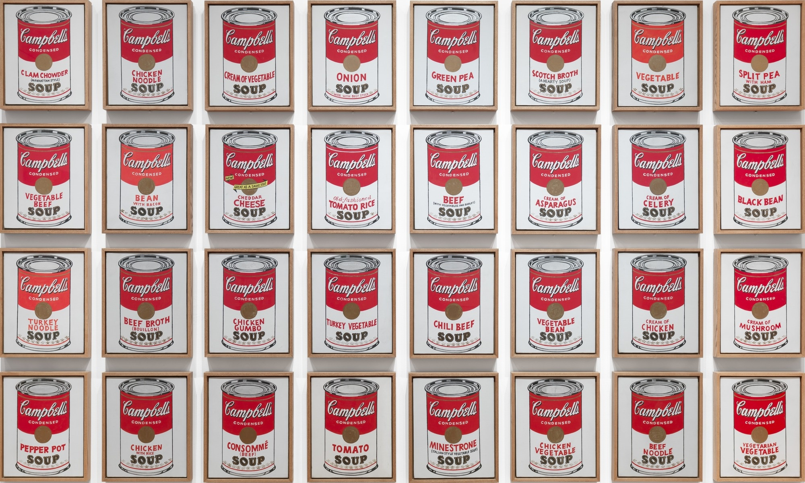

## Marilyn Diptych 玛丽莲双联画 1962 （Andy Warhol, 安迪·沃霍尔）

https://en.wikipedia.org/wiki/Marilyn_Diptych

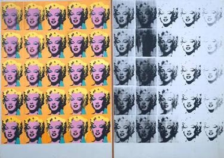

## Superman 超人 1961 （Andy Warhol, 安迪·沃霍尔）

https://theartstack.com/artist/andy-warhol/superman-1961

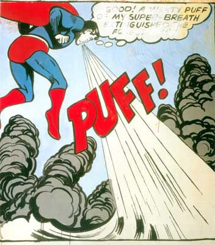

## Whaam! 嘭！ 1963 （Roy Lichtenstein, 罗伊·利希滕斯坦）

https://en.wikipedia.org/wiki/Whaam!

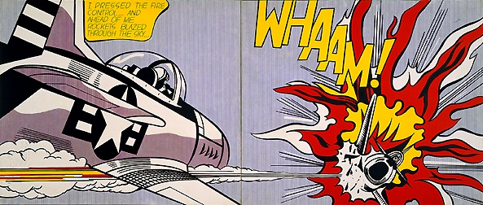

## Brushstroke 笔触 1965（Roy Lichtenstein, 罗伊·利希滕斯坦）

https://www.moma.org/collection/works/60284?locale=en

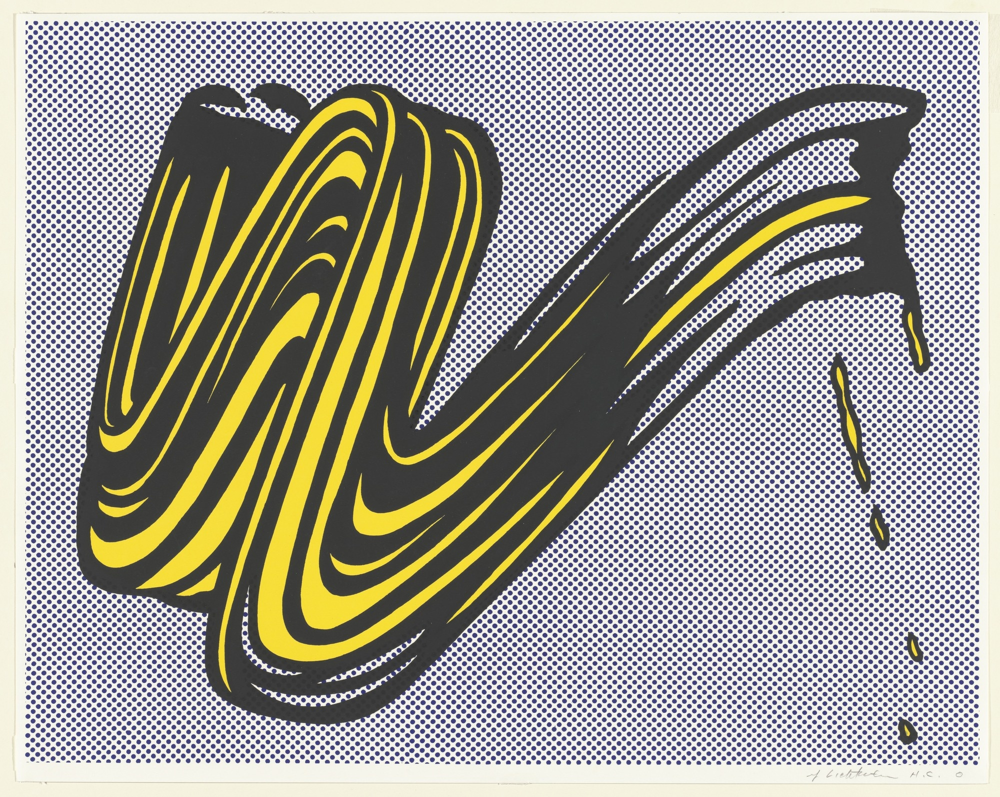

## Two Cheeseburgers, with Everything (Dual Hamburgers) 两个一切都有的芝士汉堡（双份汉堡） 1962 （Claes Oldenburg, 克拉斯·欧登伯格）

https://www.moma.org/collection/works/81183?locale=en

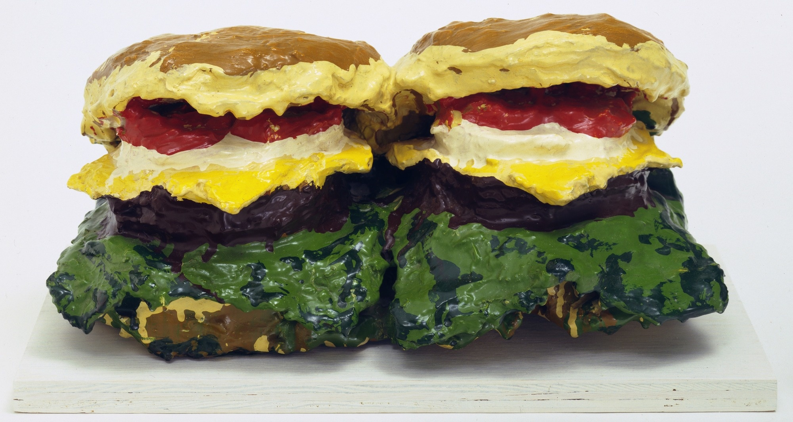
