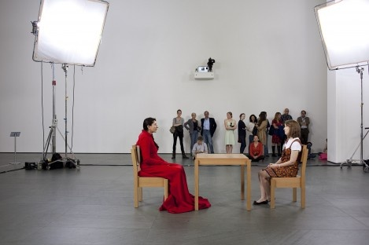
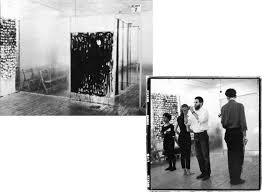

# 17 观念主义/激流派/贫穷主义/行为艺术：心灵游戏 1952 年至今

## The Artist Is Present 艺术家在现场 2010 （Marina Abramović, 玛丽娜·阿布拉莫维奇）

https://www.moma.org/learn/moma_learning/marina-abramovic-marina-abramovic-the-artist-is-present-2010

## 18 Happenings in 6 Parts 6处18次即兴表演 1959 （Allan Kaprow, 艾伦·卡普罗）

http://www.medienkunstnetz.de/works/18-happenings-in-6-parts/

