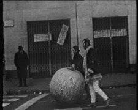
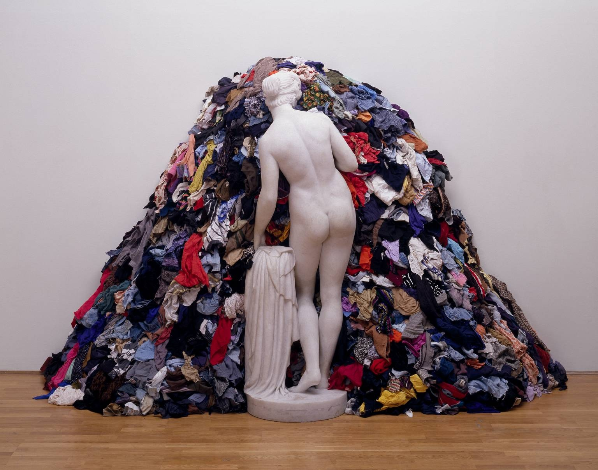
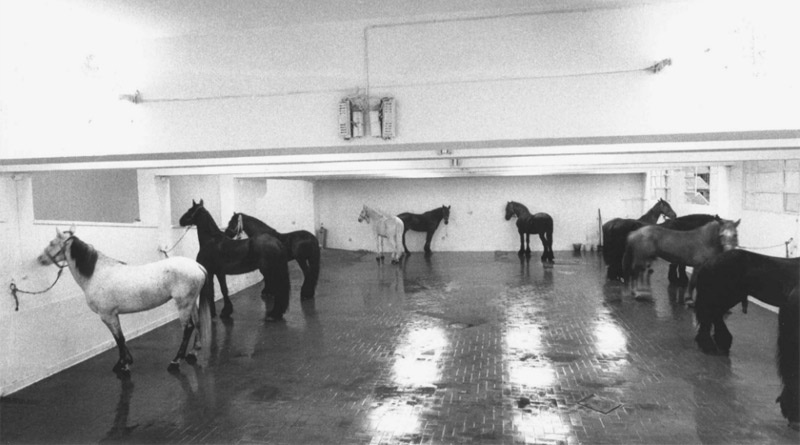

# 贫穷艺术

## Newspaper Sphere 报纸球  1966（Michelangelo Pistoletto, 米开朗基罗·皮斯特莱托）

## Venus of the Rags 破衫中的维纳斯 1967 （Michelangelo Pistoletto, 米开朗基罗·皮斯特莱托）

http://www.tate.org.uk/art/artworks/pistoletto-venus-of-the-rags-t12200

## Untitled (12 Horses) 无题（12匹马）1969（Jannis Kounellis, 简尼斯·库奈利斯）

