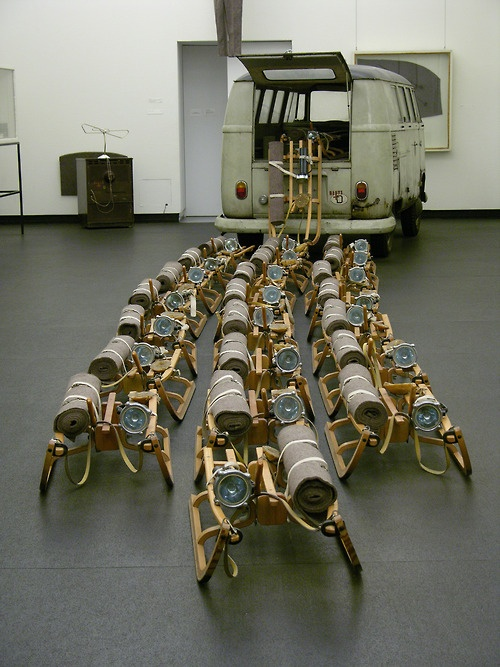
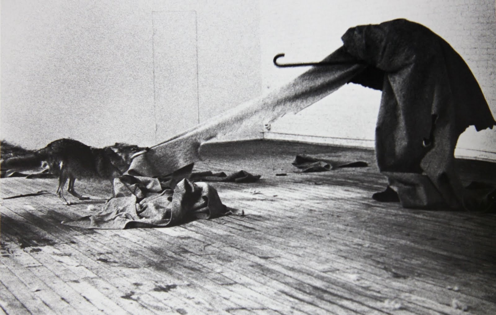
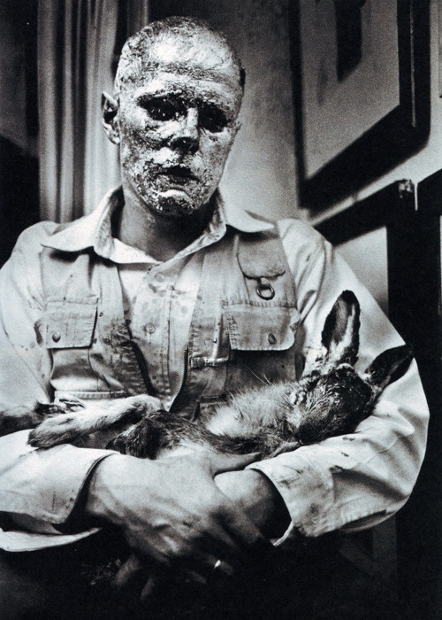
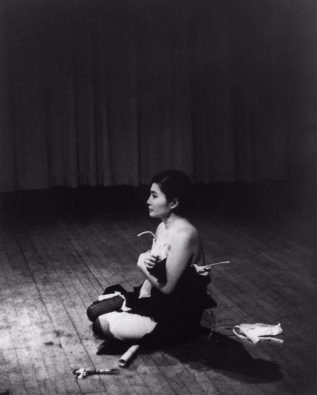

# 激流派

## The Pack 一群 1969（Joseph Beuys, 约瑟夫·博伊斯）

https://www.wikiart.org/en/joseph-beuys/the-pack-1969

## I Like America and America Likes Me 我爱美国，美国爱我 1974 （Joseph Beuys, 约瑟夫·博伊斯）

https://www.wikiart.org/en/joseph-beuys/i-like-america-and-america-likes-me

## How to Explain Pictures to a Dead Hare 怎样向一只死兔子解释绘画 1965（Joseph Beuys, 约瑟夫·博伊斯）

https://www.wikiart.org/en/joseph-beuys/how-to-explain-pictures-to-a-dead-hare-1965-1

## Cut Piece 切片 1964 （Yoko Ono, 小野洋子）https://www.zhihu.com/question/30260734?sort=created

https://www.moma.org/learn/moma_learning/yoko-ono-cut-piece-1964

