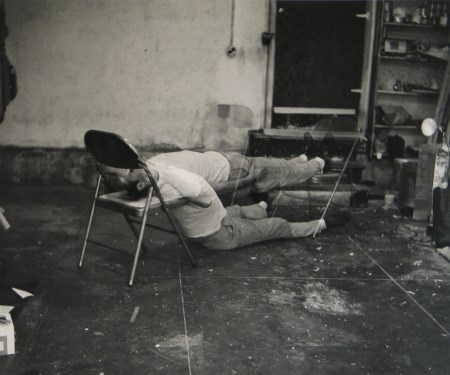
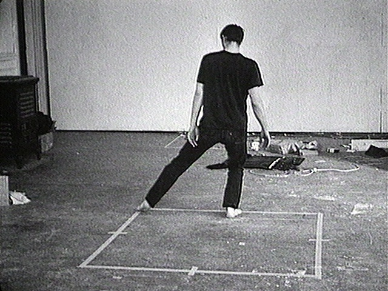
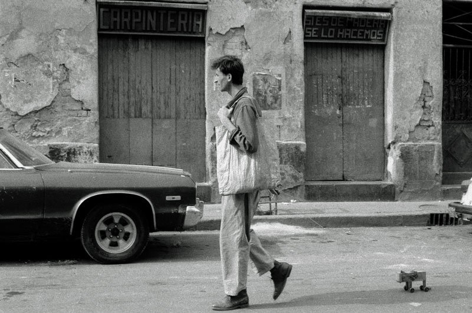
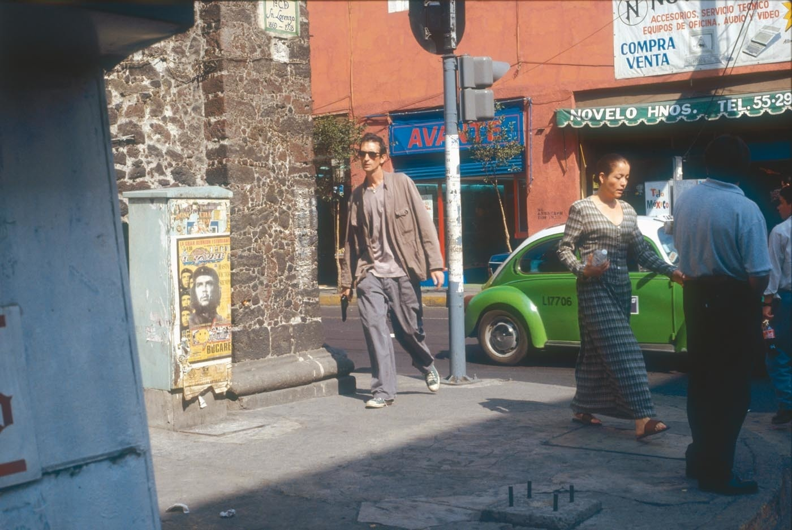
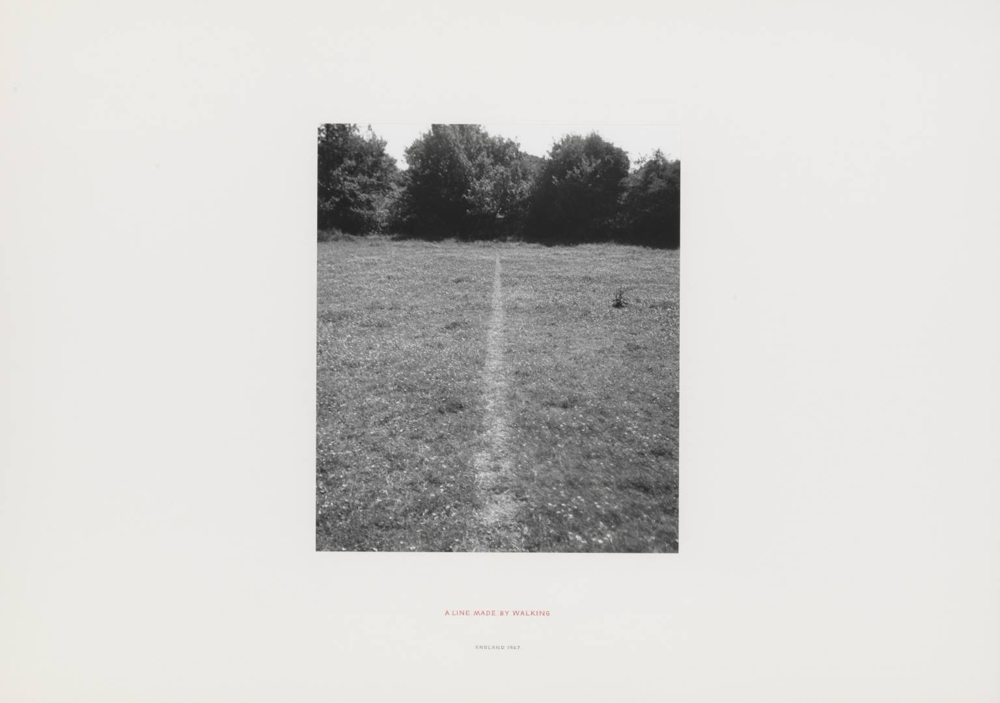
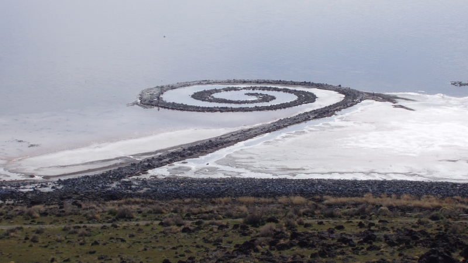

# 观念艺术

## Failure to Levitate in the Studio 未能在工作室漂浮 1966（Bruce Nauman, 布鲁斯·瑙曼） http://www.artda.cn/view.php?tid=2306&cid=29

http://www.stedelijkmuseum.nl/kunstwerk/96022-failing-to-levitate-in-the-studio

## Dance or Exercise on the Perimeter of a Square (Square Dance) 在广场周边跳舞或锻炼（广场舞） 1967（Bruce Nauman, 布鲁斯·瑙曼）

https://www.moma.org/collection/works/119087

## The Collectors 收藏家 1990-1992 （Francis Alÿs, 弗朗西斯·阿里斯）

http://www.tate.org.uk/whats-on/tate-modern/exhibition/francis-alys/francis-alys-story-deception-room-guide/francis-alys-0

## Re-enactments 重演 2001（Francis Alÿs, 弗朗西斯·阿里斯）

https://www.moma.org/collection/works/130829

## A Line Made by Walking 走出来的线 1967（Richard Long, 理查德·朗）

http://www.tate.org.uk/art/artworks/long-a-line-made-by-walking-ar00142

## Spiral Jetty 螺旋形的防波堤 1970（Robert Smithon, 罗伯特•史密森）

https://en.wikipedia.org/wiki/Spiral_Jetty

