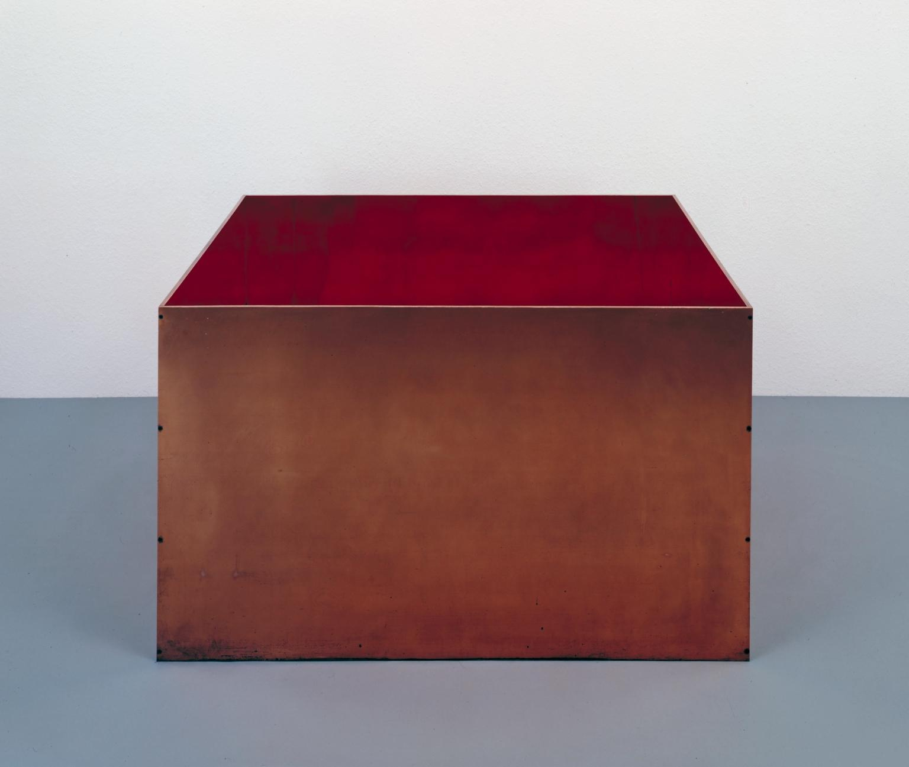
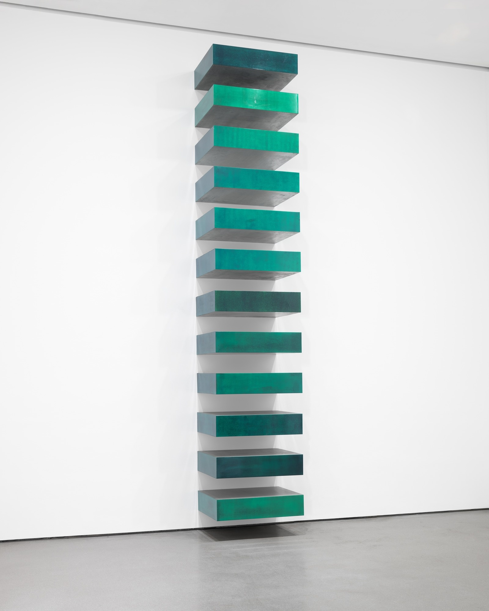
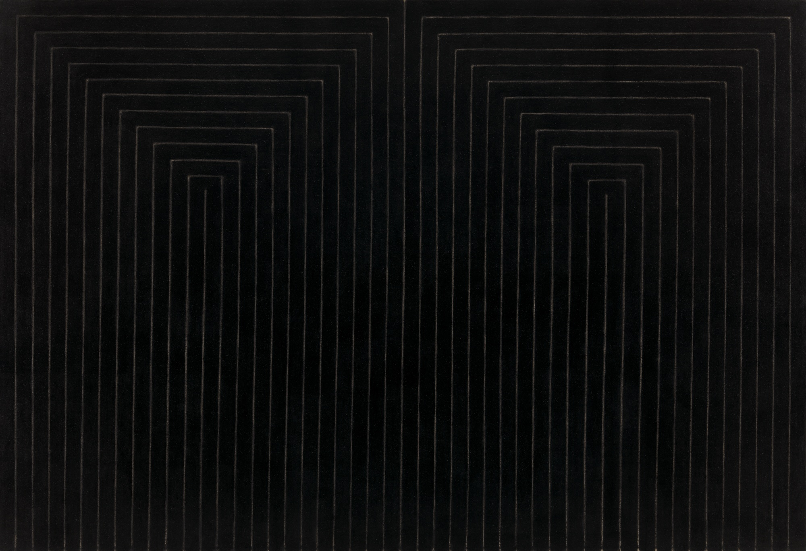
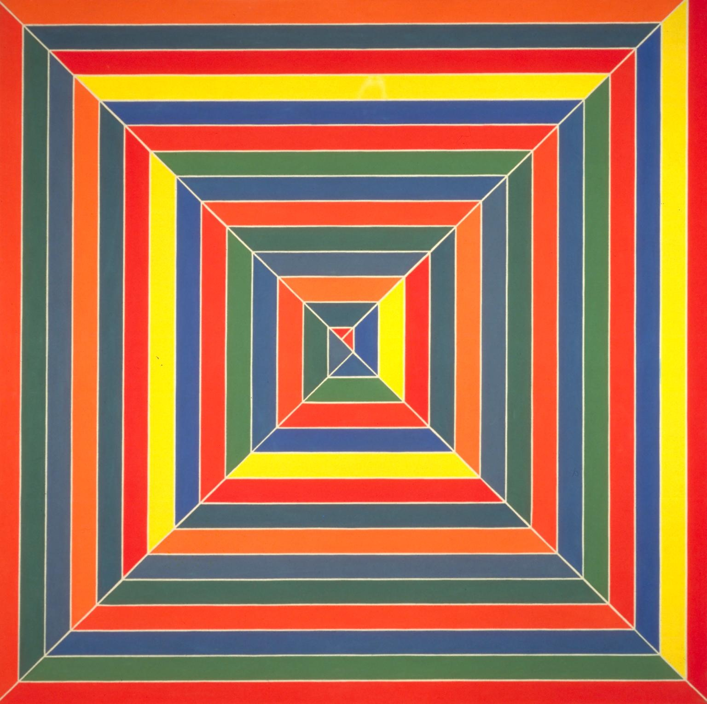
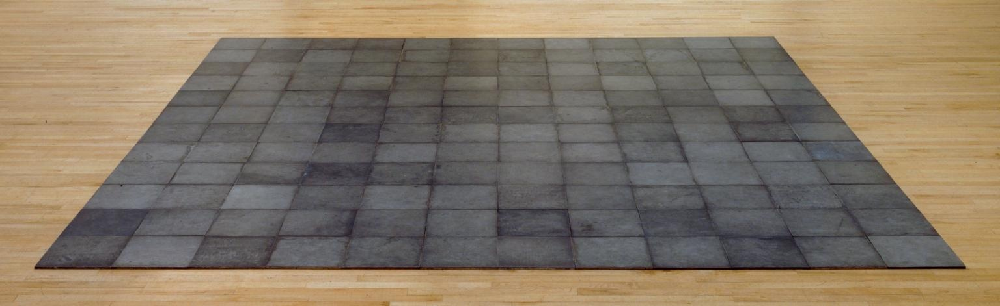
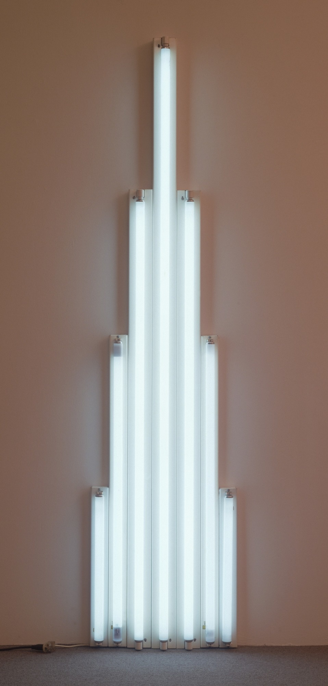
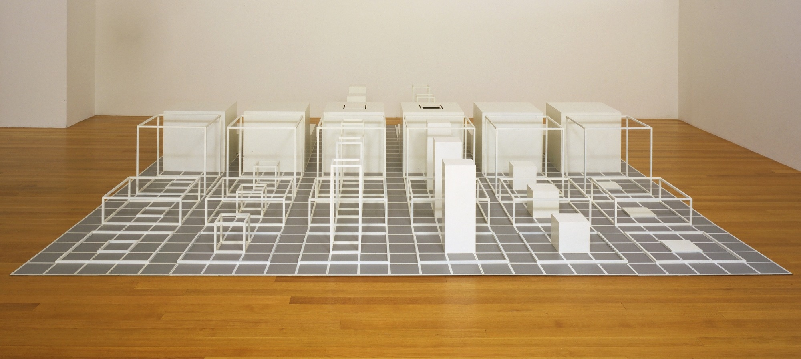

# 18 极简主义：无题 1960 - 1975

## Untitled 无题 1972（Donald Judd, 唐纳德·贾德）

http://www.tate.org.uk/art/artworks/judd-untitled-t06524

## Untitled (Stack)  无题（堆叠）1967（Donald Judd, 唐纳德·贾德）

https://www.moma.org/collection/works/81324?locale=en

## The Marriage of Reason and Squalor, II 理性与卑劣的联姻 2 1959（Frank Stella, 弗兰克·斯特拉）

https://www.moma.org/collection/works/80316

## Hyena Stomp 鬣狗爵士舞 1962（Frank Stella, 弗兰克·斯特拉）

http://www.tate.org.uk/art/artworks/stella-hyena-stomp-t00730

## 144 Magnesium Square 144块镁方砖 1969 （Carl Andre, 卡尔·安德烈）

http://www.tate.org.uk/art/artworks/andre-144-magnesium-square-t01767

## "monument" 1 for V. Tatlin 献给 V·塔特林之纪念碑 1 1964（Dan Flavin, 丹·弗莱文）

https://www.moma.org/collection/works/81337?locale=en

## Serial Project, I (ABCD) 序列工程 1 （ABCD） 1966 （Sol LeWitt, 索尔·勒维特）

https://www.moma.org/collection/works/81533?locale=en

