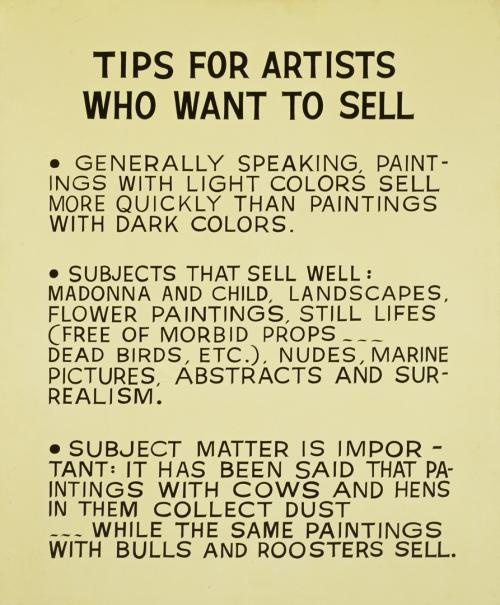

# 19 后现代主义：假身份 1970 - 1989

## Untitled Film Still #21 无题电影剧照 #21 1978（Cindy Sherman, 辛迪·舍曼）

https://www.moma.org/collection/works/56618?locale=en

## The Destroyed Room 损毁的房间 1978（Jeff Wall, 杰夫·沃尔）

http://www.tate.org.uk/whats-on/tate-modern/exhibition/jeff-wall/jeff-wall-room-guide/jeff-wall-room-guide-room-1

## The Death of Sardanapalus  萨丹纳帕鲁斯之死 1827（Eugène Delacroix, 欧仁·德拉克罗瓦）

https://en.wikipedia.org/wiki/The_Death_of_Sardanapalus

## Mimic 模拟 1982（Jeff Wall, 杰夫·沃尔）

http://www.tate.org.uk/whats-on/tate-modern/exhibition/jeff-wall/jeff-wall-room-guide/jeff-wall-room-guide-room-3

## Paris Street; Rainy Day 巴黎街道：雨天 1877（Gustave Caillebotte, 古斯塔夫·卡耶博特）

https://en.wikipedia.org/wiki/Paris_Street;_Rainy_Day

## Untitled (I shop therefore I am) 无题（我买故我在） 1987（Barbara Kruger, 芭芭拉·克鲁格）

https://www.wikiart.org/en/barbara-kruger/untitled-i-shop-therefore-i-am-1987

## Untitled (Your body is a battleground)  无题（你的身体是战场）1989（Barbara Kruger, 芭芭拉·克鲁格）

https://www.artsy.net/artwork/barbara-kruger-untitled-your-body-is-a-battleground-1

## Untitled (You Invest in the Divinity of the Masterpiece) 无题（你投资杰作之神圣性）1982（Barbara Kruger, 芭芭拉·克鲁格）

https://www.moma.org/collection/works/79334

## How to Work Better 怎么更好工作 1991（Peter Fischli & David Weiss, 彼得·弗施利与大卫·韦斯）

https://www.moma.org/collection/works/222300?locale=en&recent_acquisitions=1

## Tips for Artists Who Want to Sell 给想卖作品的艺术家的建议 1966-1968 （John Baldessari, 约翰·巴尔代萨里）

https://www.thebroad.org/art/john-baldessari/tips-artists-who-want-sell

## Heel 脚后跟 1986 （John Baldessari, 约翰·巴尔代萨里）

https://theartstack.com/artist/john-baldessari/heel

## The Way Things Go 天衣无缝的连锁反应  1987（Peter Fischli & David Weiss, 彼得·弗施利与大卫·韦斯）  *art film*

https://en.wikipedia.org/wiki/The_Way_Things_Go

