# 20 今日艺术：名利场 1988 - 2008 至今

## Made in Heaven 天堂制造 1989（Jeff Koons，杰夫·昆斯）

http://www.jeffkoons.com/artwork/made-in-heaven

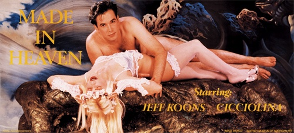

## Spot Painting 现场画 1986（Damien Hirst, 达米恩·赫斯特）

http://www.damienhirst.com/spot-painting

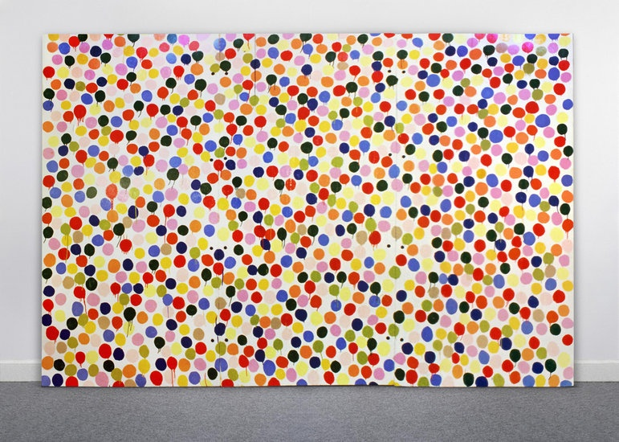

## A Thousand Years 一千年 1990 （Damien Hirst, 达米恩·赫斯特）

http://www.damienhirst.com/a-thousand-years

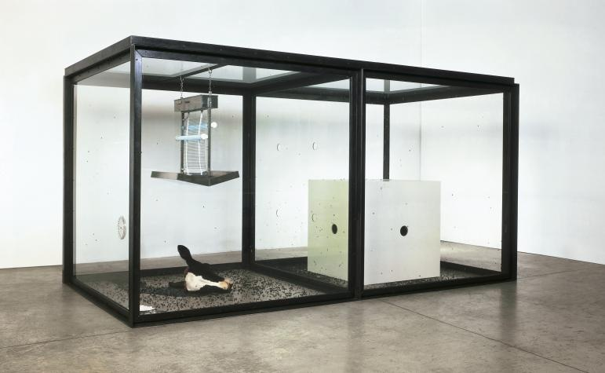

## The Physical Impossibility of Death in the Mind of Someone Living 生者对于死亡的无动于衷 1991（Damien Hirst, 达米恩·赫斯特）

http://www.damienhirst.com/the-physical-impossibility-of

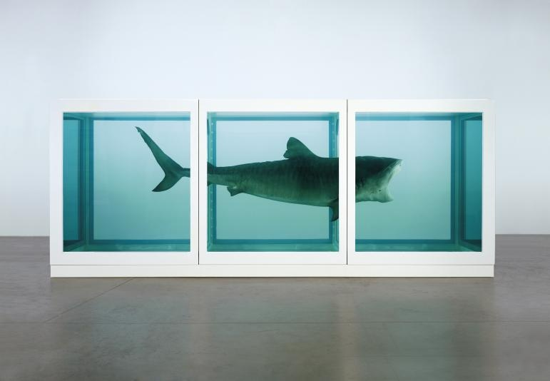

## Self 自己 1991（Marc Quinn, 马克·奎恩）

http://marcquinn.com/artworks/single/self-1991

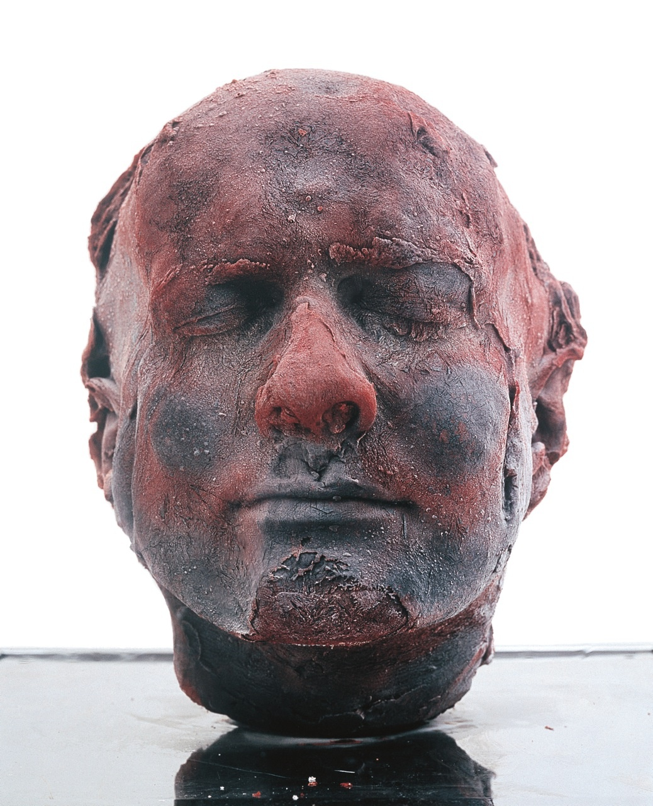

## Myra 迈尔 1995 （Marcus Harvey, 马克斯·哈维）

https://en.wikipedia.org/wiki/Myra_(painting)

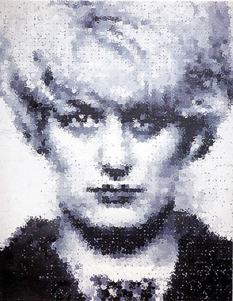

## For the Love of God 献给上帝的爱 2007（Damien Hirst, 达米恩·赫斯特）

http://www.damienhirst.com/for-the-love-of-god

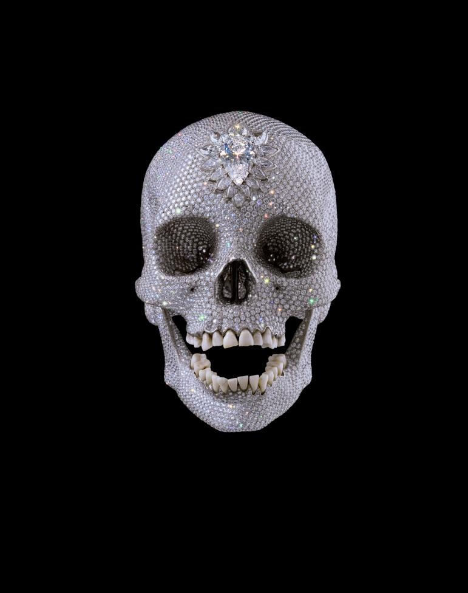

## Two Fried Eggs and a Kebab 两个煎鸡蛋和一根烤肉串 1992（Sarah Lucas, 莎拉·卢卡斯）

http://www.saatchigallery.com/artists/artpages/sarah_lucas_2.htm

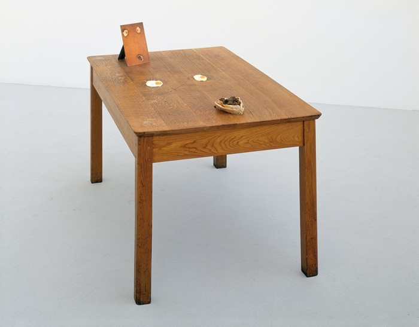

## Au Naturel 裸体 1994（Sarah Lucas, 莎拉·卢卡斯）

http://www.saatchigallery.com/artists/artpages/sarah_lucas_1.htm

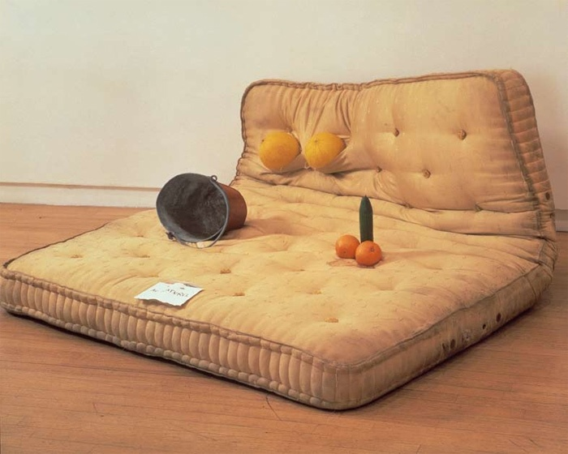

## Everyone I Have Ever Slept With 1963–1995 1963至1995年曾经和我睡在一起的每一个人 1995 （Tracey Emin, 翠西·艾敏）

https://en.wikipedia.org/wiki/Everyone_I_Have_Ever_Slept_With_1963%E2%80%931995

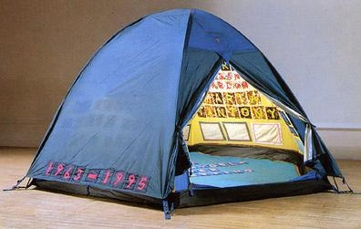

## My Bed 我的床 1998 （Tracey Emin, 翠西·艾敏）

https://en.wikipedia.org/wiki/My_Bed

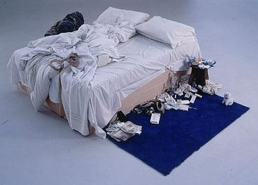

## Hotel International 国际酒店 1993（Tracey Emin, 翠西·艾敏）

https://www.artsy.net/artwork/tracey-emin-hotel-international

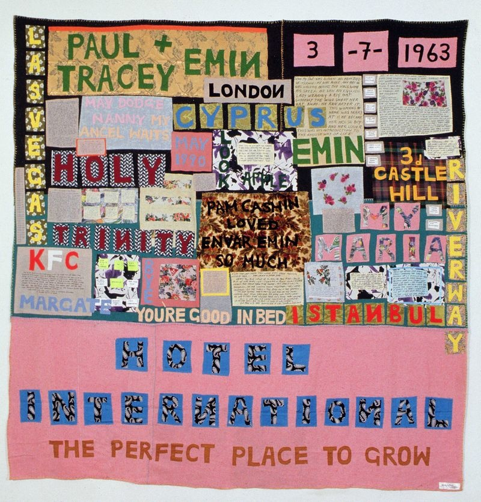

## Tea Painting in an Illusionistic Style 透视风格的茶画 1961（David Hockney, 大卫·霍克尼）

http://www.tate.org.uk/art/artworks/hockney-tea-painting-in-an-illusionistic-style-t07075

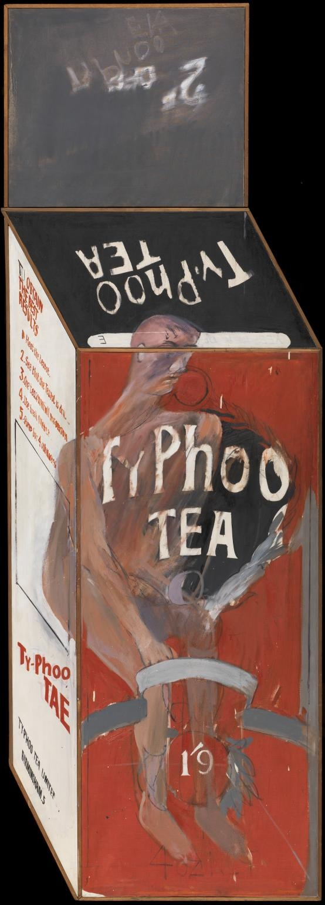

## Victory Boogie Woogie 胜利之舞 1942-1943（Piet Mondrian, 皮埃特·蒙特里安）

https://en.wikipedia.org/wiki/Victory_Boogie_Woogie

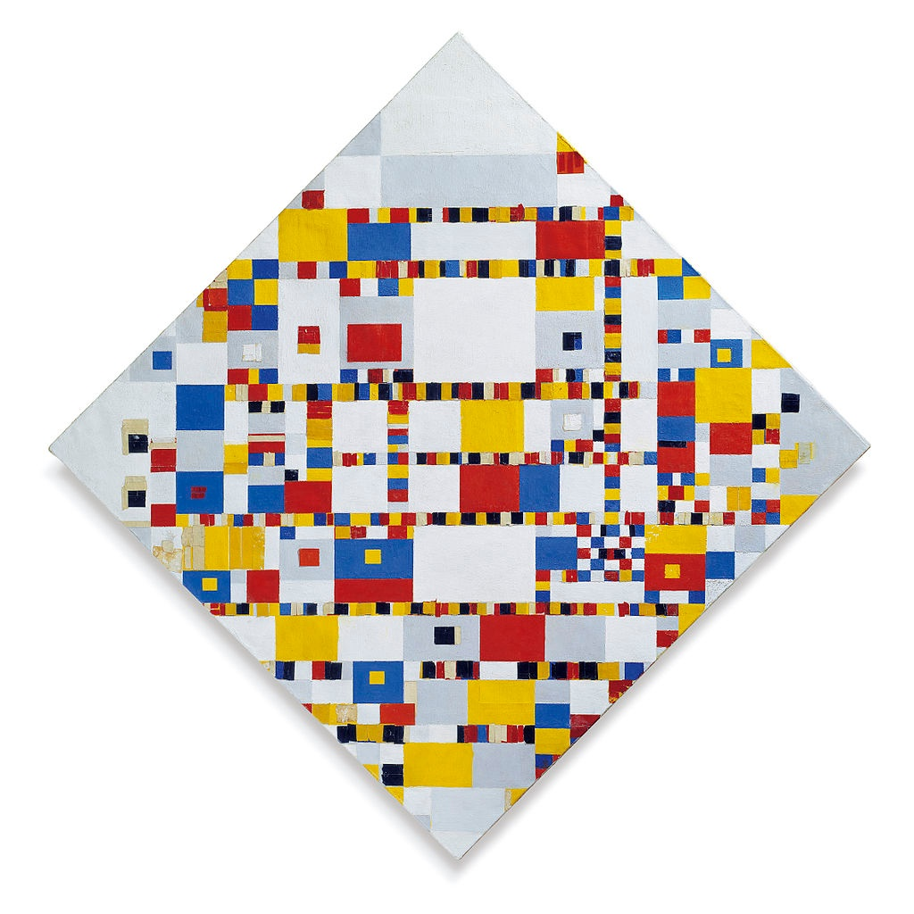

## Woman III 妇女 3 1953（Willem de Kooning, 威廉·德·库宁）

https://en.wikipedia.org/wiki/Woman_III

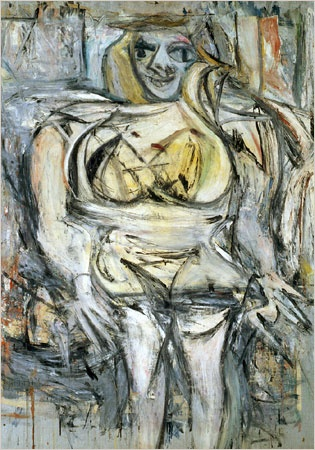

## Miss ko²  ko小姐 1997（Takashi Murakami, 村上隆）

https://www.wikiart.org/en/takashi-murakami/miss-ko-1997

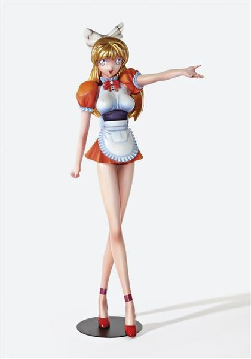

## Hiropon 1997 （Takashi Murakami, 村上隆）

http://www.artnet.com/artists/takashi-murakami/hiropon-dMN_9UQNrw4mGMprXpeWBg2

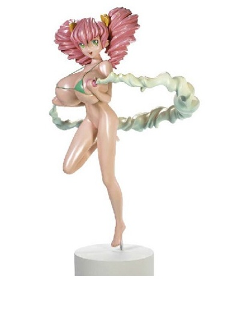

## My Lonesome Cowboy 我的寂寞牛仔 1998 （Takashi Murakami, 村上隆）

https://www.wikiart.org/en/takashi-murakami/my-lonesome-cowboy-1998

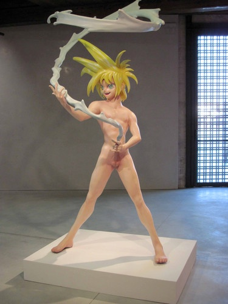

## 摔破一个汉代陶罐 Dropping a Han Dynasty Urn 1995（艾未未, Ai Weiwei）

https://www.artsy.net/artwork/ai-weiwei-dropping-a-han-dynasty-urn-1

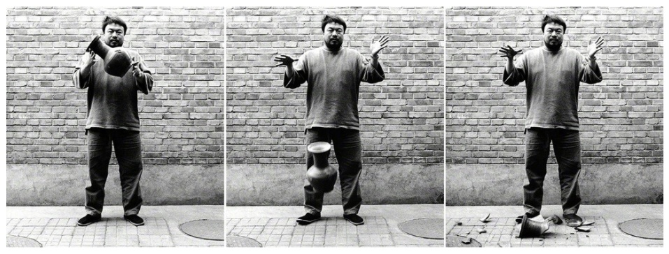
